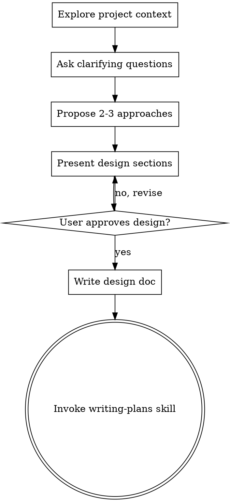

# Brainstorming Ideas Into Designs / 将想法头脑风暴成设计

## Overview / 概述

Help turn ideas into fully formed designs and specs through natural collaborative dialogue.
通过自然的协作对话，帮助将想法转化为完整的设计和规格说明。

Start by understanding the current project context, then ask questions one at a time to refine the idea. Once you understand what you're building, present the design and get user approval.
先理解当前项目上下文，然后逐个提问以完善想法。一旦理解要构建的内容，呈现设计并获得用户批准。

<HARD-GATE>
Do NOT invoke any implementation skill, write any code, scaffold any project, or take any implementation action until you have presented a design and the user has approved it. This applies to EVERY project regardless of perceived simplicity.
在呈现设计并获得用户批准之前，不要调用任何实现技能、编写任何代码、搭建任何项目或采取任何实现行动。这适用于每个项目，无论表面上的简单程度如何。
</HARD-GATE>

## Anti-Pattern: "This Is Too Simple To Need A Design" / 反模式："这太简单了不需要设计"

Every project goes through this process. A todo list, a single-function utility, a config change — all of them. "Simple" projects are where unexamined assumptions cause the most wasted work. The design can be short (a few sentences for truly simple projects), but you MUST present it and get approval.
每个项目都要经历此过程。待办列表、单函数工具、配置变更——无一例外。"简单"项目往往因未审视的假设而造成最多浪费。设计可以简短（真正简单的项目用几句话即可），但必须呈现并获批准。

## Checklist / 检查清单

You MUST create a task for each of these items and complete them in order:
必须为以下每项创建任务并按顺序完成：

1. **Explore project context** — check files, docs, recent commits
   **探索项目上下文** — 检查文件、文档、近期提交
2. **Ask clarifying questions** — one at a time, understand purpose/constraints/success criteria
   **提出澄清问题** — 逐个提问，理解目的/约束/成功标准
3. **Propose 2-3 approaches** — with trade-offs and your recommendation
   **提出 2–3 种方案** — 含权衡与推荐
4. **Present design** — in sections scaled to their complexity, get user approval after each section
   **呈现设计** — 按复杂度分段，每段后获用户批准
5. **Write design doc** — save to `docs/plans/YYYY-MM-DD-<topic>-design.md` and commit
   **撰写设计文档** — 保存到 `docs/plans/YYYY-MM-DD-<topic>-design.md` 并提交
6. **Transition to implementation** — invoke writing-plans skill to create implementation plan
   **转入实现阶段** — 调用 writing-plans 技能创建实现计划

## Process Flow

**The terminal state is invoking writing-plans.** Do NOT invoke frontend-design, mcp-builder, or any other implementation skill. The ONLY skill you invoke after brainstorming is writing-plans.
**终态是调用 writing-plans。** 不要调用 frontend-design、mcp-builder 或任何其他实现技能。头脑风暴后唯一调用的技能是 writing-plans。

## The Process / 流程

**Understanding the idea: / 理解想法：**
- Check out the current project state first (files, docs, recent commits)
  先查看当前项目状态（文件、文档、近期提交）
- Ask questions one at a time to refine the idea
  逐个提问以完善想法
- Prefer multiple choice questions when possible, but open-ended is fine too
  尽量用选择题，开放式亦可
- Only one question per message - if a topic needs more exploration, break it into multiple questions
  每次仅问一个问题——若需深入，拆成多问
- Focus on understanding: purpose, constraints, success criteria
  聚焦理解：目的、约束、成功标准

**Exploring approaches: / 探索方案：**
- Propose 2-3 different approaches with trade-offs
  提出 2–3 种方案并说明权衡
- Present options conversationally with your recommendation and reasoning
  以对话方式呈现选项并给出推荐与理由
- Lead with your recommended option and explain why
  先展示推荐方案并说明理由

**Presenting the design: / 呈现设计：**
- Once you believe you understand what you're building, present the design
  确认理解要构建的内容后，呈现设计
- Scale each section to its complexity: a few sentences if straightforward, up to 200-300 words if nuanced
  每节篇幅随复杂度调整：简单则几句，复杂则 200–300 字
- Ask after each section whether it looks right so far
  每节后询问是否符合预期
- Cover: architecture, components, data flow, error handling, testing
  涵盖：架构、组件、数据流、错误处理、测试
- Be ready to go back and clarify if something doesn't make sense
  如有不清楚之处，随时回头澄清

## After the Design / 设计之后

**Documentation: / 文档：**
- Write the validated design to `docs/plans/YYYY-MM-DD-<topic>-design.md`
  将确认的设计写入 `docs/plans/YYYY-MM-DD-<topic>-design.md`
- Use elements-of-style:writing-clearly-and-concisely skill if available
  如有可用，使用 elements-of-style:writing-clearly-and-concisely 技能
- Commit the design document to git
  将设计文档提交到 git

**Implementation: / 实现：**
- Invoke the writing-plans skill to create a detailed implementation plan
  调用 writing-plans 技能创建详细实现计划
- Do NOT invoke any other skill. writing-plans is the next step.
  不要调用其他技能。下一步是 writing-plans。

## Key Principles / 关键原则

- **One question at a time** - Don't overwhelm with multiple questions
  **一次一问** — 避免一次提多个问题
- **Multiple choice preferred** - Easier to answer than open-ended when possible
  **优先选择题** — 在可能时比开放式更容易回答
- **YAGNI ruthlessly** - Remove unnecessary features from all designs
  **坚决 YAGNI** — 从设计中移除不必要功能
- **Explore alternatives** - Always propose 2-3 approaches before settling
  **探索备选** — 敲定前先提出 2–3 种方案
- **Incremental validation** - Present design, get approval before moving on
  **逐步验证** — 呈现设计、获得批准后再继续
- **Be flexible** - Go back and clarify when something doesn't make sense
  **保持灵活** — 若有不清楚之处，回头澄清
