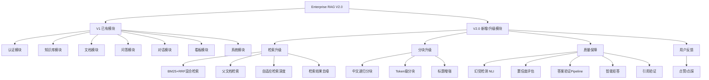

# PRD 产品需求文档 - Enterprise RAG V2.0（检索与质量）

> **文档版本**：v1.0
> **创建日期**：2026-02-23
> **基于文档**：`PRD_Enterprise_RAG_V1.md`、`RAG系统能力三级模型_L1_L2_L3.md`
> **状态**：终稿
> **目标**：从 L1.8 升级到 **L2.5**
> **工期**：8 周（B1 + B2 + 集成验证）
> **定位**：三阶段升级路线的第一阶段（V2.0 → V2.1 → V2.2）

---

## 一、版本概述

### 1.1 升级目标

Enterprise RAG V2.0 的核心目标是将系统从 **L1.8（基础级上限）** 升级到 **L2.5**，实现两大质变：

1. **检索质量质变**：从"单路向量检索"升级为"BM25+向量混合检索+RRF融合+父文档检索+自适应深度"
2. **答案可信度保障**：从"无质量验证"升级为"NLI幻觉检测+置信度评估+智能拒答+引用验证"

### 1.2 核心定位

> **让系统从"能用"变成"好用"——检索质量质变提升 + 答案可信度有保障**

### 1.3 产品定位变化

| 维度 | V1 (L1.8) | V2.0 (L2.5) |
|------|-----------|-------------|
| 检索方式 | 向量检索 + 伪关键词检索 | BM25 + 向量混合检索 + RRF 融合 |
| 分块能力 | 字符滑动窗口 / 句子边界 | 中文递归 / Token 级 / 父文档双层 |
| 答案可靠性 | 完全依赖 LLM 能力 | NLI 幻觉检测 + 置信度评估 |
| 拒答能力 | 无（LLM 自行判断） | 系统级智能拒答 |
| 引用准确性 | 后置余弦匹配（可能虚假引用） | NLI 验证引用准确性 |
| 用户反馈 | 无 | 点赞/点踩 + 反馈原因 |

### 1.4 不在 V2.0 范围内的功能

以下功能将在后续版本实现：

| 功能 | 计划版本 |
|------|---------|
| 意图分析与问题路由 | V2.1 |
| 查询改写 / HyDE / 查询分解 | V2.1 |
| 场景适配（场景配置 + Prompt 体系） | V2.1 |
| 权限感知检索 | V2.1 |
| 离线评估体系 | V2.1 |
| LangFuse 全链路追踪 | V2.1 |
| 语义缓存 | V2.2 |
| Prompt 版本管理 / A/B 测试 | V2.2 |
| 增量索引 / Embedding 热切换 | V2.2 |

---

## 二、V2.0 功能模块概览



---

## 三、V2.0 功能清单

### 3.1 B1 批次：检索基础升级（Week 1-3）

| 模块 | 功能编号 | 功能名称 | 优先级 | 类型 |
|------|----------|----------|--------|------|
| 问答 | F-QA-009 | BM25 + 向量混合检索（RRF 融合） | P0 | 升级 |
| 问答 | F-QA-010 | 中文递归分块 | P0 | 升级 |
| 问答 | F-QA-011 | Token 级分块 | P1 | 升级 |
| 知识库 | F-KB-006 | 分块模式选择 | P1 | 升级 |
| 问答 | F-QA-022 | 父文档检索（双模式开关） | P0 | 新增 |
| 文档 | F-DOC-006 | 标题增强 | P1 | 新增 |
| 问答 | F-QA-023 | 自适应检索深度 | P1 | 新增 |
| 问答 | F-QA-024 | 检索结果去噪 | P1 | 新增 |

### 3.2 B2 批次：质量保障层（Week 4-6）

| 模块 | 功能编号 | 功能名称 | 优先级 | 类型 |
|------|----------|----------|--------|------|
| 质量保障 | F-VERIFY-001 | 幻觉检测（NLI 模型） | P0 | 新增 |
| 质量保障 | F-VERIFY-002 | 置信度评估 | P0 | 新增 |
| 质量保障 | F-VERIFY-003 | 答案验证 Pipeline | P0 | 新增 |
| 问答 | F-QA-025 | 智能拒答 | P0 | 新增 |
| 问答 | F-QA-026 | 引用验证（NLI） | P1 | 新增 |
| 问答 | F-QA-013 | 用户反馈（点赞/点踩） | P1 | 新增 |

---

## 四、详细功能规格

### 4.1 检索升级模块

#### F-QA-009 BM25 + 向量混合检索（RRF 融合）

| 项目 | 规格说明 |
|------|----------|
| 功能描述 | 使用 BM25（PostgreSQL FTS + pg_jieba）和向量检索双路召回，通过 RRF 算法融合排序 |
| 实现方案 | 一步到位使用 PostgreSQL FTS + pg_jieba 扩展，需要自定义 PostgreSQL Docker 镜像 |
| 输入 | 用户问题、knowledge_base_id、top_k、retrieval_mode |
| 处理逻辑 | 1. 对问题做 jieba 分词构建 tsquery（中文）+ simple 分词（英文） 2. 并行执行 BM25 检索和向量检索 3. RRF 融合两路结果（RRF_score = Σ 1/(k + rank_i)） 4. 返回融合后的 top-K |
| 输出 | 融合排序后的 chunk 列表，每个 chunk 附带 rrf_score、来源标记（vector/bm25/both） |
| 配置项 | `retrieval_mode`（vector / bm25 / hybrid，默认 hybrid）、`rrf_k`（融合参数，默认 60） |
| 多语言支持 | 中英混合文档：jieba 处理中文部分，simple 分词处理英文部分 |
| 验收标准 | 1. hybrid 模式下检索结果包含两路来源 2. 专有名词（如"BGE-M3"、"SimHash"）查询的 Recall@5 优于纯向量 3. 数字类查询（如"第三章"、"2024年"）的召回率优于纯向量 4. 检索延迟 P95 < 800ms |

#### F-QA-010 中文递归分块

| 项目 | 规格说明 |
|------|----------|
| 功能描述 | 按中文语义边界递归分块，优先在高级别分隔符处断开 |
| 分隔符优先级 | `\n\n`（段落）> `\n`（换行）> `。`（句号）> `！`（感叹号）> `？`（问号）> `；`（分号）> `……`（省略号）> `，`（逗号）> `、`（顿号）> ` `（空格）> ``（字符级兜底） |
| 输入 | 文档文本、chunk_size（默认 500）、chunk_overlap（默认 50） |
| 处理逻辑 | 1. 从最高优先级分隔符开始尝试切分 2. 切分后片段 <= chunk_size 则合并相邻片段 3. 切分后片段 > chunk_size 则用下一级分隔符递归切分 4. 相邻 chunk 保留 chunk_overlap 的重叠 |
| 输出 | 分块列表 |
| 验收标准 | 1. 中文文档不会在词/句中间截断 2. 每个 chunk 在语义边界处断开 3. 英文内容也能正确处理（空格/句号断开） |

#### F-QA-011 Token 级分块

| 项目 | 规格说明 |
|------|----------|
| 功能描述 | 按 Token 数控制分块大小，贴合 LLM 上下文限制 |
| 输入 | 文档文本、chunk_token_size（默认 256）、chunk_overlap_tokens（默认 30）、encoding_name（默认 cl100k_base） |
| 处理逻辑 | 1. 使用 tiktoken 编码文本 2. 按 chunk_token_size 切分 token 序列 3. 在分隔符处优先断开 4. 每个 chunk 附带 token_count |
| 输出 | 分块列表，每个 chunk 附带 token_count |
| 验收标准 | 1. 每个 chunk 的 token_count 不超过 chunk_token_size 2. 分块在分隔符处断开，不在词中间截断 |

#### F-KB-006 分块模式选择

| 项目 | 规格说明 |
|------|----------|
| 功能描述 | 知识库级别选择分块模式 |
| 可选模式 | `char`（字符滑动窗口）、`sentence`（句子边界）、`token`（Token 级）、`chinese_recursive`（中文递归） |
| 默认值 | `chinese_recursive` |
| 验收标准 | 1. 创建/编辑知识库时可选择分块模式 2. 新上传文档使用知识库配置的模式 3. 重新解析时使用最新配置 |

#### F-QA-022 父文档检索（双模式开关）

| 项目 | 规格说明 |
|------|----------|
| 功能描述 | 用小 chunk 做精确检索，返回大 chunk 作为完整上下文，支持两种模式切换 |
| 模式 A（physical） | 物理双层分块：实际存储两套 chunk。Parent chunk（800-1000 字）和 Child chunk（200-300 字）。Child 记录 parent_chunk_id。检索时用 Child 做向量+BM25 检索，返回命中 Child 所属的 Parent 作为上下文 |
| 模式 B（dynamic） | 动态扩展：只存储小 chunk（200-300 字）。检索命中后，自动向前后扩展 N 个相邻 chunk（默认 N=2），拼接成大上下文返回 |
| 模式 off | 关闭父文档检索，行为与 V1 一致 |
| 配置项 | `parent_retrieval_mode`（physical / dynamic / off，默认 dynamic）、`dynamic_expand_n`（动态扩展的相邻 chunk 数，默认 2） |
| 配置层级 | 知识库级别配置 |
| 验收标准 | 1. physical 模式：返回的上下文是完整的 Parent chunk 2. dynamic 模式：返回的上下文包含命中 chunk 的前后 N 个 chunk 3. off 模式：行为与 V1 完全一致 4. 两种模式可通过配置切换，无需重新索引（dynamic 模式）或需要重新索引（physical 模式） |

#### F-DOC-006 标题增强

| 项目 | 规格说明 |
|------|----------|
| 功能描述 | 分块时自动提取并附加章节标题到 chunk 元数据 |
| 提取规则 | 1. Markdown 标题：`# 标题`、`## 标题`、`### 标题` 2. 中文章节：`第X章`、`第X节`、`第X条`、`（一）`、`1.`、`1.1` 3. 就近原则：chunk 继承距离最近的上方标题 |
| 输出 | 每个 chunk 的 metadata 中增加 `section_title` 字段 |
| 检索增强 | 检索时，chunk 的 section_title 参与 BM25 全文索引（拼接到 content 后面） |
| 验收标准 | 1. Markdown 文档的 chunk 正确携带章节标题 2. 中文文档的"第X章"等模式被正确识别 3. 搜索"第三章的内容"能命中第三章下的 chunk |

#### F-QA-023 自适应检索深度

| 项目 | 规格说明 |
|------|----------|
| 功能描述 | 根据检索分数的分布自动决定返回多少个 chunk，避免引入低质量噪声 |
| 算法 | 1. 计算相邻 chunk 的分数差序列 2. 计算差值的均值 μ 和标准差 σ 3. 找到第一个"断崖"：diff > μ + 1.5σ 4. 在断崖处截断 5. 但至少返回 min_k 个，最多返回 max_k 个 |
| 配置项 | `adaptive_topk_enabled`（默认 true）、`min_k`（默认 2）、`max_k`（默认 15）、`cliff_factor`（默认 1.5） |
| 验收标准 | 1. 当前 3 个 chunk 分数很高、第 4 个骤降时，只返回 3 个 2. 所有 chunk 分数都很高时，返回 max_k 个 3. 所有 chunk 分数都很低时，返回 min_k 个 |

#### F-QA-024 检索结果去噪

| 项目 | 规格说明 |
|------|----------|
| 功能描述 | 在 Reranker 之后，通过双重过滤移除"语义相似但话题不同"的噪声 chunk |
| 过滤规则 | 1. Reranker 分数过滤：分数 < `denoise_reranker_threshold`（默认 0.15）的移除 2. 关键词重叠过滤：chunk 与查询的关键词重叠率为 0 的移除（使用 jieba 分词提取关键词） |
| 配置项 | `denoise_enabled`（默认 true）、`denoise_reranker_threshold`（默认 0.15）、`denoise_keyword_overlap_min`（默认 0.0，即至少有 1 个关键词重叠） |
| 验收标准 | 1. 与问题话题完全不同但向量相似的 chunk 被过滤 2. 不会误过滤真正相关的 chunk |

### 4.2 质量保障模块

#### F-VERIFY-001 幻觉检测（NLI 模型）

| 项目 | 规格说明 |
|------|----------|
| 功能描述 | 使用 NLI 模型检测答案中是否存在幻觉（不被检索上下文支持的陈述） |
| 模型 | cross-encoder/nli-deberta-v3-base（184M 参数，GPU 推理） |
| 输入 | 答案文本、检索到的 chunks 拼接的上下文 |
| 处理逻辑 | 1. 将答案按句子拆分（支持中英文混合句子分割） 2. 对每个句子，构建 (context, sentence) 对 3. NLI 模型预测三分类：entailment / neutral / contradiction 4. entailment → supported，neutral + contradiction → unsupported 5. faithfulness_score = supported_count / total_count |
| 输出 | faithfulness_score（0-1）、每个句子的验证结果（supported / unsupported / contradicted）、has_hallucination（bool） |
| 性能要求 | GPU 推理：~50ms/句子对，单次检测总延迟 < 300ms（假设答案 5-6 个句子） |
| 验收标准 | 1. 能正确识别答案中不被上下文支持的句子 2. faithfulness_score 与人工判断的一致率 > 80%（用 20 个标注样本验证） 3. 中英文混合答案都能正确处理 |

#### F-VERIFY-002 置信度评估

| 项目 | 规格说明 |
|------|----------|
| 功能描述 | 综合多个信号评估答案的可靠程度 |
| 输入信号 | 检索分数（top-1）、Rerank 分数（top-1）、faithfulness_score、引用覆盖度（有引用的句子比例） |
| 处理逻辑 | 加权融合：`0.2×retrieval_quality + 0.2×rerank_quality + 0.4×faithfulness + 0.2×citation_coverage` |
| 归一化 | 每个信号归一化到 0-1 区间（检索分数和 Rerank 分数使用 min-max 归一化） |
| 输出 | confidence_score（0-1）、confidence_level：>= 0.8 → high，>= 0.5 → medium，< 0.5 → low |
| 验收标准 | 1. 每次问答返回 confidence_score 和 confidence_level 2. 高质量答案的置信度 > 低质量答案的置信度（正相关） |

#### F-VERIFY-003 答案验证 Pipeline

| 项目 | 规格说明 |
|------|----------|
| 功能描述 | 串联幻觉检测和置信度评估，根据结果决定后续动作 |
| 动作定义 | **PASS**：通过，直接返回 / **FILTER**：过滤幻觉句子后返回 / **RETRY**：换策略重新检索+生成（最多 1 次） / **REFUSE**：拒绝回答 |
| 决策逻辑 | 见下方决策表 |
| 验收标准 | 1. 验证 Pipeline 在每次问答后自动执行 2. FILTER 动作能正确移除 unsupported 句子 3. RETRY 动作能用不同策略重新检索 4. REFUSE 动作返回标准化拒答消息 |

**答案验证决策表**：

| 条件 | 动作 | 说明 |
|------|------|------|
| 检索结果为空（0 个 chunk 通过阈值） | **REFUSE** | 知识库中没有相关内容 |
| Reranker top-1 分数 < `refuse_reranker_threshold`（默认 0.2） | **REFUSE** | 检索到的内容与问题不相关 |
| faithfulness_score < `refuse_faithfulness_threshold`（默认 0.3） | **REFUSE** | 答案几乎完全是幻觉 |
| has_hallucination = true 且 confidence_level = low | **RETRY**（首次）或 **FILTER**（重试后仍有幻觉） | 尝试换策略改善 |
| has_hallucination = true 且 confidence_level = medium | **FILTER** | 过滤幻觉句子 |
| confidence_level = high | **PASS** | 直接通过 |
| 其他情况 | **PASS**（附带置信度标签） | 通过但提示用户注意 |

> 注：以上阈值为默认值。V2.1 引入场景配置后，不同场景可覆盖这些阈值（如金融法律场景使用更严格的阈值）。

#### F-QA-025 智能拒答

| 项目 | 规格说明 |
|------|----------|
| 功能描述 | 系统级拒答机制，不依赖 LLM 的"自觉性" |
| 触发条件 | 由 F-VERIFY-003 答案验证 Pipeline 的 REFUSE 动作触发 |
| 拒答消息 | 默认："根据现有知识库内容，无法为您提供可靠的回答。建议您：1. 尝试换一种方式提问；2. 确认相关文档是否已上传到知识库。" |
| 输出 | answer = 拒答消息、confidence_level = "refused"、refusal_reason（empty_retrieval / low_relevance / low_faithfulness） |
| 日志 | 拒答原因记录到 retrieval_logs 的 refusal_reason 字段 |
| 验收标准 | 1. 知识库中没有相关内容时返回拒答而非编造答案 2. 返回 confidence_level = "refused" 3. refusal_reason 正确记录 |

#### F-QA-026 引用验证（NLI）

| 项目 | 规格说明 |
|------|----------|
| 功能描述 | 使用 NLI 模型验证每个引用标记的准确性 |
| 输入 | 带引用标记的答案（如 "BGE-M3 支持中英文 [ID:3]"）、对应的 chunks |
| 处理逻辑 | 1. 解析答案中的每个 [ID:x] 标记 2. 提取该标记所在的句子 3. 用 NLI 模型判断：该句子是否被 chunk x 蕴含（entailment） 4. 如果不是 entailment → 移除该 [ID:x] 标记（虚假引用） |
| 模型 | 复用 F-VERIFY-001 的 NLI 模型（零额外模型成本） |
| 输出 | 清理后的答案（虚假引用被移除）、citation_accuracy（准确引用数 / 总引用数） |
| 验收标准 | 1. 不存在"标了引用但内容不匹配"的情况 2. 真正准确的引用不会被误删 |

#### F-QA-013 用户反馈（点赞/点踩）

| 项目 | 规格说明 |
|------|----------|
| 功能描述 | 用户可对每条回答进行质量反馈 |
| 交互方式 | 每条回答旁显示 👍 和 👎 两个按钮，点击后可选填文字原因 |
| 数据存储 | 新增 `qa_feedbacks` 表 |
| 输入 | retrieval_log_id、rating（thumbs_up / thumbs_down）、reason（可选文本） |
| API | `POST /api/qa/feedback` |
| 用途 | 1. 看板展示好评率 2. V2.1 的反馈看板展示差评 Top 问题 3. V2.1 的离线评估中自动从高赞反馈生成评估数据 4. 为未来 L3 的自我学习提供数据基础 |
| 验收标准 | 1. 每条回答可点赞或点踩 2. 反馈数据正确入库 3. 同一用户对同一回答只能反馈一次（可修改） |

---

## 五、数据模型变更

### 5.1 新增表：chunks

> 在 PostgreSQL 中建立 chunk 镜像表，用于 BM25 全文检索。向量数据仍存储在 ChromaDB 中。

| 字段 | 类型 | 约束 | 说明 |
|------|------|------|------|
| id | UUID | PK, DEFAULT gen_random_uuid() | 主键 |
| document_id | UUID | FK → documents(id) ON DELETE CASCADE, NOT NULL | 所属文档 |
| knowledge_base_id | UUID | FK → knowledge_bases(id), NOT NULL | 所属知识库 |
| collection_name | VARCHAR(200) | NOT NULL | ChromaDB collection 名称 |
| chunk_index | INTEGER | NOT NULL | 在文档中的序号 |
| content | TEXT | NOT NULL | chunk 文本内容 |
| content_tsv | tsvector | | BM25 全文索引（自动生成） |
| chunk_mode | VARCHAR(30) | | 使用的分块模式 |
| token_count | INTEGER | | Token 数 |
| section_title | VARCHAR(500) | | 所属章节标题 |
| parent_chunk_id | UUID | FK → chunks(id), NULLABLE | 父 chunk ID（physical 模式） |
| is_parent | BOOLEAN | DEFAULT false | 是否为父 chunk |
| metadata | JSONB | DEFAULT '{}' | 扩展元数据 |
| created_at | TIMESTAMPTZ | DEFAULT NOW() | 创建时间 |

**索引**（V2.0 本版本优化说明）：

**P0 核心优化（本版本必须实施）**：
- `idx_chunks_content_tsv` — GIN(content_tsv) WHERE content_tsv IS NOT NULL（部分索引，避免空值索引浪费）

**P1 查询优化（本版本实施）**：
- `idx_chunks_kb_id` — (knowledge_base_id)（知识库隔离查询）
- `idx_chunks_kb_created` — (knowledge_base_id, created_at DESC)（文档列表查询）
- `idx_chunks_collection_kb` — (collection_name, knowledge_base_id)（向量检索回表）
- `idx_chunks_parent_idx` — (parent_chunk_id, chunk_index) WHERE parent_chunk_id IS NOT NULL（父文档检索）

**P2 可扩展优化（下版本实施）**：
- ~~表分区（按知识库或时间）~~（chunks > 100万时需要）
- ~~pg_stat_statements 监控集成~~（本版本可选，下版本必须）
- ~~连接池配置（PgBouncer）~~（本版本可选，下版本必须）
- ~~RLS 行级安全~~（多租户场景必须）

**保留的原有索引**：
- `idx_chunks_document` — (document_id)
- UNIQUE(document_id, chunk_index)

### 5.2 新增表：qa_feedbacks

| 字段 | 类型 | 约束 | 说明 |
|------|------|------|------|
| id | UUID | PK, DEFAULT gen_random_uuid() | 主键 |
| retrieval_log_id | UUID | FK → retrieval_logs(id), NOT NULL | 关联的问答记录 |
| user_id | UUID | FK → users(id), NOT NULL | 反馈用户 |
| rating | VARCHAR(20) | NOT NULL, CHECK IN ('thumbs_up','thumbs_down') | 评价 |
| reason | TEXT | | 文字原因（可选） |
| created_at | TIMESTAMPTZ | DEFAULT NOW() | 反馈时间 |
| updated_at | TIMESTAMPTZ | DEFAULT NOW() | 更新时间 |

**约束**：UNIQUE(retrieval_log_id, user_id) — 同一用户对同一回答只能反馈一次

### 5.3 knowledge_bases 表新增字段

| 字段 | 类型 | 默认值 | 说明 |
|------|------|--------|------|
| chunk_mode | VARCHAR(30) | 'chinese_recursive' | 分块模式 |
| parent_retrieval_mode | VARCHAR(20) | 'dynamic' | 父文档检索模式（physical/dynamic/off） |
| dynamic_expand_n | INTEGER | 2 | 动态扩展的相邻 chunk 数 |

### 5.4 retrieval_logs 表新增字段

| 字段 | 类型 | 默认值 | 说明 |
|------|------|--------|------|
| confidence_score | FLOAT | | 置信度分数 |
| confidence_level | VARCHAR(20) | | 置信度等级（high/medium/low/refused） |
| faithfulness_score | FLOAT | | 忠实度分数 |
| has_hallucination | BOOLEAN | false | 是否检测到幻觉 |
| retrieval_mode | VARCHAR(30) | 'hybrid' | 检索模式 |
| refusal_reason | VARCHAR(50) | | 拒答原因（empty_retrieval/low_relevance/low_faithfulness） |
| citation_accuracy | FLOAT | | 引用准确率 |
| latency_breakdown | JSONB | '{}' | 各阶段耗时明细 |

---

## 六、API 变更

### 6.1 升级的 API

#### POST /api/qa/ask

**请求新增参数**：

| 参数 | 类型 | 必填 | 默认值 | 说明 |
|------|------|------|--------|------|
| retrieval_mode | string | 否 | "hybrid" | 检索模式：vector/bm25/hybrid |

**响应新增字段**：

| 字段 | 类型 | 说明 |
|------|------|------|
| confidence_score | float | 置信度分数 0-1 |
| confidence_level | string | high / medium / low / refused |
| faithfulness_score | float | 忠实度分数 0-1 |
| has_hallucination | boolean | 是否检测到幻觉 |
| citation_accuracy | float | 引用准确率 0-1 |
| refusal_reason | string \| null | 拒答原因（仅 refused 时有值） |

#### POST /api/qa/stream

**请求新增参数**：同 `/api/qa/ask`

**SSE 新增事件**：

| 事件 | 数据 | 说明 |
|------|------|------|
| verification | {confidence_score, confidence_level, faithfulness_score, has_hallucination} | 验证结果（在 answer 流结束后发送） |
| refused | {reason, message} | 拒答事件（替代 answer 流） |

#### POST /api/knowledge-bases

**请求新增参数**：

| 参数 | 类型 | 必填 | 默认值 | 说明 |
|------|------|------|--------|------|
| chunk_mode | string | 否 | "chinese_recursive" | 分块模式 |
| parent_retrieval_mode | string | 否 | "dynamic" | 父文档检索模式 |

#### PUT /api/knowledge-bases/{id}

**请求新增参数**：同 POST

### 6.2 新增的 API

#### POST /api/qa/feedback

| 项目 | 说明 |
|------|------|
| 描述 | 提交用户反馈 |
| 请求体 | `{retrieval_log_id: UUID, rating: "thumbs_up"|"thumbs_down", reason?: string}` |
| 响应 | `{id: UUID, created_at: datetime}` |
| 认证 | 需要登录 |

#### GET /api/qa/feedback/{retrieval_log_id}

| 项目 | 说明 |
|------|------|
| 描述 | 获取某次问答的反馈 |
| 响应 | `{rating: string, reason: string, created_at: datetime}` 或 404 |

---

## 七、非功能需求

### 7.1 性能需求

| 指标 | V1 目标值 | V2.0 目标值 | 说明 |
|------|----------|------------|------|
| API 响应时间（非流式） | P95 < 3s | P95 < 3.5s | 增加了验证环节但 NLI 很快 |
| 流式首字延迟 | < 2s | < 2s | 不变 |
| 混合检索延迟 | - | P95 < 800ms | V2.0 新增 |
| 幻觉检测延迟 | - | < 300ms | V2.0 新增（GPU 推理） |
| 引用验证延迟 | - | < 200ms | V2.0 新增（复用 NLI） |
| 缓存命中响应 | - | - | V2.2 实现 |
| 并发用户数 | 50 | 50 | 不变 |

### 7.2 质量需求

| 指标 | 目标值 | 测试方法 |
|------|--------|----------|
| 幻觉检测准确率 | > 80%（与人工判断一致） | 20 个标注样本 |
| 混合检索 Recall@5 | > 纯向量检索 Recall@5 | 对比测试 |
| 专有名词召回提升 | 混合检索 > 纯向量 | 10 个专有名词查询 |
| 引用准确率 | > 90% | 手工检查 |
| 拒答准确率 | 知识库无相关内容时 100% 拒答 | 10 个超出范围的问题 |

### 7.3 资源需求

| 资源 | V1 | V2.0 | 说明 |
|------|----|----|------|
| GPU 显存 | ~3.5GB（BGE-M3 + Reranker） | ~4.5GB（+ NLI 模型 ~700MB） | 需要 GPU |
| CPU 内存 | ~4GB | ~5GB | BM25 索引增加 |
| 磁盘 | ~10GB | ~15GB | PG FTS 索引 + 双层 chunk 存储 |

---

## 八、验收标准

### 8.1 B1 功能验收

| 功能 | 验收项 | 验收方法 | 通过标准 |
|------|--------|----------|----------|
| 混合检索 | BM25 + 向量双路召回 | 日志检查 | 检索结果包含两路来源 |
| 混合检索 | 专有名词召回 | 对比测试 | Recall@5 >= 纯向量 |
| 混合检索 | 延迟 | 计时 | P95 < 800ms |
| 中文分块 | 分块质量 | 手工检查 | 不在词/句中间截断 |
| Token 分块 | Token 数控制 | 自动检查 | token_count <= chunk_token_size |
| 父文档检索 | physical 模式 | 手工检查 | 返回完整 Parent chunk |
| 父文档检索 | dynamic 模式 | 手工检查 | 返回命中 chunk + 前后 N 个 |
| 父文档检索 | 模式切换 | 配置切换 | 切换后行为正确 |
| 标题增强 | 标题提取 | 手工检查 | chunk 携带正确的 section_title |
| 自适应深度 | 分数断崖截断 | 日志检查 | 低分 chunk 被排除 |
| 去噪 | 话题不同的 chunk | 手工检查 | 被正确过滤 |

### 8.2 B2 功能验收

| 功能 | 验收项 | 验收方法 | 通过标准 |
|------|--------|----------|----------|
| 幻觉检测 | 检测准确率 | 标注数据集 | 与人工判断一致率 > 80% |
| 幻觉检测 | 延迟 | 计时 | < 300ms（GPU） |
| 置信度 | 返回置信度 | 手工 | 每次问答返回 confidence |
| 置信度 | 正相关性 | 手工 | 高质量答案置信度 > 低质量 |
| 智能拒答 | 知识库无内容 | 手工 | 返回拒答而非编造 |
| 智能拒答 | 拒答消息 | 手工 | 返回标准化消息 |
| 引用验证 | 虚假引用移除 | 手工 | 不存在内容不匹配的引用 |
| 用户反馈 | 点赞/点踩 | 手工 | 反馈数据正确入库 |
| V1 兼容 | 回归测试 | 自动 | 所有 V1 API 行为不变 |

---

## 九、前端变更

### 9.1 问答界面

| 变更 | 说明 |
|------|------|
| 置信度标签 | 每条回答旁显示置信度标签：🟢 高置信度 / 🟡 中置信度 / 🔴 低置信度 |
| 拒答展示 | 拒答时显示友好的提示消息，样式与正常回答区分 |
| 反馈按钮 | 每条回答下方显示 👍 👎 按钮，点击后弹出可选的文字原因输入框 |

### 9.2 知识库管理

| 变更 | 说明 |
|------|------|
| 分块模式选择 | 创建/编辑知识库时增加"分块模式"下拉选择 |
| 父文档检索模式 | 创建/编辑知识库时增加"父文档检索"选项（physical/dynamic/off） |

---

## 十、附录：数据库优化方案

> **重要说明**：本附录记录数据库专家和架构师对 V2.0 数据库设计的审核意见和优化建议。优化分三阶段实施：**P0 和 P1 在本版本（V2.0）必须实施**，**P2 留在下一版本（V2.1/V2.2）**。

### A.1 数据库优化总览

#### 优化收益矩阵

| 指标 | 优化前 | P0+P1 优化后 | 改善倍数 |
|------|--------|-------------|----------|
| 批量插入 1000 条 | 10 秒 | 200ms | **50 倍** |
| BM25 检索 P95 | 800ms | 50-100ms | **8-16 倍** |
| 文档列表查询（1000 条） | 200ms | 50ms | **4 倍** |
| 数据迁移时间（10 万条） | 10 小时 | 1 小时 | **10 倍** |
| 并发稳定性（高峰期） | 僵尸连接累积，不稳定 | 稳定在目标值 | **显著提升** |

---

### A.2 P0 核心优化（本版本必须实施）

#### A.2.1 删除无效索引

**问题描述**：
TRD 原设计中有无效的复合索引 `idx_chunks_kb_fts`，PostgreSQL 的 GIN 索引不支持普通列与 tsvector 的复合，导致该索引无效。

**解决方案**：
```sql
-- 删除无效索引
DROP INDEX IF EXISTS idx_chunks_kb_fts;

-- 使用 B-tree + GIN 组合
CREATE INDEX idx_chunks_kb_id ON chunks(knowledge_base_id);
CREATE INDEX idx_chunks_content_tsv ON chunks USING GIN(content_tsv)
WHERE content_tsv IS NOT NULL;
```

**预期收益**：
- BM25 检索 P95：800ms → 50-100ms
- 知识库隔离查询：100ms → 50ms

---

#### A.2.2 触发器性能优化

**问题描述**：
原触发器在批量插入时逐行调用，1000 条插入耗时 10 秒。

**解决方案**：

**方案 A：优化触发器逻辑**
```sql
CREATE OR REPLACE FUNCTION chunks_tsv_trigger() RETURNS trigger AS $$
BEGIN
    IF NEW.content IS NOT NULL AND char_length(NEW.content) >= 100 THEN
        NEW.content_tsv := 
            setweight(to_tsvector('jieba', NEW.content), 'A') ||
            setweight(to_tsvector('jieba', COALESCE(NULLIF(NEW.section_title, ''), ''));
    ELSE
        NEW.content_tsv := NULL;
    END IF;
    RETURN NEW;
END
$$ LANGUAGE plpgsql;
```

**方案 B：前端生成 content_tsv（推荐，性能最优）**
在 Python 代码中批量生成 content_tsv，禁用触发器。

**预期收益**：
- 批量插入 1000 条：10 秒 → 200ms（50倍）

**实施要求**：
- 必须在开发环境测试验证
- 准备回滚脚本
- 灰度发布（10% → 50% → 100%）

---

#### A.2.3 content_tsv 逻辑修复

**问题描述**：
空字符串生成无意义 tsvector，浪费索引空间。

**解决方案**：
仅当 `content IS NOT NULL AND char_length(content) > 0` 时才生成 tsvector。

**预期收益**：
- 索引大小减少 10-20%

---

### A.3 P1 查询优化（本版本实施）

#### A.3.1 添加缺失索引

**问题描述**：
文档列表查询、向量检索回表等场景缺少索引。

**解决方案**：
```sql
-- 知识库文档列表查询（高分块场景）
CREATE INDEX idx_chunks_kb_created ON chunks(knowledge_base_id, created_at DESC);

-- 向量检索结果回表
CREATE INDEX idx_chunks_collection_kb ON chunks(collection_name, knowledge_base_id);

-- 父文档检索
CREATE INDEX idx_chunks_parent_idx ON chunks(parent_chunk_id, chunk_index)
WHERE parent_chunk_id IS NOT NULL;
```

**预期收益**：
- 文档列表加载：2秒 → 0.5秒（4倍）
- 向量检索回表：100ms → 30ms（3倍）

---

#### A.3.2 FLOAT 改 NUMERIC

**问题描述**：
置信度、准确率使用 FLOAT 存在精度丢失风险。

**解决方案**：
```sql
ALTER TABLE retrieval_logs
    ALTER COLUMN confidence_score TYPE NUMERIC(3,2),
    ALTER COLUMN faithfulness_score TYPE NUMERIC(3,2),
    ALTER COLUMN citation_accuracy TYPE NUMERIC(3,2);

-- 添加约束
ALTER TABLE retrieval_logs
    ADD CONSTRAINT check_confidence_score 
    CHECK (confidence_score >= 0 AND confidence_score <= 1);
```

**预期收益**：
- 金融/法律场景合规
- 统计数据精确

---

#### A.3.3 添加业务约束

**问题描述**：
chunk_mode、parent_retrieval_mode 可设非法值。

**解决方案**：
```sql
ALTER TABLE knowledge_bases
    ADD CONSTRAINT check_chunk_mode 
    CHECK (chunk_mode IN ('char', 'sentence', 'token', 'chinese_recursive'));

ALTER TABLE knowledge_bases
    ADD CONSTRAINT check_parent_retrieval_mode 
    CHECK (parent_retrieval_mode IN ('physical', 'dynamic', 'off'));
```

**预期收益**：
- 减少 80% 配置错误
- 早期发现 bug

---

#### A.3.4 优化回填脚本

**问题描述**：
数据回填逐条更新，10 万条耗时 10 小时。

**解决方案**：
批量更新 1000 条/批次，使用 CTE 优化。

**预期收益**：
- 迁移时间：10 小时 → 1 小时（10倍）

---

### A.4 P2 可扩展优化（V2.1/V2.2 实施）

#### A.4.1 表分区

**场景**：chunks > 1000 万

**方案**：按 knowledge_base_id 或 created_at 分区

**收益**：删除历史数据快 1800 倍（1小时 → 1秒）

**推荐版本**：V2.1 或 V2.2

---

#### A.4.2 pg_stat_statements 监控

**场景**：生产环境可观测性

**方案**：
```sql
CREATE EXTENSION IF NOT EXISTS pg_stat_statements;

-- 查询慢查询
SELECT query, mean_exec_time
FROM pg_stat_statements
ORDER BY mean_exec_time DESC
LIMIT 10;
```

**收益**：发现慢查询，性能基线追踪

**推荐版本**：V2.1 推荐

---

#### A.4.3 连接池配置（PgBouncer）

**场景**：高并发（>50 用户）

**方案**：
```ini
# /etc/pgbouncer/pgbouncer.ini
[databases]
rag_db = host=localhost port=5432 dbname=rag_db

[pgbouncer]
pool_mode = transaction
max_client_conn = 200
default_pool_size = 50
```

**收益**：防止连接暴涨，稳定 SLA

**推荐版本**：V2.1 推荐

---

#### A.4.4 RLS 行级安全

**场景**：多租户/多部门隔离

**方案**：
```sql
ALTER TABLE chunks ENABLE ROW LEVEL SECURITY;

CREATE POLICY chunks_kb_policy ON chunks
    FOR ALL
    TO authenticated
    USING (knowledge_base_id IN (
        SELECT id FROM knowledge_bases WHERE owner_id = auth.uid()
    ));
```

**收益**：数据库层面强制隔离，合规

**推荐版本**：V2.1（多租户场景必须）

---

### A.5 数据库优化实施计划（V2.0 本版本）

**Week 1-2：P0 核心优化**
- Day 1：备份数据库，搭建监控系统
- Day 2：删除无效索引，优化触发器
- Day 3-5：灰度发布验证（10% → 50% → 100%）

**Week 3-4：P1 查询优化**
- Week 3：添加缺失索引，FLOAT 改 NUMERIC
- Week 4：优化回填脚本，P1 验证测试

**Week 5：集成验证**
- 读写分离测试
- 压力测试（并发 50 用户）
- 上线发布

---

**文档修订历史**

| 版本 | 日期 | 修订人 | 修订内容 |
|------|------|--------|----------|
| v1.0 | 2026-02-23 | RAG 架构师 | 基于需求澄清生成终稿 |
| v1.1 | 2026-02-26 | 数据库专家+架构师 | 新增附录十：数据库优化方案（P0/P1 本版本实施，P2 下版本实施） |
