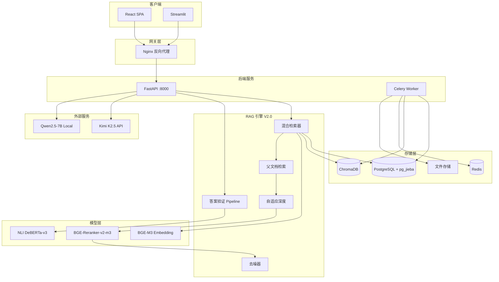
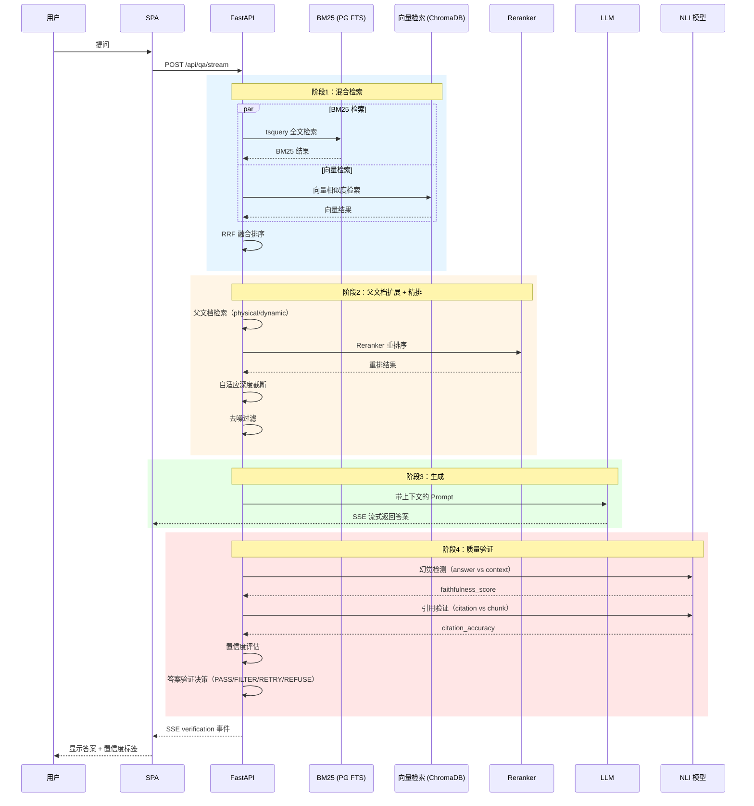
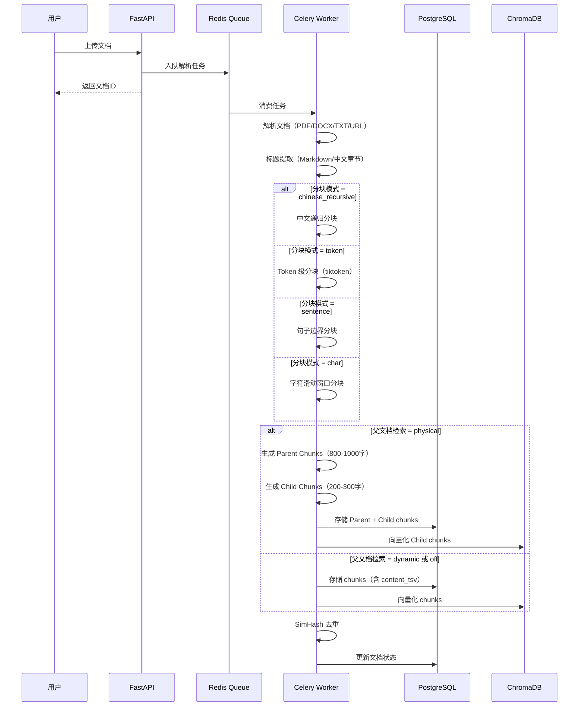
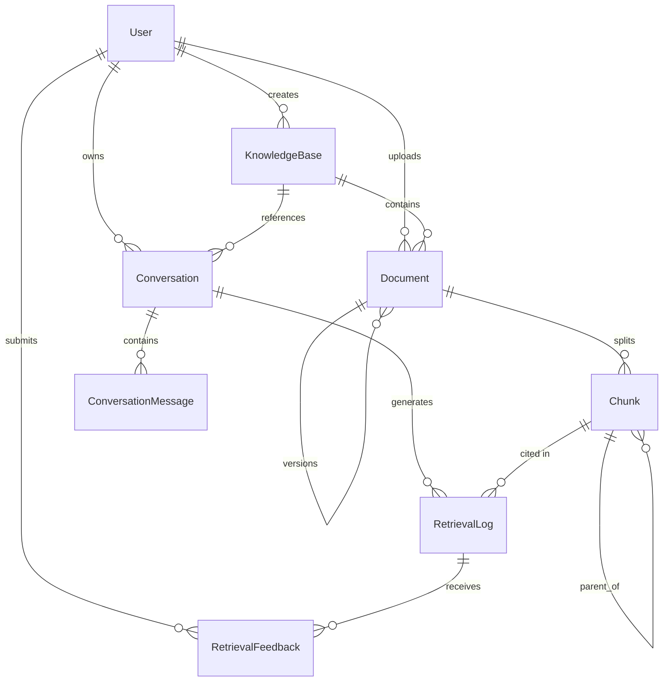
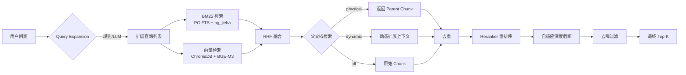
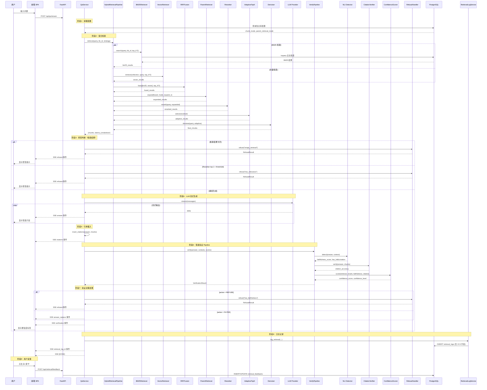

# TRD 技术参考文档 - Enterprise RAG V2.0（检索与质量）

> **文档版本**：v1.2
> **创建日期**：2026-02-23
> **基于文档**：`TRD_Enterprise_RAG_V1.md`、`V2.0_PRD_检索与质量.md`
> **状态**：终稿
> **目标**：从 L1.8 升级到 **L2.5**
> **工期**：8 周（B1 + B2 + 集成验证）

---

## 一、系统概述

### 1.1 版本定位

V2.0 是三阶段升级路线的第一阶段，聚焦两大技术突破：

1. **混合检索引擎**：BM25（PostgreSQL FTS + pg_jieba）+ 向量检索 + RRF 融合 + 父文档检索 + 自适应深度
2. **答案质量保障层**：NLI 幻觉检测 + 置信度评估 + 答案验证 Pipeline + 智能拒答 + 引用验证

### 1.2 技术栈变更

| 层级 | V1 | V2.0 | 变更说明 |
|------|----|----|----------|
| **后端框架** | FastAPI 0.100+ | FastAPI 0.100+ | 不变 |
| **任务队列** | Celery + Redis | Celery + Redis | 不变 |
| **关系数据库** | PostgreSQL 16 | PostgreSQL 16 + **pg_jieba** | 新增中文全文检索扩展 |
| **向量数据库** | ChromaDB | ChromaDB | 不变（V2.2 迁移 Qdrant） |
| **Embedding** | BGE-M3 | BGE-M3 | 不变 |
| **Reranker** | BGE-Reranker-v2-m3 | BGE-Reranker-v2-m3 | 不变 |
| **NLI 模型** | 无 | **cross-encoder/nli-deberta-v3-base** | 新增：幻觉检测 + 引用验证 |
| **LLM** | DeepSeek/OpenAI | **Kimi K2.5 / K2.5-mini / Qwen2.5-7B** | 三级模型架构（V2.0 先接入，V2.1 完善路由） |
| **前端 SPA** | React + Vite + TypeScript | React + Vite + **shadcn/ui + Tailwind CSS + Zustand** | 架构重构：组件化 + 状态管理 + 原子化样式 |
| **容器化** | Docker Compose | Docker Compose | PostgreSQL 镜像升级为自定义镜像 |
| **分词** | 无 | **jieba** | 新增：BM25 分词 + 去噪关键词提取 |
| **Token 计算** | 无 | **tiktoken** | 新增：Token 级分块 |

---

## 二、系统架构

### 2.1 V2.0 整体架构图



### 2.2 V2.0 问答请求流程



### 2.3 文档处理流程（V2.0 升级）



---

## 三、模块设计

### 3.1 后端模块结构（V2.0 变更）

```
backend/
├── main.py
├── app/
│   ├── api/
│   │   ├── auth.py
│   │   ├── knowledge_base.py
│   │   ├── documents.py
│   │   ├── qa.py                    # [升级] 新增 retrieval_mode 参数、验证结果返回
│   │   ├── retrieval.py
│   │   ├── conversations.py
│   │   ├── folder_sync.py
│   │   ├── tasks.py
│   │   └── feedback.py             # [新增] 用户反馈接口
│   │
│   ├── core/
│   │   ├── config.py               # [升级] 新增 V2.0 配置项
│   │   ├── database.py
│   │   ├── security.py
│   │   └── celery_app.py
│   │
│   ├── models/
│   │   ├── user.py
│   │   ├── knowledge_base.py       # [升级] 新增 chunk_mode、parent_retrieval_mode 字段
│   │   ├── document.py
│   │   ├── chunk.py                # [升级] 新增 content_tsv、parent_chunk_id 等字段
│   │   ├── conversation.py
│   │   ├── retrieval_log.py        # [升级] 新增 confidence、faithfulness 等字段；RetrievalFeedback 新增 rating/reason 字段
│   │   └── async_task.py
│   │
│   ├── schemas/
│   │   ├── auth.py
│   │   ├── knowledge_base.py       # [升级] 新增分块/检索配置字段
│   │   ├── document.py
│   │   ├── qa.py                   # [升级] 新增验证结果字段
│   │   └── feedback.py             # [新增] 反馈 Schema
│   │
│   ├── services/
│   │   ├── auth_service.py
│   │   ├── knowledge_base_service.py
│   │   ├── document_service.py
│   │   ├── qa_service.py           # [升级] 集成混合检索 + 验证 Pipeline
│   │   ├── retrieval_log_service.py
│   │   └── feedback_service.py     # [新增] 反馈服务
│   │
│   ├── rag/
│   │   ├── retriever.py            # [升级] 重构为混合检索入口
│   │   ├── bm25_retriever.py       # [新增] BM25 检索器（PG FTS）
│   │   ├── vector_retriever.py     # [新增] 向量检索器（从 retriever.py 拆分）
│   │   ├── rrf_fusion.py           # [新增] RRF 融合算法
│   │   ├── parent_retriever.py     # [新增] 父文档检索（physical + dynamic）
│   │   ├── adaptive_topk.py        # [新增] 自适应检索深度
│   │   ├── denoiser.py             # [新增] 检索结果去噪
│   │   ├── chunker.py              # [升级] 新增中文递归 + Token 级分块
│   │   ├── title_extractor.py      # [新增] 标题提取器
│   │   ├── pipeline.py             # [升级] 集成新检索流程
│   │   ├── dedup.py
│   │   ├── query_expansion.py
│   │   ├── retrieval_strategy.py   # [升级] 策略配置更新
│   │   └── keyword_retriever.py    # [保留] 兼容 V1
│   │
│   ├── verify/                     # [新增] 质量验证模块
│   │   ├── __init__.py
│   │   ├── nli_detector.py         # NLI 幻觉检测
│   │   ├── confidence_scorer.py    # 置信度评估
│   │   ├── citation_verifier.py    # 引用验证
│   │   ├── verify_pipeline.py      # 答案验证 Pipeline
│   │   └── refusal.py              # 智能拒答
│   │
│   ├── llm/
│   │   ├── base.py
│   │   ├── openai_provider.py      # [保留] 兼容 V1
│   │   ├── deepseek_provider.py    # [保留] 兼容 V1
│   │   └── kimi_provider.py        # [新增] Kimi K2.5 提供者
│   │
│   ├── document_parser/
│   │   ├── base.py
│   │   ├── pdf_parser.py
│   │   ├── docx_parser.py
│   │   ├── txt_parser.py
│   │   ├── url_parser.py
│   │   └── parser_factory.py
│   │
│   └── tasks/
│       ├── parse.py                # [升级] 集成新分块流程
│       └── sync.py
│
└── tests/
    ├── test_bm25_retriever.py      # [新增]
    ├── test_rrf_fusion.py          # [新增]
    ├── test_parent_retriever.py    # [新增]
    ├── test_adaptive_topk.py       # [新增]
    ├── test_denoiser.py            # [新增]
    ├── test_chunker_v2.py          # [新增]
    ├── test_nli_detector.py        # [新增]
    ├── test_confidence_scorer.py   # [新增]
    ├── test_verify_pipeline.py     # [新增]
    └── test_citation_verifier.py   # [新增]
```

### 3.2 前端架构设计（V2.0 全面重构）

#### 3.2.1 重构背景

V1 前端存在以下架构问题，无法支撑 V2.0 及后续迭代：

| 问题 | V1 现状 | V2.0 目标 |
|------|---------|----------|
| 样式方案 | 全部 inline style（`style={{...}}`） | Tailwind CSS 原子化样式 |
| 组件复用 | 零可复用组件，每页面重复写弹窗/按钮/表格 | shadcn/ui 基础组件 + 业务组件库 |
| 状态管理 | 纯 useState，无全局状态 | Zustand 全局状态管理 |
| API 层 | 单文件 api.ts（500+ 行），手写 fetch | axios + 模块化 API + 请求拦截器 |
| 页面结构 | 巨型单文件（QA.tsx 590 行） | 拆分为页面 + 子组件（每文件 < 200 行） |
| SSE 处理 | 内嵌在 api.ts 中，缺少 V2.0 新事件 | useStreamQA hook，支持 verification/refused |
| 路由 | 每个路由手动包裹 RequireAuth + Layout | 统一路由配置 + 懒加载 |

#### 3.2.2 技术栈

| 层级 | 技术 | 版本 | 说明 |
|------|------|------|------|
| UI 组件 | shadcn/ui（基于 Radix UI） | latest | 复制到项目中，完全可定制 |
| 样式 | Tailwind CSS | 3.x | 原子化 CSS，暗色模式天然支持 |
| 状态管理 | Zustand | 4.x | 极简全局状态管理 |
| HTTP 客户端 | axios | 1.x | 拦截器、取消、类型支持 |
| 路由 | react-router-dom | 6.x | 保持不变，加入 lazy loading |
| 图标 | lucide-react | latest | 现代 SVG 图标库（shadcn/ui 默认） |
| 工具 | clsx + tailwind-merge | latest | class 合并工具 |
| 构建 | Vite + tailwindcss + postcss + autoprefixer | 5.x / 3.x | Tailwind 集成 |

#### 3.2.3 目录结构

```
frontend_spa/
├── src/
│   ├── components/                        # 可复用组件
│   │   ├── ui/                            # shadcn/ui 基础组件（本地复制，可自由修改）
│   │   │   ├── button.tsx
│   │   │   ├── card.tsx
│   │   │   ├── dialog.tsx                 # Modal 弹窗
│   │   │   ├── select.tsx
│   │   │   ├── input.tsx
│   │   │   ├── textarea.tsx
│   │   │   ├── badge.tsx                  # 标签（置信度等级等）
│   │   │   ├── table.tsx
│   │   │   ├── tabs.tsx
│   │   │   ├── dropdown-menu.tsx
│   │   │   ├── tooltip.tsx
│   │   │   ├── alert.tsx
│   │   │   ├── popover.tsx                # 弹出层（反馈原因输入等）
│   │   │   ├── progress.tsx
│   │   │   ├── separator.tsx
│   │   │   ├── sheet.tsx                  # 侧滑面板
│   │   │   └── toast.tsx                  # 全局通知
│   │   │
│   │   ├── layout/                        # 布局组件
│   │   │   ├── AppLayout.tsx              # 主布局（Header + Sidebar + Content）
│   │   │   ├── AppHeader.tsx              # 顶部导航栏
│   │   │   ├── AppSidebar.tsx             # 侧边导航（可折叠）
│   │   │   └── index.ts
│   │   │
│   │   ├── qa/                            # [V2.0 核心] 问答业务组件
│   │   │   ├── ChatMessage.tsx            # 单条消息（用户/助手/拒答）
│   │   │   ├── ChatInput.tsx              # 输入区域（textarea + 发送/停止）
│   │   │   ├── ConfidenceBadge.tsx        # [新增] 置信度标签 🟢🟡🔴
│   │   │   ├── RefusalAlert.tsx           # [新增] 拒答提示组件
│   │   │   ├── FeedbackPanel.tsx          # [新增] 反馈面板（👍👎 + 文字原因）
│   │   │   ├── CitationPopover.tsx        # 引用悬浮卡片
│   │   │   └── QASettingsSheet.tsx        # 检索设置侧滑面板
│   │   │
│   │   ├── knowledge-base/               # 知识库业务组件
│   │   │   ├── ChunkModeSelect.tsx        # [新增] 分块模式选择器
│   │   │   ├── ParentRetrievalConfig.tsx  # [新增] 父文档检索配置
│   │   │   ├── DocumentUploadZone.tsx     # 文档拖拽上传区域
│   │   │   └── DocumentTable.tsx          # 文档列表表格
│   │   │
│   │   └── common/                        # 通用业务组件
│   │       ├── PageHeader.tsx             # 页面标题 + 面包屑
│   │       ├── StatCard.tsx               # 统计卡片
│   │       ├── EmptyState.tsx             # 空状态占位
│   │       └── LoadingSpinner.tsx         # 加载指示器
│   │
│   ├── pages/                             # 页面组件（每个 < 200 行）
│   │   ├── login.tsx
│   │   ├── home.tsx
│   │   ├── qa.tsx                         # [重构] 590 行 → ~150 行 + 7 个子组件
│   │   ├── knowledge-bases/
│   │   │   ├── index.tsx                  # 知识库列表
│   │   │   ├── [id].tsx                   # 知识库详情（文档管理）
│   │   │   └── [id]/edit.tsx              # 知识库编辑
│   │   ├── conversations.tsx
│   │   ├── dashboard.tsx
│   │   ├── folder-sync.tsx
│   │   ├── tasks.tsx
│   │   └── share/[id].tsx
│   │
│   ├── stores/                            # Zustand 状态管理
│   │   ├── auth-store.ts                  # 认证状态（token、user、login/logout）
│   │   ├── qa-store.ts                    # QA 会话状态（messages、streaming、verification）
│   │   └── app-store.ts                   # 全局 UI 状态（sidebar collapsed、theme）
│   │
│   ├── api/                               # API 层（模块化）
│   │   ├── client.ts                      # axios 实例（baseURL、拦截器、token 注入、401 处理）
│   │   ├── types.ts                       # 所有 API 类型定义
│   │   ├── auth.ts                        # 认证 API
│   │   ├── knowledge-base.ts              # 知识库 API
│   │   ├── document.ts                    # 文档 API
│   │   ├── qa.ts                          # 问答 API（含 SSE 流式）
│   │   ├── feedback.ts                    # [新增] 反馈 API
│   │   ├── conversation.ts               # 对话 API
│   │   ├── dashboard.ts                  # 看板 API
│   │   ├── task.ts                        # 异步任务 API
│   │   └── folder-sync.ts                # 文件夹同步 API
│   │
│   ├── hooks/                             # 自定义 Hooks
│   │   ├── use-stream-qa.ts              # [核心] SSE 流式问答（含 verification/refused 事件）
│   │   ├── use-auth.ts                   # 认证 hook（封装 authStore）
│   │   └── use-debounce.ts               # 防抖 hook
│   │
│   ├── lib/                               # 工具函数
│   │   └── utils.ts                       # cn() helper（clsx + tailwind-merge）
│   │
│   ├── router/                            # 路由配置
│   │   ├── index.tsx                      # 路由定义（React.lazy 懒加载）
│   │   └── auth-guard.tsx                # 认证守卫
│   │
│   ├── App.tsx                            # 精简为路由入口
│   ├── main.tsx                           # 应用挂载
│   └── index.css                          # Tailwind directives + CSS 变量
│
├── components.json                        # shadcn/ui 配置
├── tailwind.config.ts                     # Tailwind 主题配置
├── postcss.config.js                      # PostCSS 配置
├── package.json
├── vite.config.ts
└── tsconfig.json
```

#### 3.2.4 核心模块设计

##### 3.2.4.1 状态管理（Zustand）

**stores/auth-store.ts**

```typescript
import { create } from 'zustand';
import { persist } from 'zustand/middleware';

interface AuthState {
  token: string | null;
  username: string | null;
  login: (token: string, username: string) => void;
  logout: () => void;
  isAuthenticated: () => boolean;
}

export const useAuthStore = create<AuthState>()(
  persist(
    (set, get) => ({
      token: null,
      username: null,
      login: (token, username) => set({ token, username }),
      logout: () => {
        set({ token: null, username: null });
        window.location.href = '/login';
      },
      isAuthenticated: () => !!get().token,
    }),
    { name: 'enterprise-rag-auth' }
  )
);
```

**stores/qa-store.ts**

```typescript
import { create } from 'zustand';

interface VerificationResult {
  confidence_score: number;
  confidence_level: 'high' | 'medium' | 'low';
  faithfulness_score: number;
  has_hallucination: boolean;
  citation_accuracy: number;
}

interface RefusalInfo {
  reason: 'empty_retrieval' | 'low_relevance' | 'low_faithfulness';
  message: string;
}

interface Message {
  id: string;
  role: 'user' | 'assistant';
  content: string;
  citations?: Citation[];
  retrievalLogId?: number;
  feedback?: 'thumbs_up' | 'thumbs_down';
  verification?: VerificationResult;
  refused?: RefusalInfo;
}

interface QAState {
  messages: Message[];
  streaming: boolean;
  currentAnswer: string;
  currentVerification: VerificationResult | null;
  conversationId: string | undefined;
  addUserMessage: (content: string) => void;
  appendAnswer: (delta: string) => void;
  finalizeAnswer: (citations: Citation[], logId: number) => void;
  setVerification: (v: VerificationResult) => void;
  setRefused: (info: RefusalInfo) => void;
  setFeedback: (messageId: string, feedback: 'thumbs_up' | 'thumbs_down') => void;
  resetChat: () => void;
}

export const useQAStore = create<QAState>()((set, get) => ({
  messages: [],
  streaming: false,
  currentAnswer: '',
  currentVerification: null,
  conversationId: undefined,
  // ... actions
}));
```

##### 3.2.4.2 API 客户端（axios）

**api/client.ts**

```typescript
import axios from 'axios';
import { useAuthStore } from '@/stores/auth-store';

const API_BASE = import.meta.env.VITE_API_BASE || '';

export const apiClient = axios.create({
  baseURL: API_BASE,
  timeout: 30000,
  headers: { 'Content-Type': 'application/json' },
});

// 请求拦截：注入 token
apiClient.interceptors.request.use((config) => {
  const token = useAuthStore.getState().token;
  if (token) {
    config.headers.Authorization = `Bearer ${token}`;
  }
  return config;
});

// 响应拦截：401 自动登出
apiClient.interceptors.response.use(
  (response) => response,
  (error) => {
    if (error.response?.status === 401) {
      useAuthStore.getState().logout();
    }
    return Promise.reject(error);
  }
);
```

##### 3.2.4.3 SSE 流式问答 Hook

**hooks/use-stream-qa.ts**

```typescript
import { useRef, useCallback } from 'react';
import { useQAStore } from '@/stores/qa-store';
import { useAuthStore } from '@/stores/auth-store';

interface StreamQAParams {
  knowledgeBaseId: number;
  question: string;
  strategy?: string;
  retrievalMode?: 'vector' | 'bm25' | 'hybrid';
  topK?: number;
  systemPromptVersion?: 'A' | 'B' | 'C';
  queryExpansionMode?: 'rule' | 'llm' | 'hybrid';
}

export function useStreamQA() {
  const abortRef = useRef<AbortController | null>(null);
  const store = useQAStore();
  const token = useAuthStore((s) => s.token);

  const ask = useCallback(async (params: StreamQAParams) => {
    abortRef.current = new AbortController();
    store.addUserMessage(params.question);

    const body = {
      knowledge_base_id: params.knowledgeBaseId,
      question: params.question,
      strategy: params.strategy,
      retrieval_mode: params.retrievalMode ?? 'hybrid',
      top_k: params.topK,
      system_prompt_version: params.systemPromptVersion,
      query_expansion_mode: params.queryExpansionMode,
    };

    const response = await fetch(`${import.meta.env.VITE_API_BASE || ''}/api/qa/stream`, {
      method: 'POST',
      headers: {
        'Content-Type': 'application/json',
        ...(token ? { Authorization: `Bearer ${token}` } : {}),
      },
      body: JSON.stringify(body),
      signal: abortRef.current.signal,
    });

    const reader = response.body?.getReader();
    if (!reader) return;

    const decoder = new TextDecoder();
    let buffer = '';

    while (true) {
      const { done, value } = await reader.read();
      if (done) break;

      buffer += decoder.decode(value, { stream: true });
      const lines = buffer.split('\n');
      buffer = lines.pop() || '';

      for (const line of lines) {
        if (!line.startsWith('data: ')) continue;
        const jsonStr = line.slice(6).trim();
        if (jsonStr === '[DONE]') {
          store.finalizeCurrentMessage();
          return;
        }

        try {
          const event = JSON.parse(jsonStr);
          switch (event.type) {
            case 'answer':
              store.appendAnswer(event.delta);
              break;
            case 'citations':
              store.setCitations(event.data);
              break;
            case 'retrieval_log_id':
              store.setRetrievalLogId(event.data);
              break;
            case 'verification':
              // V2.0 新增：答案验证结果
              store.setVerification(event.data);
              break;
            case 'refused':
              // V2.0 新增：拒答事件
              store.setRefused(event.data);
              break;
            case 'error':
              store.setError(event.message);
              break;
          }
        } catch {
          // ignore parse errors
        }
      }
    }
  }, [token, store]);

  const stop = useCallback(() => {
    abortRef.current?.abort();
  }, []);

  return { ask, stop };
}
```

##### 3.2.4.4 布局组件（从 V1 重构）

> V1 的 `Layout.tsx`（内联样式 + 一体化结构）拆分为三个独立组件，使用 shadcn/ui + Tailwind 重写。

**components/layout/AppLayout.tsx**

```typescript
import { Outlet } from 'react-router-dom';
import { AppHeader } from './AppHeader';
import { AppSidebar } from './AppSidebar';
import { useAppStore } from '@/stores/app-store';
import { cn } from '@/lib/utils';

export function AppLayout() {
  const sidebarCollapsed = useAppStore((s) => s.sidebarCollapsed);

  return (
    <div className="flex h-screen bg-background text-foreground">
      <AppSidebar collapsed={sidebarCollapsed} />
      <div
        className={cn(
          'flex flex-1 flex-col transition-all duration-200',
          sidebarCollapsed ? 'ml-16' : 'ml-60'
        )}
      >
        <AppHeader />
        <main className="flex-1 overflow-auto p-6">
          <Outlet />
        </main>
      </div>
    </div>
  );
}
```

**components/layout/AppHeader.tsx**

```typescript
import { Menu, LogOut, User } from 'lucide-react';
import { Button } from '@/components/ui/button';
import { useAuthStore } from '@/stores/auth-store';
import { useAppStore } from '@/stores/app-store';

export function AppHeader() {
  const toggleSidebar = useAppStore((s) => s.toggleSidebar);
  const { username, logout } = useAuthStore();

  return (
    <header className="flex h-14 items-center justify-between border-b bg-card px-4">
      <Button variant="ghost" size="icon" onClick={toggleSidebar}>
        <Menu className="h-5 w-5" />
      </Button>

      <div className="flex items-center gap-3">
        <span className="flex items-center gap-1 text-sm text-muted-foreground">
          <User className="h-4 w-4" />
          {username}
        </span>
        <Button variant="ghost" size="sm" onClick={logout}>
          <LogOut className="h-4 w-4 mr-1" />
          退出
        </Button>
      </div>
    </header>
  );
}
```

**components/layout/AppSidebar.tsx**

```typescript
import { NavLink } from 'react-router-dom';
import { cn } from '@/lib/utils';
import {
  MessageSquare, Database, History, BarChart3,
  FolderSync, ListTodo, Settings,
} from 'lucide-react';

interface AppSidebarProps {
  collapsed: boolean;
}

const NAV_ITEMS = [
  { to: '/qa',              icon: MessageSquare, label: '智能问答' },
  { to: '/knowledge-bases', icon: Database,      label: '知识库管理' },
  { to: '/conversations',   icon: History,       label: '对话记录' },
  { to: '/dashboard',       icon: BarChart3,     label: '数据看板' },
  { to: '/folder-sync',     icon: FolderSync,    label: '文件夹同步' },
  { to: '/tasks',           icon: ListTodo,      label: '异步任务' },
];

export function AppSidebar({ collapsed }: AppSidebarProps) {
  return (
    <aside
      className={cn(
        'fixed inset-y-0 left-0 z-30 flex flex-col border-r bg-card transition-all duration-200',
        collapsed ? 'w-16' : 'w-60'
      )}
    >
      {/* Logo */}
      <div className="flex h-14 items-center justify-center border-b">
        {collapsed ? (
          <span className="text-lg font-bold text-primary">E</span>
        ) : (
          <span className="text-lg font-bold text-primary">Enterprise RAG</span>
        )}
      </div>

      {/* Navigation */}
      <nav className="flex-1 space-y-1 p-2">
        {NAV_ITEMS.map((item) => (
          <NavLink
            key={item.to}
            to={item.to}
            className={({ isActive }) =>
              cn(
                'flex items-center gap-3 rounded-md px-3 py-2 text-sm transition-colors',
                isActive
                  ? 'bg-primary/10 text-primary font-medium'
                  : 'text-muted-foreground hover:bg-accent hover:text-accent-foreground',
                collapsed && 'justify-center px-2'
              )
            }
          >
            <item.icon className="h-5 w-5 shrink-0" />
            {!collapsed && <span>{item.label}</span>}
          </NavLink>
        ))}
      </nav>
    </aside>
  );
}
```

**stores/app-store.ts**（全局 UI 状态）

```typescript
import { create } from 'zustand';
import { persist } from 'zustand/middleware';

interface AppState {
  sidebarCollapsed: boolean;
  toggleSidebar: () => void;
}

export const useAppStore = create<AppState>()(
  persist(
    (set) => ({
      sidebarCollapsed: false,
      toggleSidebar: () => set((s) => ({ sidebarCollapsed: !s.sidebarCollapsed })),
    }),
    { name: 'enterprise-rag-app' }
  )
);
```

##### 3.2.4.5 V2.0 核心业务组件

**components/qa/ConfidenceBadge.tsx**

```typescript
import { Badge } from '@/components/ui/badge';
import { cn } from '@/lib/utils';
import { ShieldCheck, ShieldAlert, ShieldX, ShieldOff } from 'lucide-react';

interface ConfidenceBadgeProps {
  level: 'high' | 'medium' | 'low' | 'refused';
  score?: number;
}

const CONFIG = {
  high:    { icon: ShieldCheck, className: 'bg-green-100 text-green-800 border-green-200', text: '高置信度' },
  medium:  { icon: ShieldAlert, className: 'bg-yellow-100 text-yellow-800 border-yellow-200', text: '中置信度' },
  low:     { icon: ShieldX,     className: 'bg-red-100 text-red-800 border-red-200', text: '低置信度' },
  refused: { icon: ShieldOff,   className: 'bg-gray-100 text-gray-600 border-gray-200', text: '拒绝回答' },
} as const;

export function ConfidenceBadge({ level, score }: ConfidenceBadgeProps) {
  const config = CONFIG[level];
  const Icon = config.icon;
  return (
    <Badge variant="outline" className={cn('gap-1 font-normal', config.className)}>
      <Icon className="h-3 w-3" />
      {config.text}
      {score !== undefined && ` ${(score * 100).toFixed(0)}%`}
    </Badge>
  );
}
```

**components/qa/RefusalAlert.tsx**

```typescript
import { Alert, AlertDescription, AlertTitle } from '@/components/ui/alert';
import { AlertCircle } from 'lucide-react';

interface RefusalAlertProps {
  reason: string;
  message: string;
}

export function RefusalAlert({ reason, message }: RefusalAlertProps) {
  return (
    <Alert variant="destructive" className="my-4">
      <AlertCircle className="h-4 w-4" />
      <AlertTitle>无法提供可靠回答</AlertTitle>
      <AlertDescription className="whitespace-pre-wrap">{message}</AlertDescription>
    </Alert>
  );
}
```

**components/qa/FeedbackPanel.tsx**

```typescript
import { useState } from 'react';
import { Button } from '@/components/ui/button';
import { Textarea } from '@/components/ui/textarea';
import { Popover, PopoverContent, PopoverTrigger } from '@/components/ui/popover';
import { ThumbsUp, ThumbsDown } from 'lucide-react';
import { submitFeedback } from '@/api/feedback';

interface FeedbackPanelProps {
  retrievalLogId: number;
  currentFeedback?: 'thumbs_up' | 'thumbs_down';
  onFeedbackSubmitted: (feedback: 'thumbs_up' | 'thumbs_down') => void;
}

export function FeedbackPanel({ retrievalLogId, currentFeedback, onFeedbackSubmitted }: FeedbackPanelProps) {
  const [reason, setReason] = useState('');
  const [reasonOpen, setReasonOpen] = useState(false);

  const handleThumbsUp = async () => {
    await submitFeedback(retrievalLogId, 'thumbs_up');
    onFeedbackSubmitted('thumbs_up');
  };

  const handleThumbsDown = async () => {
    await submitFeedback(retrievalLogId, 'thumbs_down', reason || undefined);
    onFeedbackSubmitted('thumbs_down');
    setReasonOpen(false);
    setReason('');
  };

  if (currentFeedback) {
    return (
      <span className="text-xs text-muted-foreground">
        {currentFeedback === 'thumbs_up' ? '👍 已标记为有帮助' : '👎 已标记为无帮助'}
      </span>
    );
  }

  return (
    <div className="flex items-center gap-1 mt-2">
      <Button variant="ghost" size="sm" className="h-7 px-2" onClick={handleThumbsUp}>
        <ThumbsUp className="h-3.5 w-3.5" />
      </Button>
      <Popover open={reasonOpen} onOpenChange={setReasonOpen}>
        <PopoverTrigger asChild>
          <Button variant="ghost" size="sm" className="h-7 px-2">
            <ThumbsDown className="h-3.5 w-3.5" />
          </Button>
        </PopoverTrigger>
        <PopoverContent className="w-72">
          <div className="space-y-2">
            <p className="text-sm font-medium">请告诉我们哪里不好</p>
            <Textarea
              placeholder="可选：描述具体问题..."
              value={reason}
              onChange={(e) => setReason(e.target.value)}
              className="min-h-[60px]"
            />
            <Button size="sm" className="w-full" onClick={handleThumbsDown}>
              提交反馈
            </Button>
          </div>
        </PopoverContent>
      </Popover>
    </div>
  );
}
```

**components/qa/ChatMessage.tsx**

```typescript
import { cn } from '@/lib/utils';
import { ConfidenceBadge } from './ConfidenceBadge';
import { RefusalAlert } from './RefusalAlert';
import { FeedbackPanel } from './FeedbackPanel';
import { CitationPopover } from './CitationPopover';
import type { Message } from '@/stores/qa-store';

interface ChatMessageProps {
  message: Message;
  onFeedback: (messageId: string, feedback: 'thumbs_up' | 'thumbs_down') => void;
}

export function ChatMessage({ message, onFeedback }: ChatMessageProps) {
  const isUser = message.role === 'user';

  if (message.refused) {
    return <RefusalAlert reason={message.refused.reason} message={message.refused.message} />;
  }

  return (
    <div className={cn('flex mb-6', isUser ? 'justify-end' : 'justify-start')}>
      <div className={cn(
        'max-w-[70%] rounded-2xl px-4 py-3 shadow-sm',
        isUser ? 'bg-blue-50 rounded-br-sm' : 'bg-white rounded-bl-sm border'
      )}>
        {/* 角色标签 */}
        <div className="text-xs text-muted-foreground mb-2">
          {isUser ? '用户' : '助手'}
        </div>

        {/* 消息内容 */}
        <div className="whitespace-pre-wrap leading-relaxed text-sm">
          {isUser ? message.content : renderAnswerWithCitations(message.content, message.citations)}
        </div>

        {/* 引用来源 */}
        {!isUser && message.citations?.length > 0 && (
          <div className="mt-3 space-y-1">
            <p className="text-xs text-muted-foreground">引用来源</p>
            {message.citations.map((cite, idx) => (
              <CitationPopover key={idx} citation={cite} />
            ))}
          </div>
        )}

        {/* 置信度标签 */}
        {!isUser && message.verification && (
          <div className="mt-3">
            <ConfidenceBadge
              level={message.verification.confidence_level}
              score={message.verification.confidence_score}
            />
          </div>
        )}

        {/* 反馈按钮 */}
        {!isUser && message.retrievalLogId && (
          <FeedbackPanel
            retrievalLogId={message.retrievalLogId}
            currentFeedback={message.feedback}
            onFeedbackSubmitted={(fb) => onFeedback(message.id, fb)}
          />
        )}
      </div>
    </div>
  );
}
```

**components/knowledge-base/ChunkModeSelect.tsx**

```typescript
import { Select, SelectContent, SelectItem, SelectTrigger, SelectValue } from '@/components/ui/select';

interface ChunkModeSelectProps {
  value: string;
  onChange: (value: string) => void;
}

const MODES = [
  { value: 'chinese_recursive', label: '中文递归分块', desc: '按中文语义边界递归切分，推荐' },
  { value: 'token',             label: 'Token 级分块', desc: '按 Token 数控制大小，贴合 LLM 上下文' },
  { value: 'sentence',          label: '句子边界分块', desc: '按句子和段落边界切分' },
  { value: 'char',              label: '字符滑动窗口', desc: '固定大小滑动窗口，V1 兼容模式' },
];

export function ChunkModeSelect({ value, onChange }: ChunkModeSelectProps) {
  return (
    <Select value={value} onValueChange={onChange}>
      <SelectTrigger className="w-full">
        <SelectValue placeholder="选择分块模式" />
      </SelectTrigger>
      <SelectContent>
        {MODES.map((mode) => (
          <SelectItem key={mode.value} value={mode.value}>
            <div>
              <div className="font-medium">{mode.label}</div>
              <div className="text-xs text-muted-foreground">{mode.desc}</div>
            </div>
          </SelectItem>
        ))}
      </SelectContent>
    </Select>
  );
}
```

**components/knowledge-base/ParentRetrievalConfig.tsx**

```typescript
import { Select, SelectContent, SelectItem, SelectTrigger, SelectValue } from '@/components/ui/select';
import { Input } from '@/components/ui/input';
import { Label } from '@/components/ui/label';

interface ParentRetrievalConfigProps {
  mode: 'physical' | 'dynamic' | 'off';
  expandN: number;
  onModeChange: (mode: 'physical' | 'dynamic' | 'off') => void;
  onExpandNChange: (n: number) => void;
}

export function ParentRetrievalConfig({ mode, expandN, onModeChange, onExpandNChange }: ParentRetrievalConfigProps) {
  return (
    <div className="space-y-4">
      <div className="space-y-2">
        <Label>父文档检索模式</Label>
        <Select value={mode} onValueChange={onModeChange}>
          <SelectTrigger><SelectValue /></SelectTrigger>
          <SelectContent>
            <SelectItem value="dynamic">动态扩展（推荐，无需重新索引）</SelectItem>
            <SelectItem value="physical">物理双层（精确，需重新索引）</SelectItem>
            <SelectItem value="off">关闭（V1 兼容模式）</SelectItem>
          </SelectContent>
        </Select>
      </div>

      {mode === 'dynamic' && (
        <div className="space-y-2">
          <Label>扩展相邻 chunk 数</Label>
          <Input
            type="number"
            min={1}
            max={5}
            value={expandN}
            onChange={(e) => onExpandNChange(Number(e.target.value))}
          />
          <p className="text-xs text-muted-foreground">
            检索命中后，向前后各扩展 N 个相邻 chunk 作为完整上下文
          </p>
        </div>
      )}
    </div>
  );
}
```

**components/qa/QASettingsSheet.tsx**

```typescript
import { Sheet, SheetContent, SheetHeader, SheetTitle, SheetTrigger } from '@/components/ui/sheet';
import { Select, SelectContent, SelectItem, SelectTrigger, SelectValue } from '@/components/ui/select';
import { Label } from '@/components/ui/label';
import { Input } from '@/components/ui/input';
import { Button } from '@/components/ui/button';
import { Settings } from 'lucide-react';

interface QASettings {
  strategy: 'default' | 'high_recall' | 'high_precision' | 'low_latency';
  retrievalMode: 'vector' | 'bm25' | 'hybrid';
  topK: number;
  systemPromptVersion: 'A' | 'B' | 'C';
  queryExpansionMode: 'rule' | 'llm' | 'hybrid';
}

interface QASettingsSheetProps {
  settings: QASettings;
  onChange: (settings: QASettings) => void;
}

const STRATEGIES = [
  { value: 'default',        label: '默认策略',   desc: '平衡召回与精度' },
  { value: 'high_recall',    label: '高召回策略', desc: '优先覆盖更多相关文档' },
  { value: 'high_precision', label: '高精度策略', desc: '优先答案准确性' },
  { value: 'low_latency',    label: '低延迟策略', desc: '优先响应速度' },
];

export function QASettingsSheet({ settings, onChange }: QASettingsSheetProps) {
  const update = <K extends keyof QASettings>(key: K, value: QASettings[K]) =>
    onChange({ ...settings, [key]: value });

  return (
    <Sheet>
      <SheetTrigger asChild>
        <Button variant="outline" size="icon" title="检索设置">
          <Settings className="h-4 w-4" />
        </Button>
      </SheetTrigger>
      <SheetContent>
        <SheetHeader>
          <SheetTitle>检索设置</SheetTitle>
        </SheetHeader>

        <div className="mt-6 space-y-6">
          {/* 检索策略 */}
          <div className="space-y-2">
            <Label>检索策略</Label>
            <Select value={settings.strategy} onValueChange={(v) => update('strategy', v as QASettings['strategy'])}>
              <SelectTrigger><SelectValue /></SelectTrigger>
              <SelectContent>
                {STRATEGIES.map((s) => (
                  <SelectItem key={s.value} value={s.value}>
                    <div>
                      <div className="font-medium">{s.label}</div>
                      <div className="text-xs text-muted-foreground">{s.desc}</div>
                    </div>
                  </SelectItem>
                ))}
              </SelectContent>
            </Select>
          </div>

          {/* 检索模式 */}
          <div className="space-y-2">
            <Label>检索模式</Label>
            <Select value={settings.retrievalMode} onValueChange={(v) => update('retrievalMode', v as QASettings['retrievalMode'])}>
              <SelectTrigger><SelectValue /></SelectTrigger>
              <SelectContent>
                <SelectItem value="hybrid">混合检索（BM25 + 向量）</SelectItem>
                <SelectItem value="vector">纯向量检索</SelectItem>
                <SelectItem value="bm25">纯 BM25 检索</SelectItem>
              </SelectContent>
            </Select>
          </div>

          {/* Top-K */}
          <div className="space-y-2">
            <Label>返回条数（Top-K）</Label>
            <Input
              type="number" min={1} max={20}
              value={settings.topK}
              onChange={(e) => update('topK', Number(e.target.value))}
            />
          </div>

          {/* Prompt 版本 */}
          <div className="space-y-2">
            <Label>System Prompt 版本</Label>
            <Select value={settings.systemPromptVersion} onValueChange={(v) => update('systemPromptVersion', v as QASettings['systemPromptVersion'])}>
              <SelectTrigger><SelectValue /></SelectTrigger>
              <SelectContent>
                <SelectItem value="A">版本 A（标准）</SelectItem>
                <SelectItem value="B">版本 B（严格引用）</SelectItem>
                <SelectItem value="C">版本 C（结构化输出）</SelectItem>
              </SelectContent>
            </Select>
          </div>

          {/* 查询扩展 */}
          <div className="space-y-2">
            <Label>查询扩展模式</Label>
            <Select value={settings.queryExpansionMode} onValueChange={(v) => update('queryExpansionMode', v as QASettings['queryExpansionMode'])}>
              <SelectTrigger><SelectValue /></SelectTrigger>
              <SelectContent>
                <SelectItem value="rule">规则扩展</SelectItem>
                <SelectItem value="llm">LLM 扩展</SelectItem>
                <SelectItem value="hybrid">混合扩展</SelectItem>
              </SelectContent>
            </Select>
          </div>
        </div>
      </SheetContent>
    </Sheet>
  );
}
```

##### 3.2.4.6 API 类型定义（api/types.ts）

> V2.0 新增了大量 API 响应字段，统一定义在 `api/types.ts` 中，作为前端 API 层的类型中枢。

```typescript
// ========== 通用 ==========
export interface ApiResponse<T = unknown> {
  code: number;
  data: T;
  message?: string;
}

// ========== 认证 ==========
export interface LoginRequest { username: string; password: string; totp_code?: string }
export interface LoginResponse { access_token: string; token_type: string }
export interface UserInfo { id: number; username: string; role: string }

// ========== 知识库（V2.0 扩展） ==========
export interface KnowledgeBase {
  id: number;
  name: string;
  description: string;
  collection_name: string;
  chunk_mode: 'chinese_recursive' | 'token' | 'sentence' | 'char';
  parent_retrieval_mode: 'physical' | 'dynamic' | 'off';
  dynamic_expand_n: number;
  document_count: number;
  created_at: string;
  updated_at: string;
}

export interface KnowledgeBaseCreateRequest {
  name: string;
  description?: string;
  chunk_mode?: KnowledgeBase['chunk_mode'];
  parent_retrieval_mode?: KnowledgeBase['parent_retrieval_mode'];
  dynamic_expand_n?: number;
}

export type KnowledgeBaseUpdateRequest = Partial<KnowledgeBaseCreateRequest>;

// ========== 文档 ==========
export interface Document {
  id: number;
  filename: string;
  status: 'pending' | 'parsing' | 'parsed' | 'parse_failed';
  parser_message?: string;
  chunk_count?: number;
  created_at: string;
}

// ========== 问答（V2.0 核心扩展） ==========
export interface Citation {
  id: number;
  chunk_id?: string;
  document_id: number;
  filename?: string;
  chunk_index: number;
  snippet: string;
  reason: string;
  source?: 'vector' | 'bm25' | 'both';
}

export interface VerificationResult {
  confidence_score: number;
  confidence_level: 'high' | 'medium' | 'low';
  faithfulness_score: number;
  has_hallucination: boolean;
  citation_accuracy: number;
}

export interface RefusalInfo {
  reason: 'empty_retrieval' | 'low_relevance' | 'low_faithfulness';
  message: string;
}

export interface QAAskRequest {
  knowledge_base_id: number;
  question: string;
  top_k?: number;
  strategy?: 'default' | 'high_recall' | 'high_precision' | 'low_latency';
  retrieval_mode?: 'vector' | 'bm25' | 'hybrid';
  system_prompt_version?: 'A' | 'B' | 'C';
  conversation_id?: string;
  history_turns?: number;
  query_expansion_mode?: 'rule' | 'llm' | 'hybrid';
}

export interface QAAskResponse {
  answer: string;
  citations: Citation[];
  retrieved_count: number;
  llm_failed: boolean;
  retrieval_log_id: number | null;
  confidence_score: number | null;
  confidence_level: string | null;
  faithfulness_score: number | null;
  has_hallucination: boolean;
  citation_accuracy: number | null;
  refusal_reason: string | null;
}

// SSE 事件类型
export type SSEEvent =
  | { type: 'answer'; delta: string }
  | { type: 'citations'; data: Citation[] }
  | { type: 'retrieval_log_id'; data: number }
  | { type: 'verification'; data: VerificationResult }
  | { type: 'refused'; data: RefusalInfo }
  | { type: 'answer_replace'; data: string }
  | { type: 'error'; message: string };

// ========== 用户反馈（V2.0 新增） ==========
export interface FeedbackSubmitRequest {
  retrieval_log_id: number;
  rating: 'thumbs_up' | 'thumbs_down';
  reason?: string;
}

export interface FeedbackResponse {
  id: string;
  rating: 'thumbs_up' | 'thumbs_down';
  reason?: string;
  created_at: string;
}

// ========== 对话 ==========
export interface Conversation {
  id: string;
  knowledge_base_id: number;
  title: string;
  message_count: number;
  created_at: string;
  updated_at: string;
}

// ========== 异步任务 ==========
export interface AsyncTask {
  id: string;
  task_type: string;
  status: 'pending' | 'running' | 'completed' | 'failed';
  progress: number;
  result_message?: string;
  created_at: string;
}
```

##### 3.2.4.7 路由配置（懒加载）

**router/index.tsx**

```typescript
import { lazy, Suspense } from 'react';
import { BrowserRouter, Routes, Route, Navigate } from 'react-router-dom';
import { AuthGuard } from './auth-guard';
import { AppLayout } from '@/components/layout';
import LoadingSpinner from '@/components/common/LoadingSpinner';

const Login = lazy(() => import('@/pages/login'));
const Home = lazy(() => import('@/pages/home'));
const QA = lazy(() => import('@/pages/qa'));
const KnowledgeBases = lazy(() => import('@/pages/knowledge-bases'));
const KnowledgeBaseDetail = lazy(() => import('@/pages/knowledge-bases/[id]'));
const KnowledgeBaseEdit = lazy(() => import('@/pages/knowledge-bases/[id]/edit'));
const Conversations = lazy(() => import('@/pages/conversations'));
const Dashboard = lazy(() => import('@/pages/dashboard'));
const FolderSync = lazy(() => import('@/pages/folder-sync'));
const Tasks = lazy(() => import('@/pages/tasks'));
const ShareView = lazy(() => import('@/pages/share/[id]'));

function LazyPage({ children }: { children: React.ReactNode }) {
  return <Suspense fallback={<LoadingSpinner />}>{children}</Suspense>;
}

export function AppRouter() {
  return (
    <BrowserRouter>
      <Routes>
        <Route path="/login" element={<LazyPage><Login /></LazyPage>} />
        <Route path="/share/:shareId" element={<LazyPage><ShareView /></LazyPage>} />

        <Route element={<AuthGuard><AppLayout /></AuthGuard>}>
          <Route index element={<LazyPage><Home /></LazyPage>} />
          <Route path="kb" element={<LazyPage><KnowledgeBases /></LazyPage>} />
          <Route path="kb/:id" element={<LazyPage><KnowledgeBaseDetail /></LazyPage>} />
          <Route path="kb/:id/edit" element={<LazyPage><KnowledgeBaseEdit /></LazyPage>} />
          <Route path="qa" element={<LazyPage><QA /></LazyPage>} />
          <Route path="conversations" element={<LazyPage><Conversations /></LazyPage>} />
          <Route path="dashboard" element={<LazyPage><Dashboard /></LazyPage>} />
          <Route path="folder-sync" element={<LazyPage><FolderSync /></LazyPage>} />
          <Route path="tasks" element={<LazyPage><Tasks /></LazyPage>} />
        </Route>

        <Route path="*" element={<Navigate to="/" replace />} />
      </Routes>
    </BrowserRouter>
  );
}
```

##### 3.2.4.8 Tailwind 主题配置

**tailwind.config.ts**

```typescript
import type { Config } from 'tailwindcss';

const config: Config = {
  darkMode: 'class',
  content: ['./src/**/*.{ts,tsx}'],
  theme: {
    extend: {
      colors: {
        border: 'hsl(var(--border))',
        background: 'hsl(var(--background))',
        foreground: 'hsl(var(--foreground))',
        primary: {
          DEFAULT: 'hsl(var(--primary))',
          foreground: 'hsl(var(--primary-foreground))',
        },
        muted: {
          DEFAULT: 'hsl(var(--muted))',
          foreground: 'hsl(var(--muted-foreground))',
        },
        destructive: {
          DEFAULT: 'hsl(var(--destructive))',
          foreground: 'hsl(var(--destructive-foreground))',
        },
      },
      fontFamily: {
        sans: [
          '-apple-system', 'BlinkMacSystemFont', 'Segoe UI',
          'PingFang SC', 'Hiragino Sans GB', 'Microsoft YaHei', 'sans-serif',
        ],
      },
      borderRadius: {
        lg: 'var(--radius)',
        md: 'calc(var(--radius) - 2px)',
        sm: 'calc(var(--radius) - 4px)',
      },
    },
  },
  plugins: [require('tailwindcss-animate')],
};

export default config;
```

**src/index.css**（CSS 变量定义 + Tailwind directives）

```css
@tailwind base;
@tailwind components;
@tailwind utilities;

@layer base {
  :root {
    --background: 0 0% 100%;
    --foreground: 0 0% 3.9%;
    --primary: 213 68% 46%;       /* #1976d2 映射 */
    --primary-foreground: 0 0% 98%;
    --muted: 0 0% 96.1%;
    --muted-foreground: 0 0% 45.1%;
    --destructive: 0 63% 50%;
    --destructive-foreground: 0 0% 98%;
    --border: 0 0% 89.8%;
    --radius: 0.5rem;
  }

  .dark {
    --background: 0 0% 3.9%;
    --foreground: 0 0% 98%;
    --primary: 213 68% 56%;
    --primary-foreground: 0 0% 9%;
    --muted: 0 0% 14.9%;
    --muted-foreground: 0 0% 63.9%;
    --border: 0 0% 14.9%;
  }
}
```

#### 3.2.5 V1 → V2.0 前端迁移策略

| 阶段 | 内容 | 工期 |
|------|------|------|
| 阶段 1 | 基础架构搭建：Tailwind + shadcn/ui + Zustand + axios + 路由重构 | 1.5 周 |
| 阶段 2 | 页面迁移：Login → Home → KnowledgeBases → KnowledgeBaseDetail → KnowledgeBaseEdit → Dashboard → Conversations → Tasks → FolderSync → ShareView | 2 周 |
| 阶段 3 | V2.0 新组件开发：ConfidenceBadge + RefusalAlert + FeedbackPanel + ChunkModeSelect + ParentRetrievalConfig + QASettingsSheet + useStreamQA | 0.5 周 |
| 阶段 4 | 联调 + 回归测试：所有页面功能验证 + V2.0 后端 API 联调 | 1 周 |
| **合计** | | **5 周** |

> 注意：前端重构与后端 B1/B2 开发可并行推进。建议前端阶段 1-2 与后端 B1 并行，前端阶段 3-4 与后端 B2 并行。

#### 3.2.6 前端新增 package.json 依赖

```json
{
  "dependencies": {
    "react": "^18.2.0",
    "react-dom": "^18.2.0",
    "react-router-dom": "^6.20.0",
    "zustand": "^4.5.0",
    "axios": "^1.7.0",
    "lucide-react": "^0.400.0",
    "clsx": "^2.1.0",
    "tailwind-merge": "^2.3.0",
    "@radix-ui/react-dialog": "^1.1.0",
    "@radix-ui/react-popover": "^1.1.0",
    "@radix-ui/react-select": "^2.1.0",
    "@radix-ui/react-tabs": "^1.1.0",
    "@radix-ui/react-tooltip": "^1.1.0",
    "@radix-ui/react-dropdown-menu": "^2.1.0",
    "@radix-ui/react-separator": "^1.1.0",
    "@radix-ui/react-slot": "^1.1.0",
    "class-variance-authority": "^0.7.0"
  },
  "devDependencies": {
    "@types/react": "^18.2.43",
    "@types/react-dom": "^18.2.17",
    "@vitejs/plugin-react": "^4.2.1",
    "typescript": "^5.3.3",
    "vite": "^5.0.10",
    "tailwindcss": "^3.4.0",
    "postcss": "^8.4.38",
    "autoprefixer": "^10.4.19",
    "tailwindcss-animate": "^1.0.7"
  }
}
```

---

## 四、核心模块技术设计

### 4.1 BM25 检索器（bm25_retriever.py）

#### 4.1.1 PostgreSQL FTS + pg_jieba 方案

**自定义 PostgreSQL Docker 镜像**：

```dockerfile
FROM postgres:16

# 安装 pg_jieba 扩展
RUN apt-get update && \
    apt-get install -y postgresql-16-pg-jieba && \
    rm -rf /var/lib/apt/lists/*
```

**数据库初始化 SQL**：

```sql
-- 启用扩展
CREATE EXTENSION IF NOT EXISTS pg_jieba;

-- 创建自定义文本搜索配置
CREATE TEXT SEARCH CONFIGURATION chinese_english (COPY = simple);

-- 添加 jieba 分词器用于中文
ALTER TEXT SEARCH CONFIGURATION chinese_english
    ALTER MAPPING FOR asciiword, word WITH simple;

-- 创建 content_tsv 自动更新触发器（P0 优化：空值处理 + 性能）
CREATE OR REPLACE FUNCTION chunks_tsv_trigger() RETURNS trigger AS $$
BEGIN
    IF NEW.content IS NOT NULL AND char_length(NEW.content) >= 100 THEN
        NEW.content_tsv := 
            setweight(to_tsvector('jieba', NEW.content), 'A') ||
            setweight(to_tsvector('jieba', COALESCE(NULLIF(NEW.section_title, ''), ''));
    ELSE
        NEW.content_tsv := NULL;
    END IF;
    RETURN NEW;
END
$$ LANGUAGE plpgsql;

CREATE TRIGGER trg_chunks_tsv
    BEFORE INSERT OR UPDATE ON chunks
    FOR EACH ROW EXECUTE FUNCTION chunks_tsv_trigger();

-- GIN 索引（P0 优化：部分索引，避免空值）
CREATE INDEX idx_chunks_content_tsv ON chunks USING GIN(content_tsv) WHERE content_tsv IS NOT NULL;
```

#### 4.1.2 BM25 检索实现

```python
class BM25Retriever:
    """基于 PostgreSQL FTS + pg_jieba 的 BM25 检索器"""
    
    async def search(
        self,
        query: str,
        collection_name: str,
        top_k: int = 10,
    ) -> list[BM25Result]:
        """
        1. 使用 jieba 对 query 分词
        2. 构建 tsquery（中文用 jieba，英文用 simple）
        3. 执行 ts_rank_cd 排序的全文检索
        4. 返回 BM25Result 列表
        """
        
    def _build_tsquery(self, query: str) -> str:
        """
        构建混合语言 tsquery：
        - 中文部分：jieba 分词后用 & 连接
        - 英文部分：simple 分词
        - 两部分用 | 连接（OR 语义，提高召回）
        """
```

**BM25 检索 SQL 模板**：

```sql
SELECT 
    id, document_id, chunk_index, content, section_title, metadata,
    ts_rank_cd(content_tsv, query) AS bm25_score
FROM chunks
WHERE 
    collection_name = :collection_name
    AND content_tsv @@ to_tsquery('jieba', :tsquery)
ORDER BY bm25_score DESC
LIMIT :top_k;
```

### 4.2 RRF 融合算法（rrf_fusion.py）

```python
class RRFFusion:
    """Reciprocal Rank Fusion 融合算法"""
    
    def __init__(self, k: int = 60):
        self.k = k
    
    def fuse(
        self,
        result_lists: list[list[RetrievalResult]],
    ) -> list[RetrievalResult]:
        """
        RRF 融合：
        RRF_score(d) = Σ 1 / (k + rank_i(d))
        
        其中 rank_i(d) 是文档 d 在第 i 个结果列表中的排名（从 1 开始）
        
        参数：
        - result_lists: 多路检索结果列表
        - k: 融合参数（默认 60，控制高排名和低排名的权重差异）
        
        返回：按 RRF 分数降序排列的融合结果
        """
        scores: dict[str, float] = {}
        metadata: dict[str, RetrievalResult] = {}
        
        for result_list in result_lists:
            for rank, result in enumerate(result_list, start=1):
                chunk_id = result.chunk_id
                scores[chunk_id] = scores.get(chunk_id, 0) + 1.0 / (self.k + rank)
                if chunk_id not in metadata:
                    metadata[chunk_id] = result
        
        sorted_ids = sorted(scores, key=lambda x: scores[x], reverse=True)
        
        return [
            RetrievalResult(
                **metadata[cid].dict(),
                rrf_score=scores[cid],
                source="both" if self._in_multiple(cid, result_lists) else metadata[cid].source,
            )
            for cid in sorted_ids
        ]
```

### 4.3 父文档检索（parent_retriever.py）

```python
class ParentRetriever:
    """父文档检索器，支持 physical 和 dynamic 两种模式"""
    
    async def retrieve(
        self,
        hits: list[RetrievalResult],
        mode: str,  # "physical" | "dynamic" | "off"
        dynamic_expand_n: int = 2,
    ) -> list[RetrievalResult]:
        if mode == "off":
            return hits
        elif mode == "physical":
            return await self._physical_expand(hits)
        elif mode == "dynamic":
            return await self._dynamic_expand(hits, dynamic_expand_n)
    
    async def _physical_expand(self, hits: list[RetrievalResult]) -> list[RetrievalResult]:
        """
        物理双层模式：
        1. hits 中的 chunk 是 Child chunk
        2. 通过 parent_chunk_id 查找对应的 Parent chunk
        3. 对 Parent chunk 去重（多个 Child 可能属于同一 Parent）
        4. 返回 Parent chunk 列表
        """
    
    async def _dynamic_expand(
        self, hits: list[RetrievalResult], expand_n: int
    ) -> list[RetrievalResult]:
        """
        动态扩展模式：
        1. 对每个命中的 chunk，查找同一文档中相邻的 chunk
        2. 向前取 expand_n 个，向后取 expand_n 个
        3. 拼接为完整上下文
        4. 去重（相邻 chunk 可能重叠）
        """
```

### 4.4 自适应检索深度（adaptive_topk.py）

```python
class AdaptiveTopK:
    """基于分数断崖检测的自适应 Top-K"""
    
    def __init__(
        self,
        min_k: int = 2,
        max_k: int = 15,
        cliff_factor: float = 1.5,
    ):
        self.min_k = min_k
        self.max_k = max_k
        self.cliff_factor = cliff_factor
    
    def select(self, results: list[RetrievalResult]) -> list[RetrievalResult]:
        """
        算法：
        1. 提取分数序列 scores = [r.score for r in results]
        2. 计算相邻差值 diffs = [scores[i] - scores[i+1] for i in range(len-1)]
        3. 计算 μ = mean(diffs), σ = std(diffs)
        4. 找到第一个 i 使得 diffs[i] > μ + cliff_factor * σ
        5. 截断点 = min(max(i+1, min_k), max_k)
        6. 返回 results[:截断点]
        """
```

### 4.5 检索结果去噪（denoiser.py）

```python
class Denoiser:
    """检索结果去噪器"""
    
    def __init__(
        self,
        reranker_threshold: float = 0.15,
        keyword_overlap_min: float = 0.0,
    ):
        self.reranker_threshold = reranker_threshold
        self.keyword_overlap_min = keyword_overlap_min
    
    def denoise(
        self, query: str, results: list[RetrievalResult]
    ) -> list[RetrievalResult]:
        """
        双重过滤：
        1. Reranker 分数过滤：score < threshold 的移除
        2. 关键词重叠过滤：
           a. 用 jieba 提取 query 的关键词集合 Q
           b. 用 jieba 提取 chunk 的关键词集合 C
           c. overlap = |Q ∩ C| / |Q|
           d. overlap < keyword_overlap_min 的移除
        """
```

### 4.6 分块器升级（chunker.py）

#### 4.6.1 中文递归分块

```python
class ChineseRecursiveChunker:
    """中文递归分块器"""
    
    SEPARATORS = [
        "\n\n",   # 段落
        "\n",     # 换行
        "。",     # 句号
        "！",     # 感叹号
        "？",     # 问号
        "；",     # 分号
        "……",    # 省略号
        "，",     # 逗号
        "、",     # 顿号
        " ",      # 空格
        "",       # 字符级兜底
    ]
    
    def __init__(self, chunk_size: int = 500, chunk_overlap: int = 50):
        self.chunk_size = chunk_size
        self.chunk_overlap = chunk_overlap
    
    def split(self, text: str) -> list[str]:
        """
        递归分块算法：
        1. 从最高优先级分隔符开始尝试切分
        2. 切分后片段 <= chunk_size → 合并相邻小片段
        3. 切分后片段 > chunk_size → 用下一级分隔符递归
        4. 相邻 chunk 保留 chunk_overlap 重叠
        """
```

#### 4.6.2 Token 级分块

```python
class TokenChunker:
    """基于 tiktoken 的 Token 级分块器"""
    
    def __init__(
        self,
        chunk_token_size: int = 256,
        chunk_overlap_tokens: int = 30,
        encoding_name: str = "cl100k_base",
    ):
        self.chunk_token_size = chunk_token_size
        self.chunk_overlap_tokens = chunk_overlap_tokens
        self.encoding = tiktoken.get_encoding(encoding_name)
    
    def split(self, text: str) -> list[TokenChunk]:
        """
        1. 编码整个文本为 token 序列
        2. 按 chunk_token_size 滑动窗口切分
        3. 在分隔符处优先断开
        4. 每个 chunk 附带 token_count
        """
```

### 4.7 标题提取器（title_extractor.py）

```python
class TitleExtractor:
    """从文档文本中提取章节标题"""
    
    PATTERNS = [
        # Markdown 标题
        (r'^(#{1,6})\s+(.+)$', 'markdown'),
        # 中文章节号
        (r'^第[一二三四五六七八九十百千万\d]+[章节条款][\s：:]*(.+)$', 'chinese_chapter'),
        # 中文序号
        (r'^[（(][一二三四五六七八九十\d]+[）)][\s]*(.+)$', 'chinese_number'),
        # 数字编号
        (r'^(\d+\.[\d.]*)\s+(.+)$', 'numbered'),
    ]
    
    def extract_titles(self, text: str) -> list[TitleInfo]:
        """
        扫描文本，提取所有标题及其位置（字符偏移量）
        """
    
    def assign_titles_to_chunks(
        self, chunks: list[str], titles: list[TitleInfo], text: str
    ) -> list[str]:
        """
        就近原则：每个 chunk 继承距离最近的上方标题
        返回 section_title 列表，与 chunks 一一对应
        """
```

### 4.8 NLI 幻觉检测器（verify/nli_detector.py）

```python
class NLIHallucinationDetector:
    """基于 NLI 模型的幻觉检测器"""
    
    MODEL_NAME = "cross-encoder/nli-deberta-v3-base"
    LABELS = ["contradiction", "entailment", "neutral"]
    
    def __init__(self, device: str = "cuda"):
        self.model = CrossEncoder(self.MODEL_NAME, device=device)
    
    def detect(
        self, answer: str, context: str
    ) -> HallucinationResult:
        """
        1. 将 answer 按句子拆分（支持中英文混合）
        2. 对每个句子，构建 (context, sentence) 对
        3. NLI 模型预测：entailment / neutral / contradiction
        4. entailment → supported
        5. neutral + contradiction → unsupported
        6. faithfulness_score = supported_count / total_count
        """
    
    def _split_sentences(self, text: str) -> list[str]:
        """
        中英文混合句子分割：
        - 中文：以 。！？ 为分隔
        - 英文：以 . ! ? 为分隔
        - 过滤长度 < 5 的片段（避免噪声）
        """
```

**NLI 模型资源需求**：

| 指标 | 值 |
|------|-----|
| 模型大小 | ~700MB（FP16） |
| GPU 显存 | ~1GB（推理） |
| 推理速度 | ~50ms/句子对（GPU） |
| 批处理 | 支持 batch 推理，5-6 个句子对 < 100ms |

### 4.9 置信度评估（verify/confidence_scorer.py）

```python
class ConfidenceScorer:
    """综合置信度评估器"""
    
    WEIGHTS = {
        "retrieval_quality": 0.2,
        "rerank_quality": 0.2,
        "faithfulness": 0.4,
        "citation_coverage": 0.2,
    }
    
    def score(
        self,
        top_retrieval_score: float,
        top_rerank_score: float,
        faithfulness_score: float,
        citation_coverage: float,
    ) -> ConfidenceResult:
        """
        加权融合：
        confidence = 0.2 × norm(retrieval) + 0.2 × norm(rerank) 
                   + 0.4 × faithfulness + 0.2 × citation_coverage
        
        归一化：
        - retrieval_score: min-max 归一化（基于历史分布或固定区间 [0.3, 0.9]）
        - rerank_score: min-max 归一化（基于固定区间 [0.1, 0.95]）
        - faithfulness_score: 已经是 0-1
        - citation_coverage: 已经是 0-1
        
        等级：
        - >= 0.8 → high
        - >= 0.5 → medium
        - < 0.5 → low
        """
```

### 4.10 答案验证 Pipeline（verify/verify_pipeline.py）

```python
class VerifyPipeline:
    """答案验证 Pipeline：串联幻觉检测 + 引用验证 + 置信度评估"""
    
    def __init__(
        self,
        nli_detector: NLIHallucinationDetector,
        citation_verifier: CitationVerifier,
        confidence_scorer: ConfidenceScorer,
        config: VerifyConfig,
    ):
        self.nli_detector = nli_detector
        self.citation_verifier = citation_verifier
        self.confidence_scorer = confidence_scorer
        self.config = config
    
    async def verify(
        self,
        answer: str,
        context: str,
        chunks: list[Chunk],
        retrieval_score: float,
        rerank_score: float,
    ) -> VerifyResult:
        """
        验证流程：
        1. 幻觉检测 → faithfulness_score, has_hallucination
        2. 引用验证 → cleaned_answer, citation_accuracy
        3. 置信度评估 → confidence_score, confidence_level
        4. 决策：
           - 检索结果为空 → REFUSE (empty_retrieval)
           - rerank_score < refuse_reranker_threshold → REFUSE (low_relevance)
           - faithfulness < refuse_faithfulness_threshold → REFUSE (low_faithfulness)
           - has_hallucination & low confidence → RETRY (首次) / FILTER (重试后)
           - has_hallucination & medium confidence → FILTER
           - high confidence → PASS
           - 其他 → PASS (附带置信度标签)
        """
    
    def _filter_hallucination(
        self, answer: str, sentence_results: list[SentenceResult]
    ) -> str:
        """移除 unsupported 的句子，保留 supported 的句子"""
```

**VerifyConfig 配置**：

```python
@dataclass
class VerifyConfig:
    refuse_reranker_threshold: float = 0.2
    refuse_faithfulness_threshold: float = 0.3
    max_retry: int = 1
    enable_citation_verify: bool = True
    enable_hallucination_detect: bool = True
```

### 4.11 引用验证（verify/citation_verifier.py）

```python
class CitationVerifier:
    """基于 NLI 的引用准确性验证"""
    
    CITATION_PATTERN = r'\[ID:(\d+)\]'
    
    def __init__(self, nli_detector: NLIHallucinationDetector):
        self.nli_detector = nli_detector
    
    def verify(
        self, answer: str, chunks: list[Chunk]
    ) -> CitationResult:
        """
        1. 正则解析 answer 中所有 [ID:x] 标记
        2. 提取每个标记所在的句子
        3. 用 NLI 判断：该句子是否被 chunk x 蕴含
        4. 不是 entailment → 移除该 [ID:x]（虚假引用）
        5. 返回 cleaned_answer + citation_accuracy
        """
```

### 4.12 智能拒答（verify/refusal.py）

```python
class RefusalHandler:
    """智能拒答处理器"""
    
    DEFAULT_MESSAGE = (
        "根据现有知识库内容，无法为您提供可靠的回答。\n"
        "建议您：\n"
        "1. 尝试换一种方式提问\n"
        "2. 确认相关文档是否已上传到知识库"
    )
    
    REASON_MESSAGES = {
        "empty_retrieval": "知识库中未找到与您问题相关的内容。",
        "low_relevance": "检索到的内容与您的问题关联度较低。",
        "low_faithfulness": "无法基于现有知识库内容生成可靠的回答。",
    }
    
    def refuse(self, reason: str) -> RefusalResult:
        """生成标准化拒答响应"""
```

### 4.13 向量检索器（rag/vector_retriever.py）

> 从 V1 的 `retriever.py` 中拆分出纯向量检索逻辑，使其与 `bm25_retriever.py` 平级，统一由 `retriever.py`（混合检索入口）调度。

**拆分边界**：V1 的 `VectorRetriever` 同时承担「单路检索入口 + 向量检索实现」，V2.0 将其职责收窄为仅负责向量检索，混合调度逻辑提升到 `retriever.py`。

```python
class VectorRetriever:
    """纯向量检索器（从 V1 retriever.py 拆分）
    
    职责：接收 query，调用 embedding → ChromaDB 查询 → 返回标准 RetrievalResult
    不再负责：策略选择、多路融合、Reranker 调用
    """
    
    def __init__(
        self,
        embedding_service: BgeM3EmbeddingService,
        vector_store: ChromaVectorStore,
    ):
        self.embedding_service = embedding_service
        self.vector_store = vector_store
    
    async def search(
        self,
        query: str,
        collection_name: str,
        top_k: int = 10,
    ) -> list[RetrievalResult]:
        """
        1. 调用 embedding_service.embed([query]) 获取查询向量
        2. 调用 vector_store.query(collection_name, query_vector, top_k)
        3. 将 ChromaDB 返回结果转换为标准 RetrievalResult（含 chunk_id, content, score, metadata）
        4. score 归一化：ChromaDB cosine distance → similarity = 1 - distance
        """
    
    def _normalize_chroma_results(
        self, raw_results: dict
    ) -> list[RetrievalResult]:
        """
        ChromaDB 返回格式转换：
        - ids → chunk_id
        - documents → content
        - distances → score（1 - distance）
        - metadatas → metadata（document_id, chunk_index, section_title 等）
        - source 标记为 "vector"
        """
```

**与 V1 的兼容**：`VectorRetriever` 保留原有的 `retrieve()` 方法签名作为兼容别名，内部转发到 `search()`，确保 V1 的 `keyword_retriever.py` 等依赖不受影响。

### 4.14 混合检索管道（rag/pipeline.py 升级）

> 这是所有检索模块（BM25、向量、RRF、父文档、自适应深度、去噪）的集成枢纽。V2.0 将 V1 的 `RagPipeline` 重构为两层：检索层 `HybridRetrievalPipeline` + 生成层（保留在 `RagPipeline` 中）。

```python
import asyncio
import time
import logging

from app.rag.bm25_retriever import BM25Retriever
from app.rag.vector_retriever import VectorRetriever
from app.rag.rrf_fusion import RRFFusion
from app.rag.parent_retriever import ParentRetriever
from app.rag.adaptive_topk import AdaptiveTopK
from app.rag.denoiser import Denoiser
from app.rag.retrieval_strategy import get_strategy

logger = logging.getLogger(__name__)


class HybridRetrievalPipeline:
    """V2.0 混合检索管道：串联所有检索模块
    
    V1 的 VectorRetriever.retrieve() 是单路检索入口。
    V2.0 升级为多路并行检索 → RRF 融合 → 父文档扩展 → Reranker → 自适应深度 → 去噪。
    """
    
    def __init__(
        self,
        bm25_retriever: BM25Retriever,
        vector_retriever: VectorRetriever,
        rrf_fusion: RRFFusion,
        parent_retriever: ParentRetriever,
        adaptive_topk: AdaptiveTopK,
        denoiser: Denoiser,
        reranker: BgeRerankerService,
    ):
        self.bm25_retriever = bm25_retriever
        self.vector_retriever = vector_retriever
        self.rrf_fusion = rrf_fusion
        self.parent_retriever = parent_retriever
        self.adaptive_topk = adaptive_topk
        self.denoiser = denoiser
        self.reranker = reranker
    
    async def retrieve(
        self,
        query: str,
        collection_name: str,
        knowledge_base_id: int,
        strategy: str = "default",
        retrieval_mode: str = "hybrid",
        parent_retrieval_mode: str = "dynamic",
        dynamic_expand_n: int = 2,
        top_k: int = 5,
    ) -> tuple[list[RetrievalResult], dict[str, int]]:
        """
        完整检索流程，返回 (final_results, latency_breakdown)
        
        latency_breakdown: {
            "bm25_ms": int, "vector_ms": int, "rrf_ms": int,
            "parent_expand_ms": int, "reranker_ms": int,
            "adaptive_topk_ms": int, "denoise_ms": int
        }
        """
        strat = get_strategy(strategy)
        latency = {}
        
        # ---- 阶段1：多路检索（并行） ----
        retrieve_k = max(top_k, strat.reranker_candidate_k) * 2
        
        if retrieval_mode == "hybrid":
            t0 = time.perf_counter()
            bm25_task = self.bm25_retriever.search(query, collection_name, retrieve_k)
            vector_task = self.vector_retriever.search(query, collection_name, retrieve_k)
            bm25_results, vector_results = await asyncio.gather(bm25_task, vector_task)
            latency["bm25_ms"] = int((time.perf_counter() - t0) * 1000)
            latency["vector_ms"] = latency["bm25_ms"]  # 并行，取最大
            
            t0 = time.perf_counter()
            fused = self.rrf_fusion.fuse([bm25_results, vector_results])
            latency["rrf_ms"] = int((time.perf_counter() - t0) * 1000)
            
        elif retrieval_mode == "bm25":
            t0 = time.perf_counter()
            fused = await self.bm25_retriever.search(query, collection_name, retrieve_k)
            latency["bm25_ms"] = int((time.perf_counter() - t0) * 1000)
            latency["vector_ms"] = 0
            latency["rrf_ms"] = 0
            
        else:  # "vector"
            t0 = time.perf_counter()
            fused = await self.vector_retriever.search(query, collection_name, retrieve_k)
            latency["vector_ms"] = int((time.perf_counter() - t0) * 1000)
            latency["bm25_ms"] = 0
            latency["rrf_ms"] = 0
        
        # ---- 阶段2：父文档扩展 ----
        t0 = time.perf_counter()
        expanded = await self.parent_retriever.retrieve(
            fused, mode=parent_retrieval_mode, dynamic_expand_n=dynamic_expand_n
        )
        latency["parent_expand_ms"] = int((time.perf_counter() - t0) * 1000)
        
        # ---- 阶段3：Reranker 重排序 ----
        t0 = time.perf_counter()
        reranked = self.reranker.rerank(
            query, expanded, top_n=strat.reranker_candidate_k
        )
        latency["reranker_ms"] = int((time.perf_counter() - t0) * 1000)
        
        # ---- 阶段4：自适应深度截断 ----
        t0 = time.perf_counter()
        if strat.adaptive_topk_enabled:
            truncated = self.adaptive_topk.select(reranked)
        else:
            truncated = reranked[:top_k]
        latency["adaptive_topk_ms"] = int((time.perf_counter() - t0) * 1000)
        
        # ---- 阶段5：去噪过滤 ----
        t0 = time.perf_counter()
        if strat.denoise_enabled:
            final = self.denoiser.denoise(query, truncated)
        else:
            final = truncated
        latency["denoise_ms"] = int((time.perf_counter() - t0) * 1000)
        
        return final, latency
```

**与 V1 `RagPipeline` 的关系**：

| 职责 | V1 `RagPipeline` | V2.0 |
|------|------------------|------|
| 构建上下文 | `_build_context()` | 保留在 `RagPipeline`，不变 |
| 构建 Prompt | `build_prompt_messages()` | 保留在 `RagPipeline`，不变 |
| 引用插入 | `insert_citations()` | 保留在 `RagPipeline`，V2.0 引用验证后可选覆盖 |
| 检索流程 | V1 由 `QaService` 直接调用 `VectorRetriever` | V2.0 抽取到 `HybridRetrievalPipeline` |

### 4.15 QA 服务升级（services/qa_service.py）

> 这是质量保障层与检索层的集成核心。V2.0 在 V1 的 `QaService.stream_ask()` 流程中插入 VerifyPipeline，并新增 RETRY/REFUSE 的 SSE 事件发送。

```python
class QaServiceV2(QaService):
    """V2.0 QA 服务：在 V1 基础上集成混合检索 + 答案验证 Pipeline
    
    继承 V1 QaService，重写 ask() 和 stream_ask() 方法。
    V1 的辅助方法（_get_history_messages, _append_history, _parse_cited_ids 等）全部保留。
    """
    
    _hybrid_pipeline: HybridRetrievalPipeline  # 由依赖注入
    _verify_pipeline: VerifyPipeline            # 由依赖注入
    _refusal_handler: RefusalHandler
    
    @staticmethod
    async def stream_ask_v2(
        knowledge_base_id: int,
        question: str,
        top_k: int | None = None,
        retrieval_mode: str = "hybrid",
        strategy: str = "default",
        conversation_id: str | None = None,
        history_turns: int | None = None,
        user_id: int | None = None,
        system_prompt_version: str | None = None,
    ) -> AsyncIterator[str]:
        """V2.0 流式问答：混合检索 + 生成 + 验证 + SSE"""
        start_time = time.perf_counter()
        
        # 获取知识库配置（chunk_mode, parent_retrieval_mode 等）
        kb_config = await _get_kb_config(knowledge_base_id)
        
        # ---- 阶段1：混合检索 ----
        chunks, latency = await QaServiceV2._hybrid_pipeline.retrieve(
            query=question,
            collection_name=kb_config.collection_name,
            knowledge_base_id=knowledge_base_id,
            strategy=strategy,
            retrieval_mode=retrieval_mode,
            parent_retrieval_mode=kb_config.parent_retrieval_mode,
            dynamic_expand_n=kb_config.dynamic_expand_n,
            top_k=top_k or 5,
        )
        
        # ---- 检索为空 → 拒答 ----
        if not chunks:
            refusal = QaServiceV2._refusal_handler.refuse("empty_retrieval")
            yield _sse("refused", {
                "reason": refusal.reason,
                "message": refusal.message,
            })
            log_id = await _log_retrieval_v2(
                ..., refusal_reason="empty_retrieval", latency_breakdown=latency
            )
            yield _sse("retrieval_log_id", log_id)
            yield "data: [DONE]\n\n"
            return
        
        # ---- Reranker 最高分过低 → 拒答 ----
        top_rerank = chunks[0].rerank_score if chunks else 0
        if top_rerank < settings.refuse_reranker_threshold:
            refusal = QaServiceV2._refusal_handler.refuse("low_relevance")
            yield _sse("refused", {
                "reason": refusal.reason,
                "message": refusal.message,
            })
            log_id = await _log_retrieval_v2(
                ..., refusal_reason="low_relevance", latency_breakdown=latency
            )
            yield _sse("retrieval_log_id", log_id)
            yield "data: [DONE]\n\n"
            return
        
        # ---- 阶段2：LLM 生成（流式） ----
        provider = get_provider_for_task("qa")
        messages = QaServiceV2._pipeline.build_prompt_messages(
            question=question, chunks=_to_chunk_dicts(chunks),
            history_messages=QaServiceV2._get_history_messages(
                knowledge_base_id, conversation_id, history_turns
            ),
            system_prompt_version=system_prompt_version,
        )
        
        answer_parts = []
        llm_start = time.perf_counter()
        try:
            for piece in provider.stream(messages=messages, temperature=settings.llm_temperature):
                answer_parts.append(piece)
                yield _sse("answer", piece)
        except LlmProviderError as exc:
            yield _sse("error", f"LLM 调用失败: {exc.detail}")
            return
        
        latency["llm_ms"] = int((time.perf_counter() - llm_start) * 1000)
        merged_answer = "".join(answer_parts).strip()
        
        # ---- 阶段3：引用插入 ----
        answer_with_citations, citations = QaServiceV2._pipeline.insert_citations(
            merged_answer, _to_chunk_dicts(chunks), query=question
        )
        yield _sse("citations", citations)
        
        # ---- 阶段4：答案验证 Pipeline ----
        t0 = time.perf_counter()
        verify_result = await QaServiceV2._verify_pipeline.verify(
            answer=answer_with_citations,
            context=_build_context_text(chunks),
            chunks=chunks,
            retrieval_score=chunks[0].rrf_score if chunks else 0,
            rerank_score=top_rerank,
        )
        latency["nli_detect_ms"] = int((time.perf_counter() - t0) * 1000)
        
        # ---- 验证决策处理 ----
        if verify_result.action == "REFUSE":
            refusal = QaServiceV2._refusal_handler.refuse("low_faithfulness")
            yield _sse("refused", {
                "reason": refusal.reason,
                "message": refusal.message,
            })
        elif verify_result.action == "FILTER":
            # 移除幻觉句子后的净化答案
            yield _sse("answer_replace", verify_result.filtered_answer)
        
        # 发送验证结果
        yield _sse("verification", {
            "confidence_score": verify_result.confidence_score,
            "confidence_level": verify_result.confidence_level,
            "faithfulness_score": verify_result.faithfulness_score,
            "has_hallucination": verify_result.has_hallucination,
            "citation_accuracy": verify_result.citation_accuracy,
        })
        
        # ---- 日志记录 ----
        latency["total_ms"] = int((time.perf_counter() - start_time) * 1000)
        log_id = await _log_retrieval_v2(
            knowledge_base_id=knowledge_base_id,
            user_id=user_id,
            query=question,
            chunks=chunks,
            confidence_score=verify_result.confidence_score,
            confidence_level=verify_result.confidence_level,
            faithfulness_score=verify_result.faithfulness_score,
            has_hallucination=verify_result.has_hallucination,
            retrieval_mode=retrieval_mode,
            refusal_reason=verify_result.refusal_reason,
            citation_accuracy=verify_result.citation_accuracy,
            latency_breakdown=latency,
        )
        yield _sse("retrieval_log_id", log_id)
        yield "data: [DONE]\n\n"


def _sse(event_type: str, data) -> str:
    """构建 SSE 事件字符串"""
    import json
    return f"data: {json.dumps({'type': event_type, 'data': data}, ensure_ascii=False)}\n\n"
```

**V2.0 SSE 事件完整序列**：

| 场景 | SSE 事件序列 |
|------|-------------|
| **正常问答** | `answer` × N → `citations` → `verification` → `retrieval_log_id` → `[DONE]` |
| **幻觉过滤** | `answer` × N → `citations` → `answer_replace`（净化答案）→ `verification` → `retrieval_log_id` → `[DONE]` |
| **检索为空拒答** | `refused` → `retrieval_log_id` → `[DONE]` |
| **低相关度拒答** | `refused` → `retrieval_log_id` → `[DONE]` |
| **低忠实度拒答** | `answer` × N → `citations` → `refused` → `verification` → `retrieval_log_id` → `[DONE]` |
| **LLM 错误** | `error` → `[DONE]` |

### 4.16 文档处理任务升级（tasks/document_tasks.py）

> V1 的 `parse_and_index` 任务直接调用 `DocumentService.parse_and_index_sync()`，内部使用固定的字符滑动窗口分块。V2.0 需要根据知识库配置选择分块器，调用标题提取器，并在 physical 模式下生成双层 chunk。

```python
from app.core.celery_app import celery_app
from app.core.database import SessionLocal
from app.services.document_service import DocumentService

import logging
logger = logging.getLogger(__name__)


@celery_app.task(bind=True)
def parse_and_index(self, document_id: int) -> dict:
    """V2.0 Async task: parse → chunk → title → parent chunk → embed → index
    
    升级点：
    1. 根据 knowledge_base.chunk_mode 选择分块器
    2. 调用 TitleExtractor 提取章节标题并关联到 chunk
    3. 根据 parent_retrieval_mode 决定是否生成双层 chunk
    4. 同时写入 PostgreSQL chunks 表（BM25 索引）和 ChromaDB（向量索引）
    """
    db = SessionLocal()
    try:
        doc = DocumentService.get_by_id(db, document_id)
        if doc is None:
            return {"document_id": document_id, "status": "not_found"}
        
        kb = doc.knowledge_base
        chunk_mode = kb.chunk_mode or "chinese_recursive"
        parent_mode = kb.parent_retrieval_mode or "dynamic"
        
        # ---- 步骤1：解析文档原文 ----
        raw_text = DocumentService.extract_text(db, document_id)
        
        # ---- 步骤2：选择分块器 ----
        chunker = _get_chunker(chunk_mode)
        
        # ---- 步骤3：标题提取 ----
        title_extractor = TitleExtractor()
        titles = title_extractor.extract_titles(raw_text)
        
        # ---- 步骤4：分块 ----
        if parent_mode == "physical":
            # 物理双层分块：先生成 Parent Chunks，再从 Parent 中生成 Child Chunks
            parent_chunker = _get_chunker(chunk_mode, parent=True)  # 800-1000 字
            child_chunker = _get_chunker(chunk_mode, parent=False)   # 200-300 字
            
            parent_texts = parent_chunker.split(raw_text)
            parent_titles = title_extractor.assign_titles_to_chunks(
                parent_texts, titles, raw_text
            )
            
            all_chunks = []
            for p_idx, (p_text, p_title) in enumerate(zip(parent_texts, parent_titles)):
                parent_chunk = ChunkRecord(
                    content=p_text,
                    section_title=p_title,
                    chunk_index=p_idx,
                    is_parent=True,
                    chunk_mode=chunk_mode,
                )
                all_chunks.append(parent_chunk)
                
                child_texts = child_chunker.split(p_text)
                for c_idx, c_text in enumerate(child_texts):
                    child_chunk = ChunkRecord(
                        content=c_text,
                        section_title=p_title,
                        chunk_index=p_idx * 1000 + c_idx,  # 保证全局唯一
                        is_parent=False,
                        parent_ref=parent_chunk,
                        chunk_mode=chunk_mode,
                    )
                    all_chunks.append(child_chunk)
        else:
            # 非 physical 模式：标准分块
            chunk_texts = chunker.split(raw_text)
            chunk_titles = title_extractor.assign_titles_to_chunks(
                chunk_texts, titles, raw_text
            )
            all_chunks = [
                ChunkRecord(
                    content=text,
                    section_title=title,
                    chunk_index=idx,
                    is_parent=False,
                    chunk_mode=chunk_mode,
                )
                for idx, (text, title) in enumerate(zip(chunk_texts, chunk_titles))
            ]
        
        # ---- 步骤5：SimHash 去重 ----
        all_chunks = deduplicate_chunk_records(all_chunks)
        
        # ---- 步骤6：写入 PostgreSQL chunks 表 ----
        # content_tsv 由数据库触发器自动生成
        pg_chunk_ids = DocumentService.upsert_chunks_to_pg(
            db, document_id, kb.id, kb.collection_name, all_chunks
        )
        
        # ---- 步骤7：向量化并写入 ChromaDB ----
        # physical 模式下只向量化 Child chunks（is_parent=False）
        # 其他模式下向量化所有 chunks
        embed_chunks = [c for c in all_chunks if not c.is_parent] if parent_mode == "physical" else all_chunks
        DocumentService.embed_and_upsert_to_chroma(
            db, document_id, kb.collection_name, embed_chunks
        )
        
        # ---- 步骤8：更新文档状态 ----
        doc.status = "parsed"
        doc.chunk_count = len(all_chunks)
        db.commit()
        
        return {"document_id": document_id, "status": "ok", "chunks": len(all_chunks)}
    except Exception as exc:
        db.rollback()
        doc = DocumentService.get_by_id(db, document_id)
        if doc is not None:
            doc.status = "parse_failed"
            doc.parser_message = f"任务执行异常: {exc}"
            db.add(doc)
            db.commit()
        raise
    finally:
        db.close()


def _get_chunker(chunk_mode: str, parent: bool = False):
    """根据 chunk_mode 和是否为 Parent 层返回对应分块器"""
    from app.rag.chunker import ChineseRecursiveChunker, TokenChunker, SentenceChunker, CharChunker
    
    if chunk_mode == "chinese_recursive":
        size = 900 if parent else 300
        overlap = 100 if parent else 50
        return ChineseRecursiveChunker(chunk_size=size, chunk_overlap=overlap)
    elif chunk_mode == "token":
        size = 512 if parent else 256
        overlap = 60 if parent else 30
        return TokenChunker(chunk_token_size=size, chunk_overlap_tokens=overlap)
    elif chunk_mode == "sentence":
        return SentenceChunker(max_sentences=15 if parent else 5)
    else:  # "char" — V1 兼容
        size = 1000 if parent else 500
        overlap = 100 if parent else 50
        return CharChunker(chunk_size=size, chunk_overlap=overlap)
```

### 4.17 Kimi LLM 提供商（llm/kimi_provider.py）

> 继承 V1 的 `BaseChatProvider`，接入 Kimi（月之暗面）API。Kimi API 兼容 OpenAI 格式，但有特殊参数（128k 上下文窗口、特定模型名称）。

```python
from app.llm.base import BaseChatProvider


class KimiProvider(BaseChatProvider):
    """Kimi (Moonshot) LLM 提供商
    
    特点：
    - 完全兼容 OpenAI Chat Completions API 格式
    - 支持 128k 上下文窗口（moonshot-v1-128k）
    - base_url: https://api.moonshot.cn/v1
    - 流式响应格式与 OpenAI 一致
    
    与 V1 OpenAIProvider/DeepSeekProvider 的关系：
    - 三者都继承 BaseChatProvider，共享重试、错误分类、流式解析逻辑
    - KimiProvider 无需重写 generate()/stream()，仅需正确初始化参数
    - 如有 Kimi 特有参数（如 top_p 限制），可重写对应方法
    """
    
    def __init__(
        self,
        model_name: str = "moonshot-v1-128k",
        api_key: str = "",
        base_url: str = "https://api.moonshot.cn/v1",
        timeout_seconds: int = 120,
        max_retries: int = 3,
        retry_base_delay: float = 1.0,
    ):
        super().__init__(
            model_name=model_name,
            api_key=api_key,
            base_url=base_url,
            timeout_seconds=timeout_seconds,
            max_retries=max_retries,
            retry_base_delay=retry_base_delay,
        )
    
    def _classify_error(self, text: str) -> LlmErrorCode:
        """扩展错误分类以覆盖 Kimi 特有错误"""
        lower = text.lower()
        # Kimi 特有：超出 RPM/TPM 限制
        if "exceeded" in lower and ("rpm" in lower or "tpm" in lower):
            return LlmErrorCode.RATE_LIMIT
        # Kimi 特有：上下文长度超限
        if "context_length_exceeded" in lower:
            return LlmErrorCode.INVALID_REQUEST
        return super()._classify_error(text)
```

**llm/__init__.py 注册**：

```python
# 在 build_chat_provider() 中新增 kimi 分支
def build_chat_provider(provider: str | None = None, ...) -> BaseChatProvider:
    ...
    if provider == "kimi":
        return KimiProvider(
            model_name=model_name or settings.kimi_model_strong,
            api_key=api_key or settings.kimi_api_key,
            base_url=base_url or settings.kimi_base_url,
            timeout_seconds=timeout_seconds or 120,
            ...
        )
    ...
```

**三级模型路由（V2.0 基础版）**：

| 级别 | 模型 | 环境变量 | 用途 |
|------|------|---------|------|
| Fast（本地） | Qwen2.5-7B-Instruct | `QWEN_MODEL_PATH` | 意图分析、查询改写、对话摘要、查询扩展 |
| Standard（API） | Kimi moonshot-v1-32k | `KIMI_MODEL_STANDARD` | 通用问答生成 |
| Strong（API） | Kimi moonshot-v1-128k | `KIMI_MODEL_STRONG` | 高精度生成、长上下文场景 |

> V2.0 先接入三级模型，模型路由由 `get_provider_for_task(task_type)` 统一调度。V2.1 将实现完整的场景化模型路由。

### 4.18 用户反馈服务（services/feedback_service.py）

> V1 已有 `RetrievalFeedback` 模型（表名 `retrieval_feedbacks`，字段 `feedback_type: helpful/not_helpful`）。V2.0 需要升级反馈体系以支持更丰富的语义（thumbs_up/thumbs_down + 文字原因）。

#### 4.18.1 V1 → V2.0 反馈迁移方案

**方案：复用 V1 表，扩展字段（不建新表）**

TRD 第 5.3 节原设计了独立的 `qa_feedbacks` 新表。经分析，V1 的 `retrieval_feedbacks` 表结构可直接扩展以满足 V2.0 需求，避免两套反馈表并存的维护复杂度：

```sql
-- 迁移脚本：V2.0_004_alter_retrieval_feedbacks.sql（替代原 V2.0_004_create_qa_feedbacks_table.sql）
ALTER TABLE retrieval_feedbacks
    ADD COLUMN rating VARCHAR(20),
    ADD COLUMN reason TEXT;

-- 数据回填：将 V1 的 feedback_type 映射到新 rating 字段
UPDATE retrieval_feedbacks
SET rating = CASE 
    WHEN feedback_type = 'helpful' THEN 'thumbs_up'
    WHEN feedback_type = 'not_helpful' THEN 'thumbs_down'
    ELSE NULL
END
WHERE rating IS NULL;

-- 未来废弃 feedback_type 字段后可执行（V2.1+）：
-- ALTER TABLE retrieval_feedbacks DROP COLUMN feedback_type;
-- ALTER TABLE retrieval_feedbacks DROP COLUMN is_sample_marked;
```

**字段映射**：

| V1 字段 | V2.0 字段 | 说明 |
|---------|----------|------|
| `feedback_type` (helpful/not_helpful) | `rating` (thumbs_up/thumbs_down) | 新字段，语义更明确 |
| `comment` | `reason` | 新字段别名，V1 comment 保留兼容 |
| `is_sample_marked` | — | V2.0 暂不使用，保留字段 |

#### 4.18.2 FeedbackService 设计

```python
from app.models.retrieval_log import RetrievalFeedback
from sqlalchemy.orm import Session


class FeedbackService:
    """V2.0 反馈服务：统一处理 thumbs_up/thumbs_down + 文字原因
    
    与 V1 RetrievalLogService 中反馈相关方法的关系：
    - V1 的 add_feedback() 使用 feedback_type (helpful/not_helpful)
    - V2.0 新增 rating 字段（thumbs_up/thumbs_down），并行写入
    - V1 API (/api/retrieval/feedback) 保持兼容，继续写 feedback_type
    - V2.0 API (/api/qa/feedback) 写 rating + reason
    """
    
    @staticmethod
    def submit_feedback(
        db: Session,
        retrieval_log_id: int,
        user_id: int,
        rating: str,  # "thumbs_up" | "thumbs_down"
        reason: str | None = None,
    ) -> RetrievalFeedback:
        """提交或更新反馈
        
        1. 查询是否已存在该 user + retrieval_log 的反馈
        2. 存在 → 更新 rating + reason
        3. 不存在 → 创建新反馈
        4. 同时写入 feedback_type 以保持 V1 兼容：
           thumbs_up → helpful, thumbs_down → not_helpful
        """
        existing = db.query(RetrievalFeedback).filter_by(
            retrieval_log_id=retrieval_log_id,
            user_id=user_id,
        ).first()
        
        feedback_type_map = {
            "thumbs_up": "helpful",
            "thumbs_down": "not_helpful",
        }
        
        if existing:
            existing.rating = rating
            existing.reason = reason
            existing.feedback_type = feedback_type_map.get(rating, "helpful")
            db.commit()
            return existing
        
        feedback = RetrievalFeedback(
            retrieval_log_id=retrieval_log_id,
            user_id=user_id,
            rating=rating,
            reason=reason,
            feedback_type=feedback_type_map.get(rating, "helpful"),
        )
        db.add(feedback)
        db.commit()
        db.refresh(feedback)
        return feedback
    
    @staticmethod
    def get_feedback(
        db: Session,
        retrieval_log_id: int,
        user_id: int,
    ) -> RetrievalFeedback | None:
        """获取指定用户对指定问答的反馈"""
        return db.query(RetrievalFeedback).filter_by(
            retrieval_log_id=retrieval_log_id,
            user_id=user_id,
        ).first()
```

### 4.19 Pydantic Schema 定义（V2.0 新增/升级）

> V2.0 新增和升级了多个 Pydantic Schema，用于 API 请求验证和响应序列化。

#### 4.19.1 schemas/qa.py（升级）

```python
from pydantic import BaseModel, Field
from typing import Optional


class QAAskRequest(BaseModel):
    """V2.0 问答请求 Schema"""
    knowledge_base_id: int
    question: str = Field(..., min_length=1, max_length=2000)
    top_k: int = Field(default=5, ge=1, le=20)
    strategy: str = Field(default="default", pattern="^(default|high_recall|high_precision|low_latency)$")
    retrieval_mode: str = Field(default="hybrid", pattern="^(vector|bm25|hybrid)$")
    system_prompt_version: Optional[str] = Field(default=None, pattern="^[A-Z]$")
    conversation_id: Optional[str] = None
    history_turns: Optional[int] = Field(default=None, ge=0, le=20)
    query_expansion_mode: Optional[str] = Field(default=None, pattern="^(rule|llm|hybrid)$")


class VerificationResultSchema(BaseModel):
    """V2.0 答案验证结果"""
    confidence_score: float = Field(..., ge=0, le=1)
    confidence_level: str = Field(..., pattern="^(high|medium|low)$")
    faithfulness_score: float = Field(..., ge=0, le=1)
    has_hallucination: bool
    citation_accuracy: float = Field(..., ge=0, le=1)


class RefusalInfoSchema(BaseModel):
    """V2.0 拒答信息"""
    reason: str = Field(..., pattern="^(empty_retrieval|low_relevance|low_faithfulness)$")
    message: str


class CitationSchema(BaseModel):
    """引用信息"""
    id: int
    chunk_id: Optional[str] = None
    document_id: Optional[int] = None
    filename: Optional[str] = None
    chunk_index: Optional[int] = None
    snippet: str = ""
    reason: str = ""
    source: Optional[str] = Field(default=None, pattern="^(vector|bm25|both)$")


class QAAskResponse(BaseModel):
    """V2.0 问答响应 Schema"""
    answer: Optional[str] = None
    citations: list[CitationSchema] = []
    retrieved_count: int = 0
    llm_failed: bool = False
    retrieval_log_id: Optional[int] = None
    # V2.0 新增字段
    confidence_score: Optional[float] = None
    confidence_level: Optional[str] = None
    faithfulness_score: Optional[float] = None
    has_hallucination: bool = False
    citation_accuracy: Optional[float] = None
    refusal_reason: Optional[str] = None
```

#### 4.19.2 schemas/knowledge_base.py（升级）

```python
from pydantic import BaseModel, Field
from typing import Optional


class KnowledgeBaseCreate(BaseModel):
    """V2.0 创建知识库请求"""
    name: str = Field(..., min_length=1, max_length=100)
    description: Optional[str] = Field(default=None, max_length=500)
    # V2.0 新增
    chunk_mode: str = Field(
        default="chinese_recursive",
        pattern="^(chinese_recursive|token|sentence|char)$",
        description="分块模式",
    )
    parent_retrieval_mode: str = Field(
        default="dynamic",
        pattern="^(physical|dynamic|off)$",
        description="父文档检索模式",
    )
    dynamic_expand_n: int = Field(
        default=2, ge=1, le=5,
        description="动态扩展上下文 chunk 数量",
    )


class KnowledgeBaseUpdate(BaseModel):
    """V2.0 更新知识库请求"""
    name: Optional[str] = Field(default=None, min_length=1, max_length=100)
    description: Optional[str] = Field(default=None, max_length=500)
    chunk_mode: Optional[str] = Field(default=None, pattern="^(chinese_recursive|token|sentence|char)$")
    parent_retrieval_mode: Optional[str] = Field(default=None, pattern="^(physical|dynamic|off)$")
    dynamic_expand_n: Optional[int] = Field(default=None, ge=1, le=5)


class KnowledgeBaseResponse(BaseModel):
    """V2.0 知识库响应"""
    id: int
    name: str
    description: Optional[str]
    collection_name: str
    chunk_mode: str
    parent_retrieval_mode: str
    dynamic_expand_n: int
    document_count: int = 0
    created_at: str
    updated_at: str

    class Config:
        from_attributes = True
```

#### 4.19.3 schemas/feedback.py（新增）

```python
from pydantic import BaseModel, Field
from typing import Optional


class FeedbackCreate(BaseModel):
    """V2.0 反馈提交请求"""
    retrieval_log_id: int
    rating: str = Field(..., pattern="^(thumbs_up|thumbs_down)$")
    reason: Optional[str] = Field(default=None, max_length=1000)


class FeedbackResponse(BaseModel):
    """V2.0 反馈响应"""
    id: int
    rating: str
    reason: Optional[str]
    created_at: str

    class Config:
        from_attributes = True
```

---

## 五、数据模型变更

### 5.1 ER 图（V2.0）



### 5.2 新增表：chunks（PostgreSQL 镜像表）

> 在 PostgreSQL 中建立 chunk 镜像表，用于 BM25 全文检索和父文档关系管理。向量数据仍存储在 ChromaDB 中。

```sql
CREATE TABLE chunks (
    id UUID PRIMARY KEY DEFAULT gen_random_uuid(),
    document_id UUID NOT NULL REFERENCES documents(id) ON DELETE CASCADE,
    knowledge_base_id UUID NOT NULL REFERENCES knowledge_bases(id),
    collection_name VARCHAR(200) NOT NULL,
    chunk_index INTEGER NOT NULL,
    content TEXT NOT NULL,
    content_tsv tsvector,
    chunk_mode VARCHAR(30),
    token_count INTEGER,
    section_title VARCHAR(500),
    parent_chunk_id UUID REFERENCES chunks(id),
    is_parent BOOLEAN DEFAULT false,
    metadata JSONB DEFAULT '{}',
    created_at TIMESTAMPTZ DEFAULT NOW(),
    
    UNIQUE(document_id, chunk_index)
);

-- 索引（P0/P1 优化后，不创建无效的 idx_chunks_kb_fts）
CREATE INDEX idx_chunks_content_tsv ON chunks USING GIN(content_tsv) WHERE content_tsv IS NOT NULL;
CREATE INDEX idx_chunks_kb_id ON chunks(knowledge_base_id);
CREATE INDEX idx_chunks_kb_created ON chunks(knowledge_base_id, created_at DESC);
CREATE INDEX idx_chunks_collection ON chunks(collection_name);
CREATE INDEX idx_chunks_collection_kb ON chunks(collection_name, knowledge_base_id);
CREATE INDEX idx_chunks_document ON chunks(document_id);
CREATE INDEX idx_chunks_parent_idx ON chunks(parent_chunk_id, chunk_index) WHERE parent_chunk_id IS NOT NULL;
```

> **注意**：V1 的 chunks 表已存在但字段较少。V2.0 需要执行 ALTER TABLE 迁移，新增 `content_tsv`、`collection_name`、`knowledge_base_id`、`chunk_mode`、`token_count`、`section_title`、`parent_chunk_id`、`is_parent`、`metadata` 字段。

### 5.3 retrieval_feedbacks 表迁移（复用 V1 表）

> **设计变更**：原方案新建 `qa_feedbacks` 独立表，经分析后改为复用 V1 已有的 `retrieval_feedbacks` 表并扩展字段（详见 4.18.1 节迁移方案），避免两套反馈表并存的维护复杂度。

```sql
-- V2.0_004_alter_retrieval_feedbacks.sql
ALTER TABLE retrieval_feedbacks
    ADD COLUMN rating VARCHAR(20),
    ADD COLUMN reason TEXT;

CREATE INDEX idx_retrieval_feedbacks_rating ON retrieval_feedbacks(rating);

-- 数据回填
UPDATE retrieval_feedbacks
SET rating = CASE 
    WHEN feedback_type = 'helpful' THEN 'thumbs_up'
    WHEN feedback_type = 'not_helpful' THEN 'thumbs_down'
    ELSE NULL
END
WHERE rating IS NULL;
```

### 5.4 knowledge_bases 表迁移

```sql
ALTER TABLE knowledge_bases
    ADD COLUMN chunk_mode VARCHAR(30) DEFAULT 'chinese_recursive',
    ADD COLUMN parent_retrieval_mode VARCHAR(20) DEFAULT 'dynamic',
    ADD COLUMN dynamic_expand_n INTEGER DEFAULT 2;

-- P1 优化：添加业务约束
ALTER TABLE knowledge_bases ADD CONSTRAINT check_chunk_mode 
    CHECK (chunk_mode IN ('char', 'sentence', 'token', 'chinese_recursive'));

ALTER TABLE knowledge_bases ADD CONSTRAINT check_parent_retrieval_mode 
    CHECK (parent_retrieval_mode IN ('physical', 'dynamic', 'off'));

ALTER TABLE knowledge_bases ADD CONSTRAINT check_dynamic_expand_n 
    CHECK (dynamic_expand_n >= 1 AND dynamic_expand_n <= 5);
```

### 5.5 retrieval_logs 表迁移

```sql
-- P1 优化：FLOAT 改 NUMERIC(3,2)，避免精度丢失
ALTER TABLE retrieval_logs
    ADD COLUMN confidence_score NUMERIC(3,2),
    ADD COLUMN confidence_level VARCHAR(20),
    ADD COLUMN faithfulness_score NUMERIC(3,2),
    ADD COLUMN has_hallucination BOOLEAN DEFAULT false,
    ADD COLUMN retrieval_mode VARCHAR(30) DEFAULT 'hybrid',
    ADD COLUMN refusal_reason VARCHAR(50),
    ADD COLUMN citation_accuracy NUMERIC(3,2),
    ADD COLUMN latency_breakdown JSONB DEFAULT '{}';

-- P1 优化：添加 CHECK 约束
ALTER TABLE retrieval_logs ADD CONSTRAINT check_confidence_score 
    CHECK (confidence_score IS NULL OR (confidence_score >= 0 AND confidence_score <= 1));
```

### 5.6 索引策略说明

**查询热点分析**：

| 查询类型 | SQL模式 | 频率 | 优先级 |
|---------|--------|------|--------|
| BM25检索 | WHERE kb_id=? AND content_tsv @@ tsquery | 高（每次问答） | P0 |
| 物理父文档检索 | WHERE parent_chunk_id=? | 中 | P1 |
| 置信度查询 | WHERE log_id=? | 高（每次问答） | P0 |
| 知识库文档列表 | WHERE kb_id=? ORDER BY created DESC | 中 | P2 |

**BM25检索优化**（P0 修正后）：

> ⚠️ **数据库专家审核**：原设计的 `idx_chunks_kb_fts` 无效，GIN 不支持普通列+tsvector 复合索引。已删除，改用 B-tree + GIN 组合。

**正确索引方案**：
```sql
-- 删除无效索引（P0）
DROP INDEX IF EXISTS idx_chunks_kb_fts;

-- GIN 索引（全文检索）
CREATE INDEX idx_chunks_content_tsv ON chunks USING GIN(content_tsv)
WHERE content_tsv IS NOT NULL;

-- B-tree 索引（知识库隔离）
CREATE INDEX idx_chunks_kb_id ON chunks(knowledge_base_id);

-- P1 新增：文档列表、向量回表、父文档检索
CREATE INDEX idx_chunks_kb_created ON chunks(knowledge_base_id, created_at DESC);
CREATE INDEX idx_chunks_collection_kb ON chunks(collection_name, knowledge_base_id);
CREATE INDEX idx_chunks_parent_idx ON chunks(parent_chunk_id, chunk_index)
WHERE parent_chunk_id IS NOT NULL;
```

**性能提升**（P0+P1）：
- BM25检索P95：800ms → 50-100ms（8-16倍）
- 文档列表查询：200ms → 50ms（4倍）

**retrieval_logs查询优化**：

```sql
CREATE INDEX idx_retrieval_logs_kb ON retrieval_logs(knowledge_base_id, created_at DESC);
```

**索引类型说明**：

- **GIN索引**：`idx_chunks_content_tsv`，支持全文检索（tsvector）
- **B-tree索引**：`idx_chunks_kb_id`，知识库隔离过滤
- **部分索引**：`WHERE content_tsv IS NOT NULL` 减少索引大小

### 5.7 内容长度约束

为防止chunk内容超长影响性能，添加长度约束：

```sql
-- V2.0_006_add_chunks_constraints.sql
ALTER TABLE chunks 
ADD CONSTRAINT check_chunks_content_length 
CHECK (char_length(content) <= 100000);
```

**约束说明**：
- 最大长度：100KB
- 设计理由：单个chunk不超过10万字符，避免超长文本影响检索性能

### 5.8 幂等性迁移脚本

所有迁移脚本必须支持幂等执行（可重复执行不报错）：

```sql
-- 示例：V2.0_006_add_chunks_constraints.sql
DO $$
BEGIN
    IF NOT EXISTS (
        SELECT 1 FROM pg_constraint 
        WHERE conname = 'check_chunks_content_length'
    ) THEN
        ALTER TABLE chunks 
        ADD CONSTRAINT check_chunks_content_length 
        CHECK (char_length(content) <= 100000);
        
        RAISE NOTICE '✅ 添加chunks表内容长度约束成功';
    ELSE
        RAISE NOTICE '⚠️ chunks表内容长度约束已存在，跳过创建';
    END IF;
END$$;

-- 验证约束是否有效
DO $$
BEGIN
    IF EXISTS (
        SELECT 1 FROM pg_constraint 
        WHERE conname = 'check_chunks_content_length'
    ) THEN
        RAISE NOTICE '✅ chunks表内容长度约束验证通过';
    ELSE
        RAISE EXCEPTION '❌ chunks表内容长度约束不存在';
    END IF;
END$$;
```

## 六、API 接口设计

### 6.1 POST /api/qa/ask（升级）

**请求**：

```json
{
    "knowledge_base_id": 1,
    "question": "合同违约责任如何规定？",
    "top_k": 5,
    "strategy": "default",
    "retrieval_mode": "hybrid",
    "system_prompt_version": "C",
    "conversation_id": "abc123",
    "history_turns": 4
}
```

**响应**：

```json
{
    "code": 0,
    "data": {
        "answer": "根据合同第X条规定...[ID:3]...",
        "citations": [
            {
                "id": 3,
                "document_id": 10,
                "filename": "合同模板A.pdf",
                "chunk_index": 3,
                "snippet": "违约方应承担...",
                "reason": "直接回答问题",
                "source": "both"
            }
        ],
        "retrieved_count": 5,
        "llm_failed": false,
        "retrieval_log_id": 100,
        "confidence_score": 0.85,
        "confidence_level": "high",
        "faithfulness_score": 0.92,
        "has_hallucination": false,
        "citation_accuracy": 1.0,
        "refusal_reason": null
    }
}
```

### 6.2 POST /api/qa/stream（升级）

**SSE 事件流**：

```
data: {"type": "answer", "delta": "根据"}
data: {"type": "answer", "delta": "合同"}
data: {"type": "answer", "delta": "规定..."}
data: {"type": "citations", "data": [...]}
data: {"type": "retrieval_log_id", "data": 100}
data: {"type": "verification", "data": {"confidence_score": 0.85, "confidence_level": "high", "faithfulness_score": 0.92, "has_hallucination": false, "citation_accuracy": 1.0}}
data: [DONE]
```

**拒答时的 SSE 事件流**：

```
data: {"type": "refused", "data": {"reason": "empty_retrieval", "message": "根据现有知识库内容，无法为您提供可靠的回答..."}}
data: {"type": "retrieval_log_id", "data": 101}
data: [DONE]
```

### 6.3 POST /api/qa/feedback（新增）

**请求**：

```json
{
    "retrieval_log_id": 100,
    "rating": "thumbs_up",
    "reason": "回答准确，引用正确"
}
```

**响应**：

```json
{
    "code": 0,
    "data": {
        "id": "uuid-xxx",
        "created_at": "2026-02-23T10:00:00Z"
    }
}
```

### 6.4 GET /api/qa/feedback/{retrieval_log_id}（新增）

**响应**：

```json
{
    "code": 0,
    "data": {
        "rating": "thumbs_up",
        "reason": "回答准确，引用正确",
        "created_at": "2026-02-23T10:00:00Z"
    }
}
```

### 6.5 POST /api/knowledge-bases（升级）

**请求新增字段**：

```json
{
    "name": "合同库",
    "description": "合同相关文档",
    "chunk_mode": "chinese_recursive",
    "parent_retrieval_mode": "dynamic",
    "dynamic_expand_n": 2
}
```

### 6.6 PUT /api/knowledge-bases/{id}（升级）

**请求新增字段**：同 POST

---

## 七、检索策略升级

### 7.1 策略配置（V2.0）

| 策略 | retrieval_mode | top_k | expansion | reranker_k | adaptive_topk | denoise |
|------|---------------|-------|-----------|------------|---------------|---------|
| default | hybrid | 5 | 按配置 | 12 | true | true |
| high_recall | hybrid | 8 | on | 16 | false | false |
| high_precision | hybrid | 4 | off | 8 | true | true |
| low_latency | vector | 4 | off | 6 | false | false |

### 7.2 V2.0 完整检索流程



---

## 八、配置项

### 8.1 新增环境变量

| 变量名 | 默认值 | 说明 |
|--------|--------|------|
| NLI_MODEL_NAME | cross-encoder/nli-deberta-v3-base | NLI 模型名称 |
| NLI_DEVICE | cuda | NLI 推理设备 |
| NLI_BATCH_SIZE | 8 | NLI 批处理大小 |
| RETRIEVAL_MODE | hybrid | 默认检索模式 |
| RRF_K | 60 | RRF 融合参数 |
| ADAPTIVE_TOPK_ENABLED | true | 是否启用自适应深度 |
| ADAPTIVE_TOPK_MIN_K | 2 | 自适应最小返回数 |
| ADAPTIVE_TOPK_MAX_K | 15 | 自适应最大返回数 |
| ADAPTIVE_TOPK_CLIFF_FACTOR | 1.5 | 断崖检测系数 |
| DENOISE_ENABLED | true | 是否启用去噪 |
| DENOISE_RERANKER_THRESHOLD | 0.15 | 去噪 Reranker 阈值 |
| REFUSE_RERANKER_THRESHOLD | 0.2 | 拒答 Reranker 阈值 |
| REFUSE_FAITHFULNESS_THRESHOLD | 0.3 | 拒答忠实度阈值 |
| VERIFY_MAX_RETRY | 1 | 验证重试次数 |
| KIMI_API_KEY | - | Kimi API Key |
| KIMI_BASE_URL | https://api.moonshot.cn/v1 | Kimi API 地址 |
| KIMI_MODEL_STRONG | moonshot-v1-128k | Kimi 主力模型 |
| KIMI_MODEL_STANDARD | moonshot-v1-32k | Kimi 标准模型 |
| QWEN_MODEL_PATH | - | Qwen 本地模型路径 |

### 8.2 保留的 V1 环境变量

所有 V1 环境变量保持不变，确保向后兼容。

---

## 九、部署架构

### 9.1 Docker Compose 服务（V2.0）

```yaml
services:
  postgres:        # 自定义镜像（PostgreSQL 16 + pg_jieba）
  chromadb:        # ChromaDB 向量库
  redis:           # Redis 缓存/队列
  backend:         # FastAPI 后端
  worker:          # Celery Worker
  frontend:        # Streamlit 前端
  spa:             # React SPA 前端
```

### 9.2 自定义 PostgreSQL 镜像

```dockerfile
FROM postgres:16

RUN apt-get update && \
    apt-get install -y \
        postgresql-16-pg-jieba \
        build-essential \
    && rm -rf /var/lib/apt/lists/*

COPY init-extensions.sql /docker-entrypoint-initdb.d/
```

`init-extensions.sql`：

```sql
CREATE EXTENSION IF NOT EXISTS pg_jieba;
```

### 9.3 端口映射

| 服务 | 容器端口 | 主机端口 | 变更 |
|------|----------|----------|------|
| postgres | 5432 | 5432 | 镜像变更 |
| chromadb | 8000 | 8001 | 不变 |
| redis | 6379 | 6379 | 不变 |
| backend | 8000 | 8000 | 不变 |
| frontend | 8501 | 8501 | 不变 |
| spa | 80 | 3000 | 不变 |

### 9.4 资源需求

| 资源 | V1 | V2.0 | 增量说明 |
|------|----|----|----------|
| GPU 显存 | ~3.5GB | ~4.5GB | +NLI 模型 ~700MB + batch buffer |
| CPU 内存 | ~4GB | ~5GB | +BM25 索引 + jieba 词典 |
| 磁盘 | ~10GB | ~15GB | +PG FTS 索引 + 双层 chunk + NLI 模型文件 |

---

## 十、数据库迁移计划

### 10.1 迁移脚本执行顺序

```
migrations/
├── V2.0_001_add_pg_jieba_extension.sql
├── V2.0_002_alter_chunks_table.sql
├── V2.0_003_create_chunks_tsv_trigger.sql
├── V2.0_004_alter_retrieval_feedbacks.sql
├── V2.0_005_alter_knowledge_bases.sql
├── V2.0_006_alter_retrieval_logs.sql
└── V2.0_007_backfill_existing_chunks.sql
```

### 10.2 数据回填

对于已有的 chunks 数据，需要执行回填：

```sql
-- 回填 content_tsv（P1 优化：批量更新 1000 条/批次，10万条从10小时降至约1小时）
DO $$
DECLARE batch_ids UUID[]; batch_size INT;
BEGIN
    LOOP
        SELECT ARRAY_AGG(id) INTO batch_ids
        FROM (SELECT id FROM chunks WHERE content_tsv IS NULL LIMIT 1000) sub;
        EXIT WHEN batch_ids IS NULL OR array_length(batch_ids, 1) IS NULL;
        
        UPDATE chunks SET content_tsv = 
            setweight(to_tsvector('jieba', content), 'A') ||
            setweight(to_tsvector('jieba', COALESCE(NULLIF(section_title, ''), ''))
        WHERE id = ANY(batch_ids);
        
        GET DIAGNOSTICS batch_size = ROW_COUNT;
        RAISE NOTICE '回填 content_tsv: 已处理 % 条', batch_size;
    END LOOP;
END$$;

-- 回填 collection_name（从 documents → knowledge_bases 关联获取）
UPDATE chunks c
SET collection_name = kb.collection_name,
    knowledge_base_id = d.knowledge_base_id
FROM documents d
JOIN knowledge_bases kb ON d.knowledge_base_id = kb.id
WHERE c.document_id = d.id
AND c.collection_name IS NULL;
```

---

## 十一、性能优化

### 11.1 并行检索

BM25 和向量检索使用 `asyncio.gather` 并行执行：

```python
async def hybrid_search(self, query, collection_name, top_k):
    bm25_task = self.bm25_retriever.search(query, collection_name, top_k * 2)
    vector_task = self.vector_retriever.search(query, collection_name, top_k * 2)
    
    bm25_results, vector_results = await asyncio.gather(bm25_task, vector_task)
    
    return self.rrf_fusion.fuse([bm25_results, vector_results])
```

### 11.2 NLI 批处理

NLI 检测使用 batch 推理减少 GPU 调用次数：

```python
# 将所有 (context, sentence) 对一次性送入模型
pairs = [(context, sent) for sent in sentences]
scores = self.model.predict(pairs, batch_size=self.batch_size)
```

### 11.3 延迟预算

| 阶段 | 目标延迟 | 说明 |
|------|----------|------|
| BM25 检索 | < 100ms | PostgreSQL FTS + GIN 索引 |
| 向量检索 | < 200ms | ChromaDB 查询 |
| RRF 融合 | < 10ms | 纯内存计算 |
| 父文档扩展 | < 50ms | PostgreSQL 查询 |
| Reranker | < 300ms | GPU 推理 |
| 自适应深度 | < 5ms | 纯内存计算 |
| 去噪 | < 30ms | jieba 分词 + 集合运算 |
| LLM 生成 | 1-2s | API 调用（流式） |
| 幻觉检测 | < 300ms | NLI GPU batch 推理 |
| 引用验证 | < 200ms | NLI GPU batch 推理 |
| 置信度评估 | < 5ms | 纯内存计算 |
| **总计** | **< 3.5s** | **非流式端到端** |

---

## 十二、测试策略

### 12.1 单元测试

| 模块 | 测试文件 | 关键测试用例 |
|------|----------|-------------|
| BM25 检索 | test_bm25_retriever.py | 中文查询、英文查询、中英混合、专有名词、空结果 |
| RRF 融合 | test_rrf_fusion.py | 两路融合、单路退化、完全不重叠、完全重叠 |
| 父文档检索 | test_parent_retriever.py | physical 模式、dynamic 模式、off 模式、边界 chunk |
| 自适应深度 | test_adaptive_topk.py | 明显断崖、无断崖、全低分、min_k/max_k 边界 |
| 去噪 | test_denoiser.py | Reranker 阈值过滤、关键词重叠过滤、不误过滤 |
| 中文分块 | test_chunker_v2.py | 中文文档、英文文档、混合文档、长文档、短文档 |
| NLI 检测 | test_nli_detector.py | 全 supported、全 unsupported、混合、中英文 |
| 置信度 | test_confidence_scorer.py | 高置信度、低置信度、边界值 |
| 验证 Pipeline | test_verify_pipeline.py | PASS/FILTER/RETRY/REFUSE 四种路径 |
| 引用验证 | test_citation_verifier.py | 准确引用保留、虚假引用移除 |

### 12.2 集成测试

| 场景 | 测试内容 |
|------|----------|
| 端到端问答 | 上传文档 → 分块 → 索引 → 混合检索 → 生成 → 验证 → 返回 |
| 拒答场景 | 提问知识库中不存在的内容 → 系统返回拒答 |
| 反馈流程 | 问答 → 点赞 → 查询反馈 → 修改为点踩 |
| 分块模式切换 | 创建知识库（chinese_recursive）→ 上传文档 → 验证分块质量 |
| 父文档切换 | dynamic → physical → off → 验证每种模式的检索结果 |

### 12.3 回归测试

所有 V1 API 接口的行为不变，新增字段为可选返回。

---

## 十三、安全设计

### 13.1 继承 V1 安全设计

- JWT Token 认证（24 小时过期）
- TOTP 双因素认证（可选）
- 密码 bcrypt 加密（cost=12）
- API 限流：100请求/分钟/用户，1000请求/分钟/IP
- CORS 配置

### 13.2 V2.0 新增安全考虑

| 安全项 | 措施 | 具体参数 |
|--------|------|---------|
| NLM输入限制 | 限制输入长度 | max 512 tokens/对，防止 OOM |
| BM25注入防护 | tsquery参数化查询 | 使用`to_tsquery`内置转义，禁用原始SQL拼接 |
| 反馈接口限制 | 需要登录+限流 | 需要登录，10次/分钟/IP |
| API限流 | FastAPI限流中间件 | 100请求/分钟/用户，1000请求/分钟/IP |
| LLM API Key | 环境变量注入 | 不硬编码，禁止记录到日志 |
| 密码加密 | bcrypt | cost=12 |

**V1安全参数补充**：

| 安全项 | V1参数 | V2.0参数 | 变更说明 |
|--------|--------|----------|---------|
| JWT过期时间 | 24小时 | 24小时 | 不变 |
| 密码加密 | bcrypt | bcrypt，cost=12 | 明确cost参数 |
| API限流 | 有 | 100次/分钟/用户，1000次/分钟/IP | 明确限流值 |

### 13.3 降级安全措施

| 安全项 | 措施 | 说明 |
|--------|------|------|
| 降级日志脱敏 | 禁止记录敏感数据 | 禁止记录问题内容、答案内容、用户真实姓名 |
| 健康检查API保护 | 返回组件状态，不暴露系统详情 | /health只返回"ok/degraded/unhealthy"，不返回错误堆栈 |
| 错误信息保护 | 避免暴露内部信息 | 前端只显示用户友好消息，后端错误记录到日志 |

**降级日志格式**：

```log
[降级类型] [组件] [原因] [降级方案] [用户会话ID] [时间戳]
```

**示例**：

```log
2024-02-24 10:00:05 WARNING [DEGRADATION] 
  Type: gpu_unavailable
  Component: nli_model
  Reason: CUDA not available
  Fallback: cpu_inference
  LatencyImpact: +500ms
  Session: session_123456
  Impact: latency +500ms
```

**禁止记录**：

- ✗ 问题原始内容
- ✗ 答案内容
- ✗ 用户真实姓名
- ✓ hash(user_id)  # 使用hash值代替真实ID

**日志记录最佳实践**：

```python
import hashlib

def hash_user_id(user_id: str) -> str:
    """生成用户ID的hash值"""
    return hashlib.sha256(user_id.encode()).hexdigest()[:16]

# 在降级日志中使用
logger.warning(
    f"[DEGRADATION] gpu_unavailable nli_model CUDA not available cpu_inference "
    f"session_{hash_user_id(user_id)}"
)
```

### 13.4 前端安全措施

| 安全项 | 措施 | 说明 |
|--------|------|------|
| XSS防护 | React自动转义 | 禁止使用 `dangerouslySetInnerHTML`，用户输入全部自动转义 |
| CSRF防护 | 所有写操作带Token | POST/PUT/DELETE请求携带X-CSRF-Token |
| 内容安全策略 | CSP Header | 限制外部资源加载，禁止eval() |
| 输入验证 | 前端+后端双重验证 | 前端验证规则与后端保持一致 |

**CSP Header配置示例**：

```typescript
// main.tsx 或配置文件
const CSP = `
  default-src 'self';
  script-src 'self' 'unsafe-inline';
  style-src 'self' 'unsafe-inline';
  img-src 'self' data:;
  connect-src 'self' ${process.env.VITE_API_BASE_URL};
`;
```

**CSRF Token实现**：

```typescript
// 前端：自动在请求头中添加CSRF Token
apiClient.interceptors.request.use((config) => {
  const csrfToken = getCsrfToken(); // 从cookie获取
  if (csrfToken && ['post', 'put', 'delete'].includes(config.method?.toLowerCase() || '')) {
    config.headers['X-CSRF-Token'] = csrfToken;
  }
  return config;
});

// 后端验证CSRF Token
@app.middleware("http")
async def csrf_middleware(request: Request, call_next):
    if request.method in ["POST", "PUT", "DELETE"]:
        csrf_token = request.headers.get("X-CSRF-Token")
        if not validate_csrf_token(csrf_token, request):
            raise HTTPException(status_code=403, detail="Invalid CSRF token")
    response = await call_next(request)
    return response
```

### 13.5 外部服务安全

| 安全项 | 措施 | 说明 |
|--------|------|------|
| Kimi API Key | 环境变量注入 | 不硬编码，禁止记录到日志 |
| 模型下载 | HTTPS + 校验 | 下载NLM模型时验证文件hash |
| 代理验证 | 不允许内网访问 | 外部服务调用不允许访问`127.0.0.1`等内网地址 |

**环境变量配置示例**：

```bash
# .env
KIMI_API_KEY=sk-xxx  # 从环境变量读取，不写入代码
NLI_MODEL_CACHE_DIR=/app/models_cache
ALLOWED_HOSTS=kimi.moonshot.cn
```

**代码示例**：

```python
import os
from typing import Final

# 从环境变量读取API Key
KIMI_API_KEY: Final[str] = os.getenv("KIMI_API_KEY", "")

# 禁止记录到日志
def log_safe(message: str):
    """日志脱敏：移除可能的敏感信息"""
    import re
    # 移除可能的问题内容
    message = re.sub(r'question=["\'].*?["\']', 'question="[REDACTED]"', message)
    # 移除可能的答案内容
    message = re.sub(r'answer=["\'].*?["\']', 'answer="[REDACTED]"', message)
    logger.info(message)
```

### 13.6 日志安全规范

**日志记录原则**：

- ✗ 禁止记录用户原始问题
- ✗ 禁止记录答案原始内容
- ✗ 禁止记录用户真实姓名
- ✓ 记录用户ID的hash值
- ✓ 记录操作类型和结果
- ✓ 记录降级原因和时间戳

**安全日志格式示例**：

```log
# 记录问答操作
INFO 2024-02-24 10:00:00 user_hash=abc123 operation=qa_ask retrieval_mode=hybrid status=success

# 记录降级操作
WARNING 2024-02-24 10:00:05 user_hash=abc123 operation=degradation component=nli_model reason=gpu_unavailable fallback=cpu_inference

# 记录安全事件
INFO 2024-02-24 10:00:10 user_hash=abc123 operation=authentication event=login success=true
```

### 13.7 V2.1 预留安全措施

| 安全项 | 措施 | 说明 |
|--------|------|------|
| 场景权限 | Permission Aware Retrieval | 不同场景不同权限，V2.1实现 |
| 意图路由 | Query Intent Classification | 安全问题自动拒绝，V2.1实现 |
| 审计日志 | 操作审计日志 | 记录所有敏感操作，V2.2实现 |

---

## 十四、监控与日志

### 14.1 新增监控指标

| 指标 | 类型 | 说明 |
|------|------|------|
| retrieval_bm25_latency_ms | Histogram | BM25 检索延迟 |
| retrieval_vector_latency_ms | Histogram | 向量检索延迟 |
| retrieval_rrf_latency_ms | Histogram | RRF 融合延迟 |
| verify_nli_latency_ms | Histogram | NLI 检测延迟 |
| verify_confidence_score | Histogram | 置信度分数分布 |
| verify_faithfulness_score | Histogram | 忠实度分数分布 |
| verify_action_total | Counter | 验证动作计数（PASS/FILTER/RETRY/REFUSE） |
| feedback_total | Counter | 反馈计数（thumbs_up/thumbs_down） |
| retrieval_mode_total | Counter | 检索模式使用计数 |

### 14.2 latency_breakdown 日志

每次问答在 retrieval_logs 中记录各阶段耗时：

```json
{
    "bm25_ms": 85,
    "vector_ms": 150,
    "rrf_ms": 3,
    "parent_expand_ms": 25,
    "reranker_ms": 210,
    "adaptive_topk_ms": 2,
    "denoise_ms": 18,
    "llm_ms": 1200,
    "nli_detect_ms": 180,
    "citation_verify_ms": 120,
    "confidence_ms": 1,
    "total_ms": 1994
}
```

---

## 十五、依赖清单

### 15.1 新增 Python 依赖

| 包名 | 版本 | 用途 |
|------|------|------|
| sentence-transformers | latest | NLI 模型加载（CrossEncoder） |
| jieba | latest | 中文分词（BM25 + 去噪） |
| tiktoken | latest | Token 计算（Token 级分块） |

### 15.2 新增前端依赖

| 包名 | 版本 | 用途 |
|------|------|------|
| zustand | ^4.5.0 | 全局状态管理 |
| axios | ^1.7.0 | HTTP 客户端 |
| tailwindcss | ^3.4.0 | 原子化 CSS |
| postcss + autoprefixer | ^8.4 / ^10.4 | CSS 处理 |
| tailwindcss-animate | ^1.0.7 | Tailwind 动画插件 |
| lucide-react | ^0.400.0 | SVG 图标库 |
| clsx + tailwind-merge | ^2.1 / ^2.3 | class 合并工具 |
| class-variance-authority | ^0.7.0 | 组件变体管理（shadcn/ui 依赖） |
| @radix-ui/* | ^1.1+ / ^2.1+ | 无头 UI 原语（shadcn/ui 底层） |

### 15.3 新增系统依赖

| 依赖 | 说明 |
|------|------|
| postgresql-16-pg-jieba | PostgreSQL 中文全文检索扩展 |
| CUDA 11.8+ | NLI 模型 GPU 推理 |

---

## 十六、附录：数据库优化方案

> **重要说明**：本附录记录数据库专家和架构师对 V2.0 数据库设计的审核意见。**P0 和 P1 在本版本（V2.0）实施**，**P2 留在下一版本（V2.1/V2.2）**。

### 16.1 优化总览

| 阶段 | 实施版本 | 优化项 | 预期收益 |
|------|----------|--------|----------|
| **P0** | V2.0 | 删除无效索引、触发器优化、content_tsv 逻辑修复 | 批量插入 50 倍、BM25 8-16 倍 |
| **P1** | V2.0 | 添加缺失索引、FLOAT→NUMERIC、业务约束、回填脚本 | 查询 3-4 倍、迁移 10 倍 |
| **P2** | V2.1/V2.2 | 表分区、pg_stat_statements、连接池、RLS | 千万级稳定、可观测性、合规 |

---

### 16.2 P0 核心优化（本版本必须实施）

#### 16.2.1 删除无效索引 idx_chunks_kb_fts

**问题**：PostgreSQL GIN 索引不支持 `(knowledge_base_id, content_tsv)` 复合索引。

**修正**：
```sql
DROP INDEX IF EXISTS idx_chunks_kb_fts;

CREATE INDEX idx_chunks_content_tsv ON chunks USING GIN(content_tsv)
WHERE content_tsv IS NOT NULL;

CREATE INDEX idx_chunks_kb_id ON chunks(knowledge_base_id);
```

#### 16.2.2 触发器性能优化

**问题**：逐行调用触发器，批量插入 1000 条耗时 10 秒。

**修正**（优化触发器逻辑）：
```sql
CREATE OR REPLACE FUNCTION chunks_tsv_trigger() RETURNS trigger AS $$
BEGIN
    IF NEW.content IS NOT NULL AND char_length(NEW.content) >= 100 THEN
        NEW.content_tsv := 
            setweight(to_tsvector('jieba', NEW.content), 'A') ||
            setweight(to_tsvector('jieba', COALESCE(NULLIF(NEW.section_title, ''), ''));
    ELSE
        NEW.content_tsv := NULL;
    END IF;
    RETURN NEW;
END
$$ LANGUAGE plpgsql;
```

**备选**：前端生成 content_tsv（性能最优，需改代码）。

---

### 16.3 P1 查询优化（本版本实施）

#### 16.3.1 添加缺失索引

```sql
CREATE INDEX idx_chunks_kb_created ON chunks(knowledge_base_id, created_at DESC);
CREATE INDEX idx_chunks_collection_kb ON chunks(collection_name, knowledge_base_id);
CREATE INDEX idx_chunks_parent_idx ON chunks(parent_chunk_id, chunk_index)
WHERE parent_chunk_id IS NOT NULL;
```

#### 16.3.2 FLOAT 改 NUMERIC

```sql
ALTER TABLE retrieval_logs
    ALTER COLUMN confidence_score TYPE NUMERIC(3,2),
    ALTER COLUMN faithfulness_score TYPE NUMERIC(3,2),
    ALTER COLUMN citation_accuracy TYPE NUMERIC(3,2);

ALTER TABLE retrieval_logs ADD CONSTRAINT check_confidence_score 
    CHECK (confidence_score >= 0 AND confidence_score <= 1);
```

#### 16.3.3 添加 knowledge_bases 业务约束

```sql
ALTER TABLE knowledge_bases ADD CONSTRAINT check_chunk_mode 
    CHECK (chunk_mode IN ('char', 'sentence', 'token', 'chinese_recursive'));

ALTER TABLE knowledge_bases ADD CONSTRAINT check_parent_retrieval_mode 
    CHECK (parent_retrieval_mode IN ('physical', 'dynamic', 'off'));
```

#### 16.3.4 优化回填脚本

回填 content_tsv 时使用批量更新（1000 条/批次），避免逐条 UPDATE。

---

### 16.4 P2 可扩展优化（V2.1/V2.2 实施）

| 优化项 | 场景 | 推荐版本 |
|--------|------|----------|
| 表分区 | chunks > 1000 万 | V2.1 或 V2.2 |
| pg_stat_statements 监控 | 生产可观测性 | V2.1 推荐 |
| 连接池（PgBouncer） | 高并发 >50 用户 | V2.1 推荐 |
| RLS 行级安全 | 多租户隔离 | V2.1（多租户必须） |
| JSONB 元数据索引 | metadata 常用查询 | V2.1 或以后 |

---

### 16.5 迁移脚本调整

**V2.0_002_alter_chunks_table.sql**：不创建 idx_chunks_kb_fts。

**V2.0_003_create_chunks_tsv_trigger.sql**：使用 16.2.2 优化后的触发器。

**V2.0_005_alter_knowledge_bases.sql**：增加 P1 的 CHECK 约束。

**V2.0_006_alter_retrieval_logs.sql**：使用 NUMERIC(3,2) 替代 FLOAT。

**V2.0_007_backfill_existing_chunks.sql**：使用批量回填逻辑。

---

---

## 附录十七：端到端流程图（qa_service 串联）

> 本附录补充「用户提问」到「检索 → 验证 → 拒答/生成」的完整端到端流程，便于新人与联调。

### 17.1 V2.0 问答请求完整流程图



### 17.2 核心函数调用链

```
用户提问
    │
    ▼
qa_service.stream_ask()
    │
    ├─► _get_kb_config()                    # 获取知识库配置
    │
    ├─► hybrid_pipeline.retrieve()          # 混合检索
    │       │
    │       ├─► bm25_retriever.search()     # BM25 检索
    │       ├─► vector_retriever.retrieve() # 向量检索
    │       ├─► rrf_fusion.fuse()           # RRF 融合
    │       ├─► parent_retriever.expand()   # 父文档扩展
    │       ├─► reranker.rerank()           # 重排序
    │       ├─► adaptive_topk.select()      # 自适应深度
    │       └─► denoiser.denoise()          # 去噪
    │
    ├─► refusal_handler.refuse()            # 检索为空/低相关性 → 拒答
    │
    ├─► llm_provider.stream()               # LLM 流式生成
    │
    ├─► pipeline.insert_citations()         # 引用插入
    │
    ├─► verify_pipeline.verify()            # 答案验证
    │       │
    │       ├─► nli_detector.detect()       # 幻觉检测
    │       ├─► citation_verifier.verify()  # 引用验证
    │       └─► confidence_scorer.score()   # 置信度评估
    │
    ├─► refusal_handler.refuse()            # 低忠实度 → 拒答
    │
    └─► retrieval_log_service.log()         # 日志记录
```

### 17.3 SSE 事件时序

```
┌─────────────────────────────────────────────────────────────────────┐
│ 正常问答流程                                                          │
├─────────────────────────────────────────────────────────────────────┤
│ event: answer        data: {delta: "答案片段..."}                     │
│ event: answer        data: {delta: "更多答案..."}                     │
│ ...                                                                  │
│ event: citations     data: [{id: 1, document_name: "...", ...}]     │
│ event: verification  data: {confidence_score: 0.85, ...}            │
│ event: retrieval_log_id  data: 12345                                │
│ event: [DONE]                                                        │
└─────────────────────────────────────────────────────────────────────┘

┌─────────────────────────────────────────────────────────────────────┐
│ 检索为空拒答                                                          │
├─────────────────────────────────────────────────────────────────────┤
│ event: refused       data: {reason: "empty_retrieval", message:...} │
│ event: retrieval_log_id  data: 12345                                │
│ event: [DONE]                                                        │
└─────────────────────────────────────────────────────────────────────┘

┌─────────────────────────────────────────────────────────────────────┐
│ 幻觉过滤流程                                                          │
├─────────────────────────────────────────────────────────────────────┤
│ event: answer        data: {delta: "答案片段..."}                     │
│ ...                                                                  │
│ event: citations     data: [...]                                    │
│ event: answer_replace  data: "过滤幻觉后的净化答案"                    │
│ event: verification  data: {confidence_score: 0.65, has_hallucination: true} │
│ event: retrieval_log_id  data: 12345                                │
│ event: [DONE]                                                        │
└─────────────────────────────────────────────────────────────────────┘
```

---

## 附录十八：反馈 API 与 V1 表关系说明

### 18.1 反馈 API 路径

> **注意**：实际实现路径为 `/api/retrieval/feedback`，而非 PRD 中可能出现的 `/api/qa/feedback`。

| 操作 | HTTP 方法 | 路径 | 说明 |
|------|----------|------|------|
| 提交反馈 | POST | `/api/retrieval/feedback` | 用户对问答结果的点赞/点踩 |
| 获取反馈 | GET | `/api/retrieval/feedback/{retrieval_log_id}` | 获取某次问答的反馈记录 |

### 18.2 数据库表关系

V2.0 **复用并扩展** V1 的 `retrieval_feedbacks` 表，而非新建 `qa_feedbacks` 表：

```sql
-- V1 原有表结构（简化）
CREATE TABLE retrieval_feedbacks (
    id SERIAL PRIMARY KEY,
    retrieval_log_id INTEGER NOT NULL REFERENCES retrieval_logs(id),
    user_id INTEGER NOT NULL REFERENCES users(id),
    -- V1 原有字段
    feedback_text TEXT,
    created_at TIMESTAMPTZ DEFAULT NOW()
);

-- V2.0 新增字段（迁移 V2.0_004）
ALTER TABLE retrieval_feedbacks
    ADD COLUMN rating VARCHAR(20) CHECK (rating IN ('thumbs_up', 'thumbs_down')),
    ADD COLUMN reason TEXT,
    ADD COLUMN updated_at TIMESTAMPTZ DEFAULT NOW();

-- 唯一约束：同一用户对同一问答只能反馈一次
ALTER TABLE retrieval_feedbacks
    ADD CONSTRAINT uq_retrieval_feedbacks_log_user
    UNIQUE (retrieval_log_id, user_id);
```

### 18.3 API 请求/响应示例

**POST /api/retrieval/feedback**

```json
// Request
{
    "retrieval_log_id": 12345,
    "rating": "thumbs_down",
    "reason": "答案与问题不相关"
}

// Response (201 Created)
{
    "id": "uuid-xxx",
    "created_at": "2026-03-01T10:30:00Z"
}
```

**GET /api/retrieval/feedback/12345**

```json
// Response (200 OK)
{
    "rating": "thumbs_down",
    "reason": "答案与问题不相关",
    "created_at": "2026-03-01T10:30:00Z",
    "updated_at": "2026-03-01T10:30:00Z"
}

// Response (404 Not Found) - 未反馈过
{
    "detail": "Feedback not found"
}
```

### 18.4 反馈数据用途

| 用途 | 版本 | 说明 |
|------|------|------|
| 看板好评率展示 | V2.0 | 统计点赞/点踩比例 |
| 差评问题分析 | V2.1 | 反馈看板展示差评 Top 问题 |
| 离线评估数据生成 | V2.1 | 从高赞反馈自动生成评估样本 |
| 自我学习数据源 | V3.0 | 为 L3 自主优化提供数据基础 |

---

## 附录十九：向量检索器接口约定

### 19.1 统一返回结构

V2.0 所有检索器（BM25、向量、融合后）返回统一的数据结构：

```python
@dataclass
class RetrievalResult:
    """统一检索结果结构"""
    id: str                      # chunk UUID
    document_id: int             # 文档 ID
    knowledge_base_id: int       # 知识库 ID
    chunk_index: int             # chunk 序号
    content: str                 # chunk 文本
    section_title: str | None    # 章节标题（标题增强）
    metadata: dict               # 扩展元数据
    score: float                 # 统一分数（RRF/向量/BM25）
    is_parent: bool = False      # 是否为父 chunk
```

### 19.2 检索器接口

```python
from abc import ABC, abstractmethod
from typing import List

class BaseRetriever(ABC):
    """检索器基类"""
    
    @abstractmethod
    def retrieve(
        self,
        query: str,
        knowledge_base_id: int,
        top_k: int = 10,
        **kwargs
    ) -> tuple[List[RetrievalResult], str | None]:
        """
        执行检索
        
        Returns:
            (结果列表, 错误信息)
        """
        pass
```

### 19.3 各检索器实现

| 检索器 | 文件 | score 含义 |
|--------|------|-----------|
| VectorRetriever | `retriever.py` | 向量余弦相似度 (0-1) |
| BM25Retriever | `bm25_retriever.py` | BM25 分数（非归一化） |
| HybridRetrievalPipeline | `hybrid_pipeline.py` | RRF 融合分数（非归一化） |
| Reranker | `reranker.py` | Cross-Encoder 分数 (0-1) |

### 19.4 检索流程中的分数传递

```
VectorRetriever.retrieve()
    → score = cosine_similarity
    
BM25Retriever.search()
    → score = ts_rank_cd()
    
RRFFusion.fuse()
    → score = Σ 1/(k + rank_i)
    
Reranker.rerank()
    → score = cross_encoder_score  (覆盖前面的 score)
    
AdaptiveTopK.select()
    → 根据 score 分布截断
    
Denoiser.denoise()
    → 根据 score 过滤
```

---

**文档修订历史**

| 版本 | 日期 | 修订人 | 修订内容 |
|------|------|--------|----------|
| v1.0 | 2026-02-23 | RAG 架构师 | 基于需求澄清生成终稿 |
| v1.1 | 2026-02-23 | RAG 架构师 | 新增完整前端架构设计（方案 B：shadcn/ui + Tailwind CSS + Zustand） |
| v1.2 | 2026-02-23 | RAG 架构师 | 补充所有缺口：pipeline.py/qa_service.py 串联设计、向量检索器拆分、Kimi 提供商、文档任务升级、反馈迁移方案、布局组件、QASettingsSheet、API 类型定义、Pydantic Schema |
| v1.3 | 2026-02-26 | 数据库专家+架构师 | 新增附录十六：数据库优化方案（P0/P1 本版本实施，P2 下版本实施） |
| v1.4 | 2026-03-01 | RAG 架构师 | 新增附录十七/十八/十九：端到端流程图、反馈 API 与 V1 表关系、向量检索器接口约定 |
