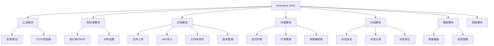
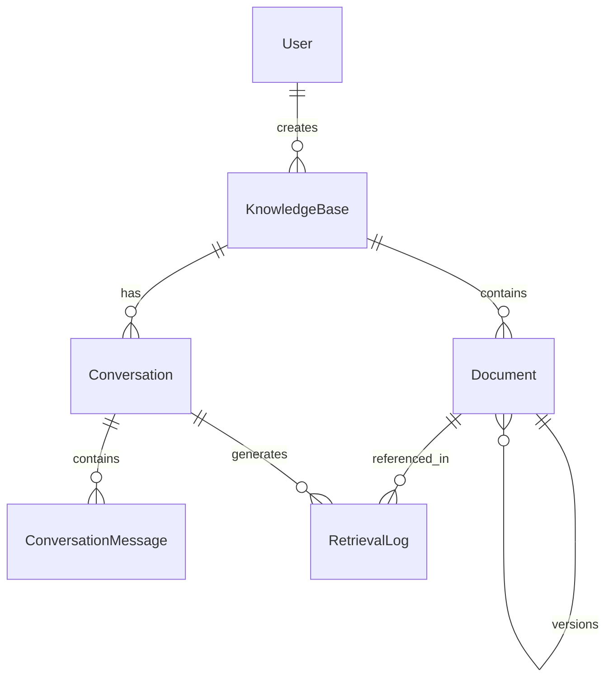

# PRD 产品需求文档 - Enterprise RAG V1

> 文档版本：v1.0
> 创建日期：2026-02-21
> 基于文档：`Enterprise_RAG_需求分析与架构方案_整合版.md`、`用户使用手册-V1.md`
> 状态：正式版

---

## 一、文档概述

### 1.1 编写目的

本文档定义 Enterprise RAG 系统的产品需求，作为开发、测试和验收的基准。

### 1.2 产品定位

Enterprise RAG 是一个企业级知识库问答系统，基于 RAG（Retrieval-Augmented Generation）技术，支持多格式文档智能问答，面向团队内部使用。

### 1.3 目标用户

| 用户类型 | 描述 | 核心需求 |
|----------|------|----------|
| 知识工作者 | 需要查询企业内部文档的员工 | 快速找到准确答案 |
| 知识管理员 | 负责知识库建设和维护 | 便捷的文档管理 |
| 系统管理员 | 负责系统运维 | 稳定可靠的运行 |

---

## 二、功能需求

### 2.1 功能模块概览

### 2.2 功能清单

| 模块 | 功能编号 | 功能名称 | 优先级 | 状态 |
|------|----------|----------|--------|------|
| 认证 | F-AUTH-001 | 用户登录 | P0 | 已完成 |
| 认证 | F-AUTH-002 | TOTP 双因素认证 | P1 | 已完成 |
| 认证 | F-AUTH-003 | 用户登出 | P0 | 已完成 |
| 知识库 | F-KB-001 | 创建知识库 | P0 | 已完成 |
| 知识库 | F-KB-002 | 知识库列表 | P0 | 已完成 |
| 知识库 | F-KB-003 | 删除知识库 | P0 | 已完成 |
| 知识库 | F-KB-004 | 编辑知识库 | P1 | 后端完成 |
| 知识库 | F-KB-005 | 分块参数设置 | P1 | 已完成 |
| 文档 | F-DOC-001 | 单文件上传 | P0 | 已完成 |
| 文档 | F-DOC-002 | 批量文件上传 | P0 | 已完成 |
| 文档 | F-DOC-003 | URL 导入 | P0 | 已完成 |
| 文档 | F-DOC-004 | 文档删除 | P0 | 已完成 |
| 文档 | F-DOC-005 | 文档预览 | P1 | 已完成 |
| 文档 | F-DOC-006 | 文档下载 | P1 | 已完成 |
| 文档 | F-DOC-007 | 重新解析 | P1 | 已完成 |
| 文档 | F-DOC-008 | 版本管理 | P1 | 已完成 |
| 文档 | F-DOC-009 | 文件夹同步 | P2 | 已完成 |
| 文档 | F-DOC-010 | 在线编辑 | P2 | 已完成 |
| 问答 | F-QA-001 | 流式问答 | P0 | 已完成 |
| 问答 | F-QA-002 | 非流式问答 | P0 | 已完成 |
| 问答 | F-QA-003 | 引用溯源 | P0 | 已完成 |
| 问答 | F-QA-004 | 多轮对话 | P1 | 已完成 |
| 问答 | F-QA-005 | 回答风格选择 | P1 | 已完成 |
| 问答 | F-QA-006 | 检索策略选择 | P1 | 已完成 |
| 问答 | F-QA-007 | LLM 失败降级 | P1 | 已完成 |
| 问答 | F-QA-008 | Query Expansion | P2 | 规则版完成 |
| 对话 | F-CONV-001 | 对话历史列表 | P1 | 已完成 |
| 对话 | F-CONV-002 | 对话分享 | P2 | 已完成 |
| 对话 | F-CONV-003 | 对话导出（MD/PDF/Word） | P2 | 已完成 |
| 对话 | F-CONV-004 | 分享查看 | P2 | 后端完成 |
| 看板 | F-DASH-001 | 检索质量统计 | P1 | 已完成 |
| 看板 | F-DASH-002 | 用户反馈收集 | P1 | 已完成 |
| 看板 | F-DASH-003 | 问题样本标记 | P2 | 后端完成 |
| 系统 | F-SYS-001 | 健康检查 | P0 | 已完成 |
| 系统 | F-SYS-002 | Prometheus 指标 | P1 | 已完成 |
| 系统 | F-SYS-003 | 异步任务管理 | P1 | 已完成 |

---

## 三、详细功能规格

### 3.1 认证模块

#### F-AUTH-001 用户登录

| 项目 | 规格说明 |
|------|----------|
| 功能描述 | 用户通过用户名和密码登录系统 |
| 输入 | 用户名（1-50字符）、密码（6-100字符）、TOTP验证码（可选） |
| 处理逻辑 | 1. 校验用户名密码 2. 如果启用TOTP则校验验证码 3. 生成JWT Token |
| 输出 | 成功：access_token；失败：错误信息 |
| 异常处理 | 用户名不存在、密码错误、TOTP验证失败、账户锁定 |
| 验收标准 | 1. 正确凭证可登录 2. 错误凭证返回明确错误 3. Token 有效期24小时 |

#### F-AUTH-002 TOTP 双因素认证

| 项目 | 规格说明 |
|------|----------|
| 功能描述 | 支持TOTP双因素认证增强安全性 |
| 输入 | TOTP密钥设置、验证码 |
| 处理逻辑 | 1. 生成TOTP密钥 2. 用户绑定密钥 3. 登录时验证 |
| 输出 | 绑定成功/失败、验证成功/失败 |
| 验收标准 | 1. 可绑定/解绑TOTP 2. 绑定后登录需验证 |

### 3.2 知识库模块

#### F-KB-001 创建知识库

| 项目 | 规格说明 |
|------|----------|
| 功能描述 | 创建新的知识库 |
| 输入 | 名称（1-100字符，唯一）、描述（0-2000字符，可选） |
| 处理逻辑 | 1. 校验名称唯一性 2. 创建知识库记录 3. 创建对应向量集合 |
| 输出 | 知识库ID和基本信息 |
| 异常处理 | 名称重复、名称格式错误 |
| 验收标准 | 1. 可创建知识库 2. 名称重复时提示 3. 自动创建向量集合 |

#### F-KB-005 分块参数设置

| 项目 | 规格说明 |
|------|----------|
| 功能描述 | 配置知识库的分块参数 |
| 输入 | chunk_size（100-10000字符）、chunk_overlap（0-500字符） |
| 处理逻辑 | 1. 校验参数范围 2. 更新知识库配置 |
| 输出 | 更新后的配置 |
| 验收标准 | 1. 可设置自定义参数 2. 可恢复默认值 3. 影响后续文档处理 |

### 3.3 文档模块

#### F-DOC-001 单文件上传

| 项目 | 规格说明 |
|------|----------|
| 功能描述 | 上传单个文档到知识库 |
| 输入 | 文件（支持：txt/md/pdf/doc/docx/xls/xlsx/ppt/pptx/png/jpg/mp3/wav/mp4/webm） |
| 限制 | 单文件最大200MB |
| 处理逻辑 | 1. 校验文件类型和大小 2. 保存文件 3. 创建文档记录 4. 入队异步解析 |
| 输出 | 文档ID和状态 |
| 状态流转 | pending → parsing → parsed → vectorized（或失败状态） |
| 验收标准 | 1. 支持所有格式 2. 超限文件拒绝 3. 自动入队解析 |

#### F-DOC-003 URL 导入

| 项目 | 规格说明 |
|------|----------|
| 功能描述 | 从网址导入内容到知识库 |
| 输入 | URL（http/https，最长500字符） |
| 处理逻辑 | 1. 校验URL格式 2. 创建文档记录 3. 入队异步抓取解析 |
| 输出 | 文档ID和状态 |
| 验收标准 | 1. 可导入网页内容 2. 无效URL提示错误 |

#### F-DOC-008 版本管理

| 项目 | 规格说明 |
|------|----------|
| 功能描述 | 管理文档的多个版本 |
| 功能点 | 1. 查看版本列表 2. 激活指定版本 3. 版本回滚 |
| 处理逻辑 | 上传同名文件时自动创建新版本，保留历史版本 |
| 验收标准 | 1. 可查看所有版本 2. 可切换版本 3. 切换后向量同步更新 |

### 3.4 问答模块

#### F-QA-001 流式问答

| 项目 | 规格说明 |
|------|----------|
| 功能描述 | 基于知识库进行智能问答，流式返回答案 |
| 输入 | knowledge_base_id（必填）、question（1-2000字符）、strategy（可选）、system_prompt_version（可选）、top_k（1-20，可选）、conversation_id（可选）、history_turns（1-20，可选） |
| 处理逻辑 | 1. 多路召回 2. 查询扩展 3. 去重 4. Reranker 5. 构建Prompt 6. LLM流式生成 7. 插入引用 |
| 输出 | SSE流：answer增量、citations、retrieval_log_id |
| 策略 | default / high_recall / high_precision / low_latency |
| 验收标准 | 1. 流式输出正常 2. 引用标注正确 3. 策略生效 |

#### F-QA-003 引用溯源

| 项目 | 规格说明 |
|------|----------|
| 功能描述 | 在答案中标注来源引用 |
| 引用格式 | [ID:x] 内联标注 |
| 引用信息 | id、document_id、filename、chunk_index、snippet、reason |
| 验收标准 | 1. 引用编号连续 2. 可定位到原文 3. snippet 包含最相关内容 |

#### F-QA-007 LLM 失败降级

| 项目 | 规格说明 |
|------|----------|
| 功能描述 | LLM 调用失败时降级返回检索结果 |
| 触发条件 | LLM API 超时、错误、不可用 |
| 降级输出 | retrieved_chunks、error_message、llm_failed=true |
| 验收标准 | 1. 失败时不阻塞 2. 返回可用检索结果 3. 明确标注降级 |

### 3.5 对话模块

#### F-CONV-003 对话导出

| 项目 | 规格说明 |
|------|----------|
| 功能描述 | 导出对话记录 |
| 支持格式 | Markdown、PDF、Word |
| 导出内容 | 问题、答案、引用来源、时间戳 |
| 验收标准 | 1. 三种格式均可导出 2. 格式正确可读 |

### 3.6 看板模块

#### F-DASH-001 检索质量统计

| 项目 | 规格说明 |
|------|----------|
| 功能描述 | 展示检索质量相关统计数据 |
| 指标 | total_queries、avg_top_score、avg_chunks_returned、avg_response_time_ms、helpful_count、not_helpful_count、not_helpful_ratio、sample_count |
| 筛选 | 按知识库、按日期范围 |
| 验收标准 | 1. 指标计算正确 2. 可按条件筛选 |

---

## 四、非功能需求

### 4.1 性能需求

| 指标 | 目标值 | 测试方法 |
|------|--------|----------|
| API 响应时间（非流式） | P95 < 3s | 压测 |
| 流式首字延迟 | < 2s | 手工测试 |
| 单文件上传（50MB） | < 10s | 手工测试 |
| 文档解析（100页PDF） | < 60s | 手工测试 |
| 向量检索延迟 | < 500ms | 压测 |
| 并发用户数 | 50 | 压测 |

### 4.2 安全需求

| 需求 | 实现方式 |
|------|----------|
| 密码安全 | bcrypt 加密存储 |
| 会话管理 | JWT Token，24小时过期 |
| 双因素认证 | TOTP 支持 |
| API 鉴权 | Bearer Token |
| 生产异常 | 不泄露敏感信息 |
| 限流 | 按用户/IP 限流 |

### 4.3 可用性需求

| 需求 | 目标 |
|------|------|
| 系统可用性 | 99% |
| 故障恢复时间 | < 30分钟 |
| 数据备份 | 每日自动备份 |

### 4.4 兼容性需求

| 类型 | 支持 |
|------|------|
| 浏览器 | Chrome 90+、Firefox 88+、Edge 90+、Safari 14+ |
| 部署环境 | Docker Compose、Linux/macOS/Windows |
| Python | 3.11+ |
| PostgreSQL | 14+ |

---

## 五、业务规则

### 5.1 文件限制

| 规则 | 限制 |
|------|------|
| 单文件大小 | 最大 200MB |
| 支持格式 | txt、md、pdf、doc、docx、xls、xlsx、ppt、pptx、png、jpg、jpeg、mp3、wav、m4a、flac、mp4、webm、mov |
| URL 长度 | 最长 500 字符 |

### 5.2 知识库限制

| 规则 | 限制 |
|------|------|
| 知识库名称 | 1-100 字符，唯一 |
| 知识库描述 | 0-2000 字符 |

### 5.3 问答限制

| 规则 | 限制 |
|------|------|
| 问题长度 | 1-2000 字符 |
| top_k 范围 | 1-20 |
| 历史轮数 | 1-20 |

---

## 六、数据模型

### 6.1 核心实体

### 6.2 实体定义

#### KnowledgeBase

| 字段 | 类型 | 说明 |
|------|------|------|
| id | int | 主键 |
| name | string(100) | 名称，唯一 |
| description | text | 描述 |
| chunk_size | int | 分块大小 |
| chunk_overlap | int | 分块重叠 |
| created_by | int | 创建人ID |
| created_at | datetime | 创建时间 |

#### Document

| 字段 | 类型 | 说明 |
|------|------|------|
| id | int | 主键 |
| knowledge_base_id | int | 所属知识库 |
| title | string | 标题 |
| filename | string | 文件名 |
| file_type | string | 文件类型 |
| file_size | int | 文件大小 |
| file_hash | string | 文件哈希 |
| status | string | 状态 |
| parser_message | string | 解析信息 |
| version | int | 版本号 |
| is_current | boolean | 是否当前版本 |
| content_text | text | 解析内容 |

---

## 七、验收标准

### 7.1 功能验收

| 功能模块 | 验收项 | 验收方法 | 通过标准 |
|----------|--------|----------|----------|
| 登录 | 正常登录 | 手工 | 返回Token |
| 登录 | 错误密码 | 手工 | 返回错误 |
| 知识库 | 创建/删除 | 手工 | 正常操作 |
| 文档 | 上传解析 | 手工 | 状态正确流转 |
| 问答 | 流式问答 | 手工 | 输出正常 |
| 问答 | 引用展示 | 手工 | 引用可点击 |
| 看板 | 统计展示 | 手工 | 数据正确 |

### 7.2 非功能验收

| 验收项 | 验收方法 | 通过标准 |
|--------|----------|----------|
| 单元测试 | pytest | 100% 通过 |
| API 响应 | 压测 | P95 < 3s |
| 安全扫描 | 工具 | 无高危漏洞 |

---

## 八、附录

### A. API 端点列表

| 模块 | 端点 | 方法 |
|------|------|------|
| 认证 | /api/auth/login | POST |
| 认证 | /api/auth/me | GET |
| 认证 | /api/auth/totp/setup | POST |
| 知识库 | /api/knowledge-bases | GET/POST |
| 知识库 | /api/knowledge-bases/{id} | GET/PUT/DELETE |
| 文档 | /api/knowledge-bases/{id}/documents | GET/POST |
| 文档 | /api/documents/{id} | DELETE |
| 问答 | /api/qa/ask | POST |
| 问答 | /api/qa/stream | POST |
| 问答 | /api/qa/strategies | GET |
| 看板 | /api/retrieval/dashboard | GET |
| 看板 | /api/retrieval/feedback | POST |

### B. 参考资料

- `Enterprise_RAG_需求分析与架构方案_整合版.md`
- `用户使用手册-V1.md`
- `docs/adr/README.md`
- `docs/checklists/pre-release.md`

---

**文档修订历史**

| 版本 | 日期 | 修订人 | 修订内容 |
|------|------|--------|----------|
| v1.0 | 2026-02-21 | 系统生成 | 基于现有功能自动生成 |
