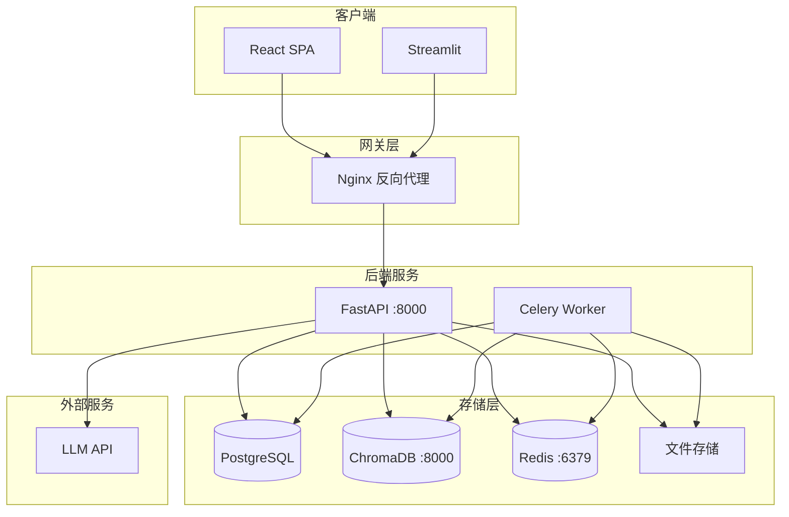
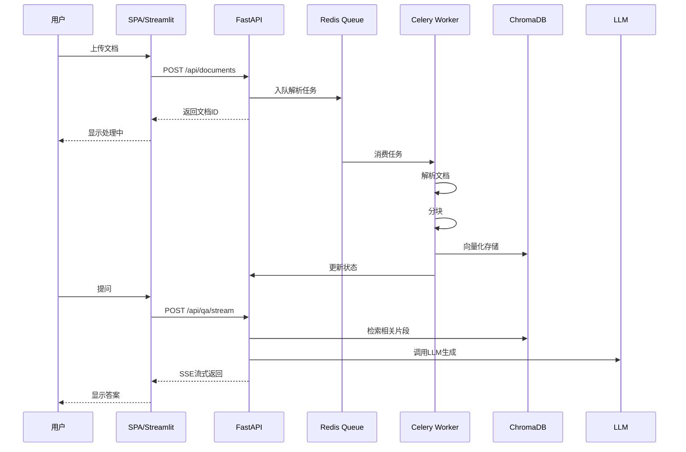
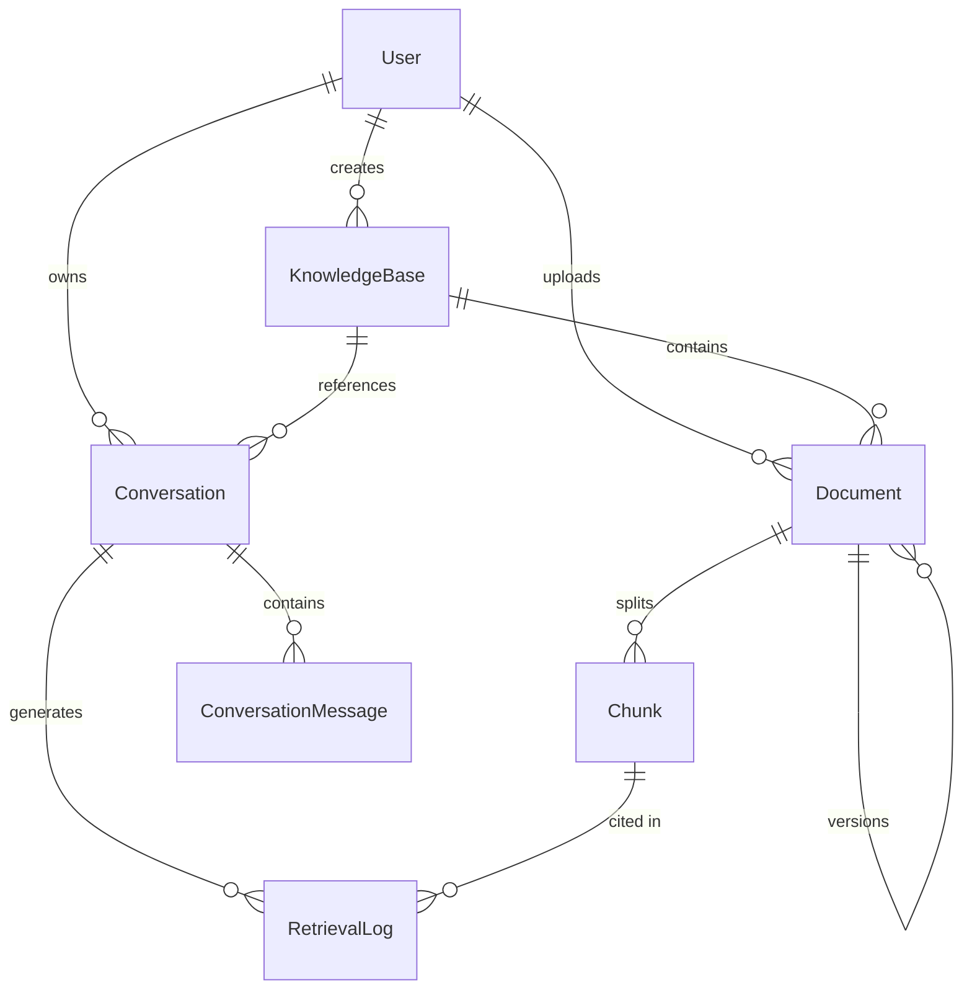
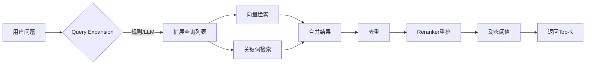

# TRD 技术参考文档 - Enterprise RAG V1

> 文档版本：v1.0
> 更新日期：2026-02-21
> 基于文档：`Enterprise_RAG_需求分析与架构方案_整合版.md`、`docs/adr/README.md`

---

## 一、系统概述

### 1.1 系统简介

Enterprise RAG 是一个企业级知识库问答系统，基于 RAG（Retrieval-Augmented Generation）技术实现智能问答。

### 1.2 技术栈

| 层级 | 技术 | 版本 | 说明 |
|------|------|------|------|
| **后端框架** | FastAPI | 0.100+ | 高性能异步 API |
| **任务队列** | Celery + Redis | 5.x / 7.x | 异步任务处理 |
| **关系数据库** | PostgreSQL | 16 | 业务数据存储 |
| **向量数据库** | ChromaDB | latest | 向量索引与检索 |
| **Embedding** | BGE-M3 | - | 中英文 Embedding |
| **Reranker** | BGE-Reranker-v2-m3 | - | 重排序模型 |
| **LLM** | DeepSeek/OpenAI/兼容API | - | 生成回答 |
| **前端 SPA** | React + Vite + TypeScript | 18.x / 5.x / 5.x | 主前端 |
| **前端调试** | Streamlit | 1.x | 内部调试工具 |
| **容器化** | Docker Compose | - | 部署编排 |

---

## 二、系统架构

### 2.1 整体架构图



### 2.2 请求流程



---

## 三、模块设计

### 3.1 后端模块结构

```
backend/
├── main.py                    # 应用入口
├── app/
│   ├── api/                   # API 路由
│   │   ├── auth.py           # 认证接口
│   │   ├── knowledge_base.py # 知识库接口
│   │   ├── documents.py      # 文档接口
│   │   ├── qa.py             # 问答接口
│   │   ├── retrieval.py      # 检索日志接口
│   │   ├── conversations.py  # 对话接口
│   │   ├── folder_sync.py    # 文件夹同步接口
│   │   └── tasks.py          # 异步任务接口
│   │
│   ├── core/                  # 核心配置
│   │   ├── config.py         # 配置管理
│   │   ├── database.py       # 数据库连接
│   │   ├── security.py       # 安全工具
│   │   └── celery_app.py     # Celery 配置
│   │
│   ├── models/                # 数据模型
│   │   ├── user.py
│   │   ├── knowledge_base.py
│   │   ├── document.py
│   │   ├── chunk.py
│   │   ├── conversation.py
│   │   ├── retrieval_log.py
│   │   └── async_task.py
│   │
│   ├── schemas/               # Pydantic Schema
│   │   ├── auth.py
│   │   ├── knowledge_base.py
│   │   ├── document.py
│   │   └── qa.py
│   │
│   ├── services/              # 业务服务
│   │   ├── auth_service.py
│   │   ├── knowledge_base_service.py
│   │   ├── document_service.py
│   │   ├── qa_service.py
│   │   └── retrieval_log_service.py
│   │
│   ├── rag/                   # RAG 模块
│   │   ├── retriever.py      # 向量检索
│   │   ├── chunker.py        # 文本分块
│   │   ├── pipeline.py       # RAG 流水线
│   │   ├── dedup.py          # 去重
│   │   ├── query_expansion.py# 查询扩展
│   │   ├── retrieval_strategy.py # 检索策略
│   │   └── keyword_retriever.py  # 关键词检索
│   │
│   ├── llm/                   # LLM 提供者
│   │   ├── base.py
│   │   ├── openai_provider.py
│   │   └── deepseek_provider.py
│   │
│   ├── document_parser/       # 文档解析
│   │   ├── base.py
│   │   ├── pdf_parser.py
│   │   ├── docx_parser.py
│   │   ├── txt_parser.py
│   │   ├── url_parser.py
│   │   └── parser_factory.py
│   │
│   └── tasks/                 # Celery 任务
│       ├── parse.py
│       └── sync.py
│
└── tests/                     # 测试
```

### 3.2 前端模块结构

```
frontend_spa/
├── src/
│   ├── components/
│   │   ├── layout/
│   │   │   ├── Header.tsx
│   │   │   ├── Sidebar.tsx
│   │   │   └── Layout.tsx
│   │   └── common/
│   │       ├── Button.tsx
│   │       ├── Card.tsx
│   │       ├── Input.tsx
│   │       └── Modal.tsx
│   │
│   ├── pages/
│   │   ├── Login.tsx
│   │   ├── Home.tsx
│   │   ├── KnowledgeBases.tsx
│   │   ├── KnowledgeBaseDetail.tsx
│   │   ├── QA.tsx
│   │   ├── Conversations.tsx
│   │   ├── FolderSync.tsx
│   │   ├── Tasks.tsx
│   │   ├── KnowledgeBaseEdit.tsx
│   │   ├── ShareView.tsx
│   │   └── Dashboard.tsx
│   │
│   ├── api.ts                 # API 调用封装
│   ├── auth.ts                # 认证工具
│   └── App.tsx                # 路由配置
│
├── nginx.conf                 # Nginx 配置
└── Dockerfile
```

---

## 四、数据模型

### 4.1 ER 图



### 4.2 核心表结构

#### users
| 字段 | 类型 | 说明 |
|------|------|------|
| id | SERIAL | 主键 |
| username | VARCHAR(50) | 用户名，唯一 |
| password_hash | VARCHAR(255) | 密码哈希 |
| totp_secret | VARCHAR(32) | TOTP密钥 |
| is_active | BOOLEAN | 是否激活 |
| created_at | TIMESTAMP | 创建时间 |

#### knowledge_bases
| 字段 | 类型 | 说明 |
|------|------|------|
| id | SERIAL | 主键 |
| name | VARCHAR(100) | 名称，唯一 |
| description | TEXT | 描述 |
| chunk_size | INTEGER | 分块大小 |
| chunk_overlap | INTEGER | 分块重叠 |
| created_by | INTEGER | 创建人ID |
| created_at | TIMESTAMP | 创建时间 |

#### documents
| 字段 | 类型 | 说明 |
|------|------|------|
| id | SERIAL | 主键 |
| knowledge_base_id | INTEGER | 知识库ID |
| title | VARCHAR(255) | 标题 |
| filename | VARCHAR(255) | 文件名 |
| file_type | VARCHAR(50) | 文件类型 |
| file_size | BIGINT | 文件大小 |
| file_hash | VARCHAR(64) | 文件哈希 |
| status | VARCHAR(20) | 状态 |
| parser_message | TEXT | 解析信息 |
| content_text | TEXT | 解析内容 |
| version | INTEGER | 版本号 |
| parent_document_id | INTEGER | 父版本ID |
| is_current | BOOLEAN | 是否当前版本 |
| source_url | VARCHAR(500) | 来源URL |

#### chunks
| 字段 | 类型 | 说明 |
|------|------|------|
| id | SERIAL | 主键 |
| document_id | INTEGER | 文档ID |
| chunk_index | INTEGER | 块索引 |
| content | TEXT | 内容 |
| chunk_hash | VARCHAR(64) | 内容哈希 |
| vector_id | VARCHAR(100) | 向量ID |

#### conversations
| 字段 | 类型 | 说明 |
|------|------|------|
| id | SERIAL | 主键 |
| knowledge_base_id | INTEGER | 知识库ID |
| user_id | INTEGER | 用户ID |
| title | VARCHAR(255) | 标题 |
| share_token | VARCHAR(32) | 分享令牌 |
| created_at | TIMESTAMP | 创建时间 |

#### retrieval_logs
| 字段 | 类型 | 说明 |
|------|------|------|
| id | SERIAL | 主键 |
| knowledge_base_id | INTEGER | 知识库ID |
| conversation_id | INTEGER | 对话ID |
| question | TEXT | 问题 |
| top_score | FLOAT | 最高分数 |
| chunks_returned | INTEGER | 返回块数 |
| response_time_ms | INTEGER | 响应时间 |
| feedback_type | VARCHAR(20) | 反馈类型 |
| cited_chunk_ids | JSONB | 引用块ID |
| strategy_used | VARCHAR(50) | 使用的策略 |

---

## 五、API 接口定义

### 5.1 认证模块

#### POST /api/auth/login
```json
// Request
{
  "username": "admin",
  "password": "password123",
  "totp_code": "123456"  // 可选
}

// Response
{
  "code": 0,
  "data": {
    "access_token": "eyJ...",
    "token_type": "bearer"
  }
}
```

### 5.2 知识库模块

#### GET /api/knowledge-bases
```json
// Response
{
  "code": 0,
  "data": [
    {
      "id": 1,
      "name": "合同库",
      "description": "合同相关文档",
      "chunk_size": 500,
      "chunk_overlap": 50,
      "created_at": "2026-02-21T10:00:00"
    }
  ]
}
```

#### POST /api/knowledge-bases
```json
// Request
{
  "name": "新产品库",
  "description": "产品相关文档"
}

// Response
{
  "code": 0,
  "data": {
    "id": 2,
    "name": "新产品库",
    "description": "产品相关文档"
  }
}
```

### 5.3 问答模块

#### POST /api/qa/ask
```json
// Request
{
  "knowledge_base_id": 1,
  "question": "合同违约责任如何规定？",
  "top_k": 5,
  "strategy": "default",
  "system_prompt_version": "C",
  "conversation_id": "abc123",
  "history_turns": 4
}

// Response
{
  "code": 0,
  "data": {
    "answer": "根据合同第X条规定...",
    "citations": [
      {
        "id": 1,
        "document_id": 10,
        "filename": "合同模板A.pdf",
        "chunk_index": 3,
        "snippet": "违约方应承担...",
        "reason": "直接回答问题"
      }
    ],
    "retrieved_count": 5,
    "llm_failed": false,
    "retrieval_log_id": 100
  }
}
```

#### POST /api/qa/stream (SSE)
```
data: {"type": "answer", "delta": "根据"}
data: {"type": "answer", "delta": "合同"}
data: {"type": "answer", "delta": "规定..."}
data: {"type": "citations", "data": [...]}
data: {"type": "retrieval_log_id", "data": 100}
data: [DONE]
```

#### GET /api/qa/strategies
```json
// Response
{
  "code": 0,
  "data": [
    {"name": "default", "description": "平衡模式"},
    {"name": "high_recall", "description": "高召回模式"},
    {"name": "high_precision", "description": "高精度模式"},
    {"name": "low_latency", "description": "低延迟模式"}
  ]
}
```

---

## 六、检索策略

### 6.1 策略配置

| 策略 | top_k | expansion | keyword | reranker_k |
|------|-------|-----------|---------|------------|
| default | 5 | 按配置 | 按配置 | 12 |
| high_recall | 8 | on | on | 16 |
| high_precision | 4 | off | off | 8 |
| low_latency | 4 | off | off | 6 |

### 6.2 检索流程



---

## 七、配置项

### 7.1 环境变量

| 变量名 | 默认值 | 说明 |
|--------|--------|------|
| POSTGRES_HOST | localhost | PostgreSQL 主机 |
| POSTGRES_PORT | 5432 | PostgreSQL 端口 |
| POSTGRES_DB | enterprise_rag | 数据库名 |
| POSTGRES_USER | enterprise_rag | 用户名 |
| POSTGRES_PASSWORD | enterprise_rag | 密码 |
| CHROMA_HOST | localhost | ChromaDB 主机 |
| CHROMA_PORT | 8000 | ChromaDB 端口 |
| JWT_SECRET_KEY | - | JWT 密钥 |
| LLM_PROVIDER | openai | LLM 提供者 |
| LLM_API_KEY | - | LLM API Key |
| LLM_BASE_URL | - | LLM API 地址 |
| LLM_MODEL_NAME | - | 模型名称 |
| RERANKER_ENABLED | true | 是否启用 Reranker |
| retrieval_query_expansion_enabled | true | 是否启用查询扩展 |
| retrieval_query_expansion_mode | rule | 查询扩展模式 |
| retrieval_strategy | default | 默认检索策略 |
| retrieval_use_keyword | true | 是否启用关键词召回 |

---

## 八、部署架构

### 8.1 Docker Compose 服务

```yaml
services:
  postgres:      # PostgreSQL 数据库
  chromadb:      # ChromaDB 向量库
  redis:         # Redis 缓存/队列
  backend:       # FastAPI 后端
  worker:        # Celery Worker
  frontend:      # Streamlit 前端
  spa:           # React SPA 前端
```

### 8.2 端口映射

| 服务 | 容器端口 | 主机端口 |
|------|----------|----------|
| postgres | 5432 | 5432 |
| chromadb | 8000 | 8001 |
| redis | 6379 | 6379 |
| backend | 8000 | 8000 |
| frontend | 8501 | 8501 |
| spa | 80 | 3000 |

---

## 九、安全设计

### 9.1 认证授权

- JWT Token 认证，24小时过期
- TOTP 双因素认证（可选）
- Bearer Token 传递

### 9.2 数据安全

- 密码 bcrypt 加密存储
- 生产环境不泄露敏感信息
- API 限流保护

### 9.3 CORS 配置

```python
CORS_ORIGINS = [
    "http://localhost:3000",
    "http://localhost:8501",
]
```

---

## 十、监控与日志

### 10.1 健康检查

- `GET /api/system/health` - 系统健康状态
- `GET /health` - 基础存活检查

### 10.2 Prometheus 指标

- `GET /metrics` - Prometheus 格式指标

### 10.3 日志级别

- LOG_LEVEL: INFO（生产）/ DEBUG（开发）

---

**文档修订历史**

| 版本 | 日期 | 修订人 | 修订内容 |
|------|------|--------|----------|
| v1.0 | 2026-02-21 | 系统生成 | 基于现有架构生成 |
