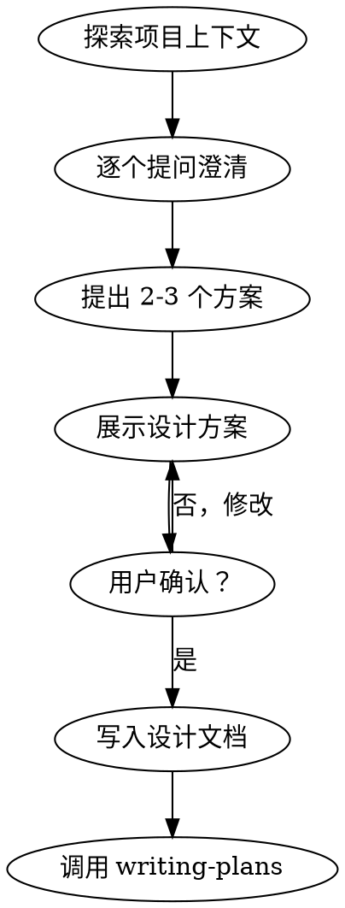
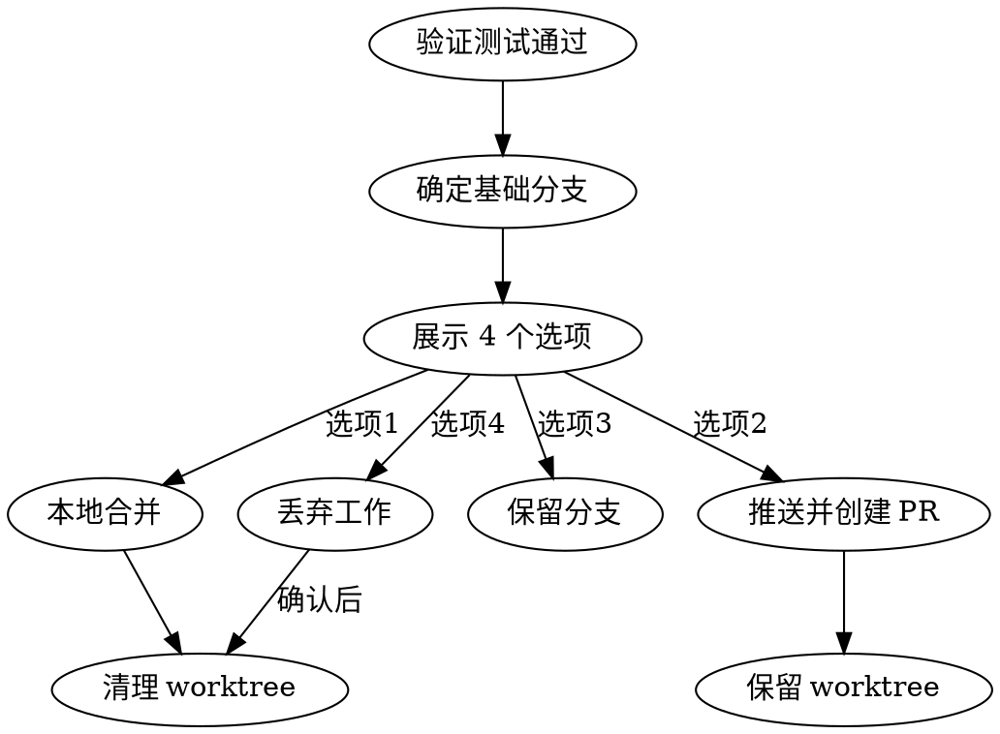

# 从需求到上线：完整开发流程指引

> **适用场景**：新项目搭建、新功能开发、重大重构
> **核心原则**：先澄清再计划，先测试再编码，先验证再发布
> **工具来源**：ECC (Everything Claude Code) + Superpowers

---

## 目录

1. [流程总览](#一流程总览)
2. [阶段一：需求澄清](#二阶段一需求澄清)
3. [阶段二：计划拆解](#三阶段二计划拆解)
4. [阶段三：TDD 开发](#四阶段三tdd-开发)
5. [阶段四：代码审查](#五阶段四代码审查)
6. [阶段五：验证检查](#六阶段五验证检查)
7. [阶段六：Git 流程与部署](#七阶段六git-流程与部署)
8. [场景分支](#八场景分支)
9. [快速参考卡](#九快速参考卡)

---

## 一、流程总览

```
┌─────────────────────────────────────────────────────────────────────────┐
│                        完整开发流程                                      │
├─────────────────────────────────────────────────────────────────────────┤
│                                                                          │
│   ┌──────────┐    ┌──────────┐    ┌──────────┐    ┌──────────┐         │
│   │  需求    │───▶│   计划   │───▶│   开发   │───▶│   审查   │         │
│   │  澄清    │    │   拆解   │    │   TDD    │    │   代码   │         │
│   └──────────┘    └──────────┘    └──────────┘    └──────────┘         │
│        │               │               │               │               │
│        ▼               ▼               ▼               ▼               │
│   brainstorming   writing-plans   test-driven-   requesting-           │
│      技能            技能          development    code-review           │
│                                     技能            技能                │
│                                                                          │
│   ┌──────────┐    ┌──────────┐                                         │
│   │   验证   │───▶│ 部署/    │                                         │
│   │   检查   │    │  收尾    │                                         │
│   └──────────┘    └──────────┘                                         │
│        │               │                                               │
│        ▼               ▼                                               │
│   verification-   finishing-a-                                         │
│   before-         development-                                         │
│   completion      branch                                               │
│      技能            技能                                               │
│                                                                          │
└─────────────────────────────────────────────────────────────────────────┘
```

### 在 Cursor 中触发流程

```
"我要开发一个新功能：[描述]，请按 Superpowers 流程进行"
```

AI 会自动：
1. 调用 `brainstorming` 技能澄清需求
2. 调用 `writing-plans` 技能制定计划
3. 按 TDD 流程开发
4. 完成后调用 `verification-before-completion` 验证

---

## 二、阶段一：需求澄清

### 触发时机
- 任何新功能、新模块、新项目
- 重大重构或架构调整
- "这个需求很简单，直接写吧" 的时候（**此时最需要！**）

### 触发命令
```
"使用 brainstorming 技能，帮我澄清这个需求"
```

### 核心技能：`superpowers:brainstorming`

### 流程步骤



### Checklist

| 步骤 | 操作 | AI 行为 |
|------|------|---------|
| 1 | 探索项目上下文 | 检查文件、文档、最近提交 |
| 2 | 逐个提问澄清 | **一次只问一个问题**，理解目的/约束/成功标准 |
| 3 | 提出 2-3 个方案 | 带权衡分析，给出推荐 |
| 4 | 展示设计方案 | 分模块展示，每个模块后确认 |
| 5 | 写入设计文档 | 保存到 `docs/plans/YYYY-MM-DD-<topic>-design.md` |
| 6 | 过渡到计划 | 调用 `writing-plans` 技能 |

### 关键原则

- **绝不跳过**：即使"简单"的项目也要走流程
- **一次一问**：不要一次抛出多个问题
- **YAGNI**：移除不必要的功能
- **多方案对比**：总是提出 2-3 个方案再选择

### 输出物
- `docs/plans/YYYY-MM-DD-<topic>-design.md` - 设计文档

---

## 三、阶段二：计划拆解

### 触发时机
- 需求澄清完成，设计方案已确认
- 准备开始编码前

### 触发命令
```
"使用 writing-plans 技能，制定实施计划"
```

### 核心技能：`superpowers:writing-plans`

### 计划文档结构

```markdown
# [功能名称] 实施计划

> **给 AI 的提示**：执行此计划时使用 superpowers:executing-plans 技能

**目标**：[一句话描述]

**架构**：[2-3 句说明方案]

**技术栈**：[关键技术/库]

---

### Task 1: [组件名称]

**文件：**
- 创建：`exact/path/to/file.py`
- 修改：`exact/path/to/existing.py:123-145`
- 测试：`tests/exact/path/to/test.py`

**Step 1: 写失败测试**
[完整测试代码]

**Step 2: 运行测试确认失败**
Run: `pytest tests/path/test.py::test_name -v`
Expected: FAIL with "function not defined"

**Step 3: 写最小实现**
[完整实现代码]

**Step 4: 运行测试确认通过**
Run: `pytest tests/path/test.py::test_name -v`
Expected: PASS

**Step 5: 提交**
git add ... && git commit -m "feat: ..."
```

### 任务粒度原则

**每个步骤 = 一个动作（2-5 分钟）**

| Good | Bad |
|------|-----|
| "写失败测试" - step | "实现用户模块" - 太大 |
| "运行确认失败" - step | "写测试和实现" - 太多 |
| "写最小实现" - step | |
| "运行确认通过" - step | |
| "提交" - step | |

### 执行选项

计划完成后，AI 会询问执行方式：

| 选项 | 适用场景 | 执行方式 |
|------|---------|---------|
| **Subagent-Driven** | 复杂多任务 | 当前会话，每任务派子代理，任务间审查 |
| **Parallel Session** | 大批量任务 | 新会话，批量执行带检查点 |

### 输出物
- `docs/plans/YYYY-MM-DD-<feature-name>.md` - 实施计划

---

## 四、阶段三：TDD 开发

### 触发时机
- **任何**新功能、Bug 修复、重构
- 每个计划任务的执行阶段

### 触发命令
```
"使用 test-driven-development 技能，开始 TDD 开发"
```

### 核心技能：`superpowers:test-driven-development`

### 铁律

```
没有失败的测试，就不写生产代码
```

**写了代码没测试？删掉。重新来。**

### Red-Green-Refactor 循环


### 详细步骤

#### RED - 写失败测试

```python
# Good: 清晰命名，测试真实行为
def test_retries_failed_operations_3_times():
    attempts = 0
    def operation():
        attempts += 1
        if attempts < 3:
            raise Error("fail")
        return "success"
    
    result = retry_operation(operation)
    
    assert result == "success"
    assert attempts == 3
```

**要求：**
- 一个行为一个测试
- 清晰的测试名称
- 真实代码（避免 mock 除非必要）

#### 验证 RED - 确认失败

```bash
pytest tests/path/test.py::test_name -v
```

**确认：**
- 测试失败（不是错误）
- 失败原因是预期的（功能缺失，不是拼写错误）
- 测试通过了？说明测试的是已有行为，修正测试

#### GREEN - 最小实现

```python
# Good: 刚好够通过
async def retry_operation(fn):
    for i in range(3):
        try:
            return await fn()
        except Exception as e:
            if i == 2:
                raise
```

**不要：**
- 添加测试之外的功能
- 顺手重构其他代码
- "顺便改进"

#### 验证 GREEN - 确认通过

```bash
pytest tests/path/test.py::test_name -v
```

**确认：**
- 测试通过
- 其他测试也通过
- 输出干净（无错误/警告）

#### REFACTOR - 清理

**仅在绿色后：**
- 移除重复
- 改进命名
- 提取辅助函数

**保持测试绿色，不添加新行为**

### TDD Checklist

开发完成后必须全部勾选：

- [ ] 每个新函数/方法都有测试
- [ ] 每个测试都看着它失败了才实现
- [ ] 每个测试失败的原因是预期的
- [ ] 每次只写了最小的代码通过测试
- [ ] 所有测试通过
- [ ] 输出干净
- [ ] 测试使用真实代码
- [ ] 边界和错误情况覆盖

**不能全部勾选？跳过了 TDD，重来。**

### 常见借口 vs 现实

| 借口 | 现实 |
|------|------|
| "太简单不需要测试" | 简单代码也会出错，测试 30 秒 |
| "测试后补也行" | 后补的测试立刻通过，什么都没验证 |
| "已经手动测过了" | 手动测试无法复现，无记录 |
| "删除 X 小时代码太浪费" | 沉没成本谬误，保留不可信代码是技术债 |

---

## 五、阶段四：代码审查

### 触发时机
- 子代理开发的每个任务完成后
- 大功能完成后
- 合并/PR 前

### 触发命令
```
"使用 requesting-code-review 技能，进行代码审查"
```

### 核心技能：`superpowers:requesting-code-review`

### 审查流程

```bash
# 1. 获取 git SHA
BASE_SHA=$(git rev-parse HEAD~1)  # 或 origin/main
HEAD_SHA=$(git rev-parse HEAD)

# 2. 派发代码审查子代理
# AI 会使用 Task tool 调用 code-reviewer
```

### 审查模板填充

```
WHAT_WAS_IMPLEMENTED: [刚实现的功能]
PLAN_OR_REQUIREMENTS: [对应计划/需求]
BASE_SHA: [起始 commit]
HEAD_SHA: [结束 commit]
DESCRIPTION: [简要描述]
```

### 处理审查反馈

| 严重性 | 处理方式 |
|--------|---------|
| **Critical** | 立即修复 |
| **Important** | 继续前修复 |
| **Minor** | 记录后续处理 |

**审查者错了？** 用技术理由反驳，展示代码/测试证明。

### ECC 审查代理

除了 Superpowers，还可使用 ECC 专项代理：

| 代理 | 用途 | 触发方式 |
|------|------|---------|
| `code-reviewer` | 通用代码审查 | "用 code-reviewer 审查" |
| `python-reviewer` | Python 专项 | "用 python-reviewer 审查" |
| `security-reviewer` | 安全专项 | "用 security-reviewer 审查" |
| `database-reviewer` | 数据库专项 | "用 database-reviewer 审查" |

---

## 六、阶段五：验证检查

### 触发时机
- **任何**声称"完成"、"修好了"、"通过了"之前
- 提交、PR、部署前

### 核心技能：`superpowers:verification-before-completion`

### 铁律

```
没有新鲜验证证据，就不能声称完成
```

### 验证门禁

```
声称任何状态前：
1. IDENTIFY: 什么命令能证明这个声明？
2. RUN: 执行完整命令（新鲜的，完整的）
3. READ: 完整输出，检查退出码，统计失败
4. VERIFY: 输出确认声明？
   - 否：用证据说明实际状态
   - 是：用证据声明
5. THEN: 才能声称
```

### 常见声明 vs 验证要求

| 声明 | 需要的证据 | 不充分的证据 |
|------|-----------|-------------|
| 测试通过 | 测试输出：0 failures | "应该通过了"、"上次跑过了" |
| Lint 干净 | Lint 输出：0 errors | 部分检查、推测 |
| 构建成功 | 构建命令：exit 0 | lint 通过、日志看起来对 |
| Bug 修复 | 原症状测试：通过 | 代码改了、假设修好了 |
| 需求完成 | 逐行检查清单 | 测试通过 |

### 红旗信号

遇到这些想法，**停止**：

- "应该可以了"
- "应该没问题"
- "看起来对了"
- "这次应该行"
- "太累了，就这样吧"
- **任何暗示成功但没验证的想法**

### 验证模式示例

**测试：**
```
✅ [运行测试命令] [看到：34/34 pass] "所有测试通过"
❌ "应该通过了" / "看起来正确"
```

**回归测试（TDD Red-Green）：**
```
✅ 写 → 跑（通过）→ 回退修复 → 跑（必须失败）→ 恢复 → 跑（通过）
❌ "我写了回归测试"（没有红绿验证）
```

---

## 七、阶段六：Git 流程与部署

### 触发时机
- 功能完成、测试通过后
- 需要决定如何集成工作

### 核心技能：`superpowers:finishing-a-development-branch`

### 流程步骤



### 四个选项

| 选项 | 操作 | worktree | 分支 |
|------|------|----------|------|
| 1. 本地合并 | merge 到 base | 清理 | 删除 |
| 2. 推送并创建 PR | push + gh pr create | 保留 | 保留 |
| 3. 保留原样 | 无操作 | 保留 | 保留 |
| 4. 丢弃 | 强制删除 | 清理 | 强制删除 |

### 本地合并流程

```bash
# 切到基础分支
git checkout main

# 拉取最新
git pull

# 合并功能分支
git merge feature-branch

# 验证测试
pytest

# 通过后删除分支
git branch -d feature-branch
```

### PR 创建流程

```bash
# 推送分支
git push -u origin feature-branch

# 创建 PR
gh pr create --title "标题" --body "$(cat <<'EOF'
## Summary
- 改动 1
- 改动 2

## Test Plan
- [ ] 验证步骤 1
- [ ] 验证步骤 2
EOF
)"
```

### Worktree 管理

**如使用 git worktree 隔离开发：**

```bash
# 检查是否在 worktree
git worktree list | grep $(git branch --show-current)

# 清理（选项 1、4）
git worktree remove <worktree-path>
```

---

## 八、场景分支

### 场景 A：新项目搭建

```
brainstorming (项目定位、技术选型)
    ↓
writing-plans (项目结构、核心模块)
    ↓
TDD 开发 (基础设施、认证、核心功能)
    ↓
code-review (架构审查)
    ↓
verification (完整测试套件)
    ↓
finishing (首次部署)
```

### 场景 B：新功能开发

```
brainstorming (功能边界、交互设计)
    ↓
writing-plans (API 设计、数据模型、业务逻辑)
    ↓
TDD 开发 (按计划任务执行)
    ↓
code-review (每个任务后审查)
    ↓
verification (功能验证 + 回归测试)
    ↓
finishing (合并/PR)
```

### 场景 C：Bug 修复

```
systematic-debugging (根因分析)
    ↓
test-driven-development (写回归测试 → 修复)
    ↓
verification (确认修复 + 无回归)
    ↓
finishing (热修复/正常流程)
```

---

## 九、快速参考卡

### 触发命令速查

| 阶段 | 触发方式 |
|------|---------|
| 需求澄清 | `"使用 brainstorming 技能"` |
| 计划拆解 | `"使用 writing-plans 技能"` |
| TDD 开发 | `"使用 test-driven-development 技能"` |
| 代码审查 | `"使用 requesting-code-review 技能"` |
| 验证检查 | `"使用 verification-before-completion 技能"` |
| 调试 | `"使用 systematic-debugging 技能"` |
| 收尾 | `"使用 finishing-a-development-branch 技能"` |

### 一键触发完整流程

```
"我要开发 [功能描述]，请按 Superpowers 流程：
1. brainstorming 澄清需求
2. writing-plans 制定计划
3. test-driven-development 开发
4. requesting-code-review 审查
5. verification-before-completion 验证
6. finishing-a-development-branch 收尾"
```

### ECC 代理速查

| 代理 | 用途 |
|------|------|
| `planner` | 复杂功能规划 |
| `architect` | 系统设计决策 |
| `tdd-guide` | TDD 指导 |
| `python-reviewer` | Python 代码审查 |
| `security-reviewer` | 安全审查 |
| `database-reviewer` | 数据库审查 |

### 关键文件位置

| 文件 | 位置 |
|------|------|
| 设计文档 | `docs/plans/YYYY-MM-DD-<topic>-design.md` |
| 实施计划 | `docs/plans/YYYY-MM-DD-<feature-name>.md` |
| 技能定义 | `.cursor/skills/superpowers/*/SKILL.md` |
| 规则定义 | `.cursor/rules/*.md` |

---

## 附录：常见问题

### Q: "这个需求很简单，能直接写代码吗？"

**A:** 不能。简单需求也需要走流程。原因是：
- "简单"的需求常有未审视的假设
- 流程可以很简短（几句话的设计），但必须呈现并确认
- 跳过流程的代价是后期返工

### Q: "我已经写了代码，还需要写测试吗？"

**A:** 删掉代码，用 TDD 重来。
- 已写代码的测试立刻通过，验证不了什么
- 保留"参考"也会让你偏向实现而非测试
- 删掉重来才能证明测试真的测到了东西

### Q: "3 次修复都失败了怎么办？"

**A:** 停止修复，质疑架构。
- 3+ 次失败通常意味着架构问题
- 不要继续打补丁
- 与人类伙伴讨论是否需要重构

### Q: "紧急 Bug 需要立刻修复，能跳过流程吗？"

**A:** 越紧急越需要流程。
- 系统化调试比乱猜更快
- TDD 保证修复有效且不引入新问题
- 紧急是跳过流程的最大诱惑，也是最大陷阱

---

*本指引基于 ECC (Everything Claude Code) 和 Superpowers 工具集编写*
*技能文件位置：`.cursor/skills/superpowers/*/SKILL.md`*
