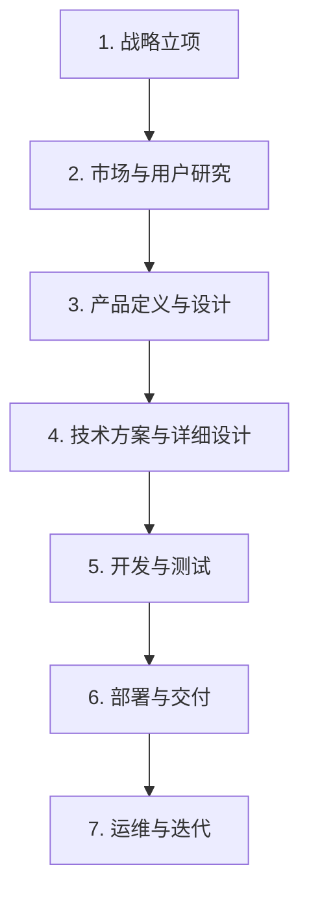

完整软件开发流程全景图（含所有关键文档）

---

### **阶段 1：战略立项（Why to Build?）**

| 活动 | 产出文档 | 编写者 | 参与方 |
|------|--------|--------|--------|
| 商业机会识别可行性分析（技术/经济/法律）初步 ROI 预测 | ✅ **BRD**（商业需求文档）✅ **可行性研究报告**✅ **项目建议书** | 产品经理 / 战略部 / 创始人 | 高管、财务、CTO |
| 项目审批会议 | ✅ **立项决议**✅ **项目章程**（Project Charter） | PMO / 项目经理 | 决策委员会 |

> 🔍 BRD 核心内容：  
> - 业务背景（如“当前工单处理效率低，客户满意度下降”）  
> - 目标（提升处理效率30%）  
> - 预期收益 vs 成本  
> - 风险与应对策略  

---

### **阶段 2：市场与用户研究（Who & What Market Needs?）**

| 活动 | 产出文档 | 编写者 | 参与方 |
|------|--------|--------|--------|
| 用户访谈 / 问卷调研竞品分析（SWOT）用户旅程地图（User Journey） | ✅ **MRD**（市场需求文档）✅ **用户画像**（Personas）✅ **竞品分析报告** | 产品经理 / 用户研究员 | 市场、客服、销售 |
| 需求优先级排序（MoSCoW 法） | ✅ **需求池**（Backlog） | 产品经理 | 全体干系人 |

> 🔍 MRD 核心内容：  
> - 目标用户（如“IT 支持工程师、客户经理”）  
> - 核心痛点（如“无法跟踪工单状态、重复沟通”）  
> - 市场规模与竞争格局  
> - MVP 功能范围建议  

---

### **阶段 3：产品定义与设计（What to Build?）**

| 活动 | 产出文档 | 编写者 | 参与方 |
|------|--------|--------|--------|
| 功能梳理 / 用户故事编写低保真 → 高保真原型设计交互流程图（Flowchart） | ✅ **PRD**（产品需求文档）✅ **原型图**（Axure/Figma）✅ **UI 设计稿** | 产品经理 + UI/UX 设计师 | 开发、测试、业务方 |
| 产品方案评审会 | ✅ **PRD 评审记录**✅ **需求确认签字表** | 产品经理 | 跨职能团队 |

> 🔍 PRD 核心内容：  
> - 功能列表（如“创建工单、分配处理人、状态更新、SLA 提醒”）  
> - 业务规则（如“超时未处理自动升级”）  
> - 非功能需求（响应时间 <1s，支持 1000 并发）  
> - 验收标准（Acceptance Criteria）  

---

### **阶段 4：技术方案与详细设计（How to Build?）**

| 活动 | 产出文档 | 编写者 | 参与方 |
|------|--------|--------|--------|
| 系统架构设计（微服务/API 网关）数据库 ER 图接口定义（OpenAPI） | ✅ **FSD**（功能规格说明书）✅ **TRD/TSD**（技术需求/设计文档）✅ **数据库设计文档** | 架构师 + 后端开发 | 前端、测试、DevOps |
| 安全与性能设计 | ✅ **安全需求文档**✅ **性能测试方案** | 安全工程师 / SRE | 全体技术团队 |
| 测试用例设计 | ✅ **测试用例**（Test Cases） | 测试工程师 | 产品经理（确认逻辑） |

> 🔍 FSD 核心内容：  
> - 页面字段说明（如“工单标题：必填，≤50字符”）  
> - 操作流程（点击“提交”后调用哪个 API）  
> - 异常处理（网络失败重试3次）  
> - 权限控制（仅管理员可删除）  

---

### **阶段 5：开发与测试（Build & Verify）**

| 活动 | 产出文档 | 工具/实践 |
|------|--------|----------|
| 编码实现（前后端分离） | ✅ **源代码**（Git 仓库） | Git + CI/CD |
| 单元测试 / 集成测试 | ✅ **单元测试报告** | Jest, JUnit |
| 系统测试 / UAT | ✅ **测试报告**✅ **Bug 跟踪清单**（Jira） | Postman, Selenium |
| 代码审查（Code Review） | ✅ **CR 记录** | GitLab MR / GitHub PR |

> 💡 此阶段强调：**自动化测试 + 持续集成**，确保质量内建。

---

### **阶段 6：部署与交付（Go Live）**

| 活动 | 产出文档 | 负责人 |
|------|--------|--------|
| 制定上线计划 | ✅ **部署方案**（含回滚策略） | DevOps 工程师 |
| 数据迁移（如有） | ✅ **数据迁移脚本 & 验证报告** | DBA |
| 用户培训 | ✅ **用户手册**✅ **操作视频**✅ **培训签到表** | 实施团队 |
| 验收交付 | ✅ **验收确认单**✅ **交付物清单**（含源码、文档、安装包） | 项目经理 + 客户 |

---

### **阶段 7：运维与迭代（Operate & Evolve）**

| 活动 | 产出文档 | 负责人 |
|------|--------|--------|
| 日常监控 | ✅ **运维日报/周报** | SRE / 运维 |
| 故障处理 | ✅ **故障根因分析报告**（RCA） | 技术负责人 |
| 用户反馈收集 | ✅ **用户反馈台账** | 客服 / 产品经理 |
| 版本迭代规划 | ✅ **迭代计划**（Sprint Plan） | 产品经理 + Scrum Master |
| 安全维护 | ✅ **安全扫描报告**✅ **漏洞修复记录** | 安全团队 |

---

## ✅ 总结：完整文档体系全景

| 类别 | 文档名称 | 作用 |
|------|--------|------|
| **战略层** | BRD、可行性报告、项目章程 | 决策是否启动项目 |
| **市场层** | MRD、用户画像、竞品报告 | 验证需求真实性 |
| **产品层** | PRD、原型图、UI 设计稿 | 定义产品功能与体验 |
| **技术层** | FSD、TRD、数据库设计、API 文档 | 指导开发实现 |
| **测试层** | 测试用例、测试报告、Bug 清单 | 保障质量 |
| **交付层** | 部署方案、用户手册、验收单 | 顺利交付客户 |
| **运维层** | 运维手册、监控日志、RCA 报告 | 保障系统稳定 |
