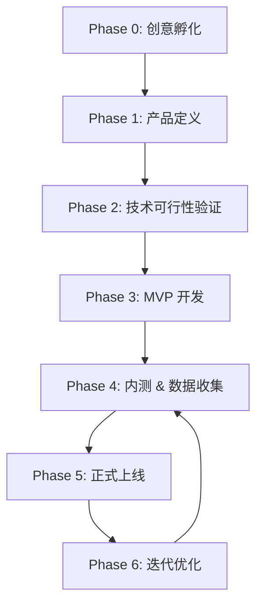

当然可以！以下是一份**结构完整、可直接用于团队对齐或项目启动的《AI 软件产品开发角色与闭环流程专业报告》**。本报告融合了你最初的构想，并基于当前（2026年）AI 工程实践、中国监管环境及行业最佳实践，进行了系统性完善。

---

# 📘 AI 软件产品开发角色架构与闭环流程建议报告  
**版本：1.0**  
**日期：2026年2月16日**  
**适用场景：AI 原生应用 / 智能体（Agent）产品 / 企业级大模型应用**

---

## 一、核心理念：以“数据-体验-合规”为三角驱动的敏捷闭环

> **成功 AI 产品的三大支柱**：  
> ✅ **高质量数据飞轮**（持续优化模型）  
> ✅ **人性化交互体验**（管理用户预期 + 情感化设计）  
> ✅ **全链路合规安全**（满足《生成式 AI 服务管理暂行办法》等法规）

---

## 二、推荐角色架构：黄金九人组 + 双支撑机制

| 角色编号 | 角色名称 | 核心职责 | 关键交付物 | 协同重点 |
|----------|--------|--------|-----------|--------|
| **R1** | **创新策略师**（Innovation Catalyst） | 主导需求探索，挑战假设，提出突破性场景 | • 创意清单• 用户痛点地图• 反向 PRD（What if…） | ↔ R2（产品）↔ R7（UX） |
| **R2** | **垂直领域产品经理**（Domain Product Manager） | 定义产品愿景、用户故事、商业模式、合规边界 | • 产品需求文档（PRD）• 用户旅程图• AI 能力边界声明• 合规自查清单 | ↔ R1, R3, R4, R9 |
| **R3** | **技术负责人**（Tech Lead + Project Manager） | 架构设计、技术选型、风险评估、排期管理 | • 系统架构图• 技术可行性报告• 项目甘特图• 上线 checklist | ↔ R4, R5, R6 |
| **R4** | **AI/ML 工程师**（AI Engineer / MLOps） | 模型选型、微调/RAG/Agent 构建、评估、部署、监控 | • 模型方案文档• 评估指标体系• 模型服务 API• 监控看板（Drift/延迟/幻觉率） | ↔ R2, R3, R8 |
| **R5** | **全栈/后端工程师**（Full-stack Developer） | 业务逻辑开发、API 实现、数据库设计、性能优化 | • 可运行 MVP 代码• 单元测试覆盖率报告• 接口文档 | ↔ R3, R7 |
| **R6** | **QA & 自动化测试工程师**（Quality Assurance） | 功能/性能/安全/边界测试，CI/CD 流水线搭建 | • 测试用例集• 自动化测试脚本• 安全扫描报告 | ↔ R3, R5 |
| **R7** | **UI/UX 设计师**（User Experience Designer） | 交互原型、视觉设计、可用性测试、AI 交互范式设计 | • 高保真原型• 设计系统规范• 用户测试报告 | ↔ R2, R1 |
| **R8** | **数据策略师**（Data Strategist） | 数据采集标准、标注管理、行为日志分析、A/B 测试设计 | • 数据字典• 标注指南• 用户反馈回流机制• A/B 测试方案 | ↔ R2, R4, R9 |
| **R9** | **交付验证 & 客户成功**（Solution Validator） | UAT 测试、客户培训、效果验收、NPS 收集 | • 验收报告• 用户满意度（NPS/CSAT）• 迭代建议清单 | ↔ R2, R6 |

---

### 🔧 双支撑机制（非专职角色，但必须制度化）

| 机制 | 说明 | 执行方式 |
|------|------|--------|
| **合规与伦理审查机制** | 确保产品符合中国法律法规（如算法备案、内容安全、隐私保护） | - 在 PRD 阶段嵌入合规检查点- 上线前由法务/安全团队签署《AI 安全评估报告》 |
| **数据-模型-产品反馈飞轮** | 将线上用户行为转化为模型迭代燃料 | - R8 建立日志管道 → R4 每周分析 bad case → R2 调整产品策略 |

---

## 三、六阶段开发闭环流程（含关键检查点）

### 各阶段详解：

#### **Phase 0：创意孵化（1–2 周）**
- **主导**：R1 + R2
- **关键动作**：
  - 举办“反事实头脑风暴”（What if we couldn’t use AI?）
  - 输出 3 个高潜力方向，每个配“反向 PRD”
- **退出标准**：至少 1 个方向通过“用户愿付意愿”快速验证（如 Landing Page 转化率 >5%）

#### **Phase 1：产品定义（2–3 周）**
- **主导**：R2
- **关键交付**：
  - 明确 **AI 能做什么 / 不能做什么**（避免过度承诺）
  - 输出《合规自查清单》（含敏感词库、人工审核触发条件）
- **退出标准**：PRD 通过 R3（技术）、R4（AI）、法务三方评审

#### **Phase 2：技术可行性验证（PoC，1–2 周）**
- **主导**：R3 + R4
- **关键动作**：
  - 搭建最小 AI 管道（如 Claude Sonnet + RAG + 简单前端）
  - 测试核心指标：响应延迟 <2s，任务完成率 >70%
- **退出标准**：PoC 证明技术路径可行，否则回退 Phase 1

#### **Phase 3：MVP 开发（4–8 周）**
- **主导**：R3（统筹）
- **开发模式**：
  - **双轨并行**：R5 开发业务逻辑，R4 开发 AI 模块
  - **每日站会**：确保 API 对接无阻塞
- **关键实践**：所有 AI 输出必须带 trace_id，便于 R8 追踪

#### **Phase 4：内测 & 数据收集（2–4 周）**
- **主导**：R6 + R8 + R9
- **关键指标**：
  - 功能正确率（QA）
  - AI 幻觉率（R4 监控）
  - 用户 NPS（R9）
  - 数据回流完整性（R8）
- **退出标准**：核心场景 bug 率 <0.5%，NPS >30

#### **Phase 5：正式上线**
- **前置条件**：
  - 通过《AI 安全评估报告》
  - 完成算法备案（如适用）
  - 配置人工审核兜底通道
- **发布策略**：灰度发布（5% → 20% → 100%）

#### **Phase 6：迭代优化（持续）**
- **核心机制**：
  - **每周**：R4 分析 bad case，R2 调整 prompt 或产品逻辑
  - **每双周**：R8 输出 A/B 测试结果，驱动模型/产品双迭代

---

## 四、特别提醒：中国市场的三大红线

1. **不得生成违法不良信息** → 必须部署内容过滤 + 人工复核机制  
2. **需标识 AI 生成内容** → UI 中明确标注“AI 生成”  
3. **算法需备案** → 上线前向属地网信部门提交《算法安全自评估报告》

> 💡 建议在 R2 的 PRD 中设立“合规负责人”字段，指定对接人。

---

## 五、附录：各角色能力画像（招聘/分工参考）

| 角色 | 关键能力要求 |
|------|-------------|
| R4（AI 工程师） | 熟悉 LangChain/LlamaIndex，有 RAG/Agent 项目经验，了解主流大模型 API（Claude/GLM/Qwen） |
| R2（领域 PM） | 具备该行业知识（如医疗/金融/教育），理解 AI 能力边界，有合规意识 |
| R7（UX） | 有 AI 产品设计经验，擅长设计“不确定性交互”（如加载状态、修正建议） |

---

> ✅ **本报告可直接用于**：  
> - 团队组建规划  
> - 项目启动会材料  
> - 投资人/高管汇报  
> - 内部 SOP 制定依据

---

如需，我可进一步提供：
- 《AI 产品 PRD 模板（含合规章节）》
- 《RAG 系统架构 Checklist》
- 《大模型应用上线合规自查表（中国版）》

欢迎告知你的具体赛道（如教育、法律、电商等），我可以为你定制更垂直的版本。